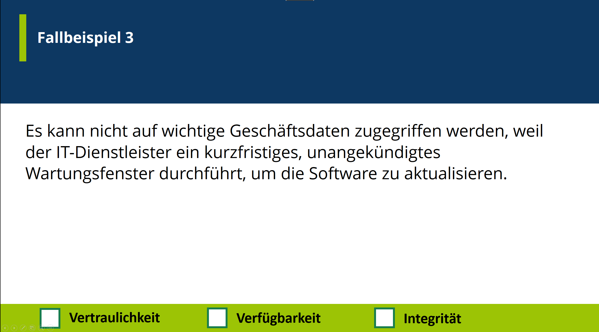
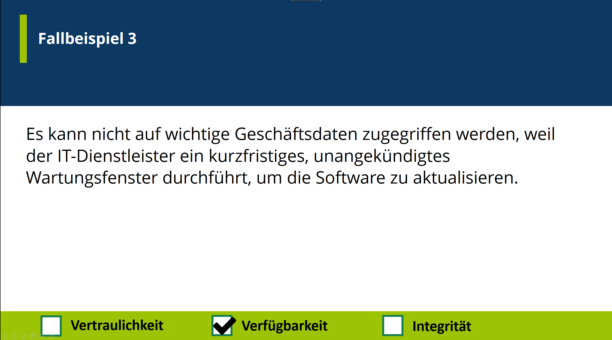
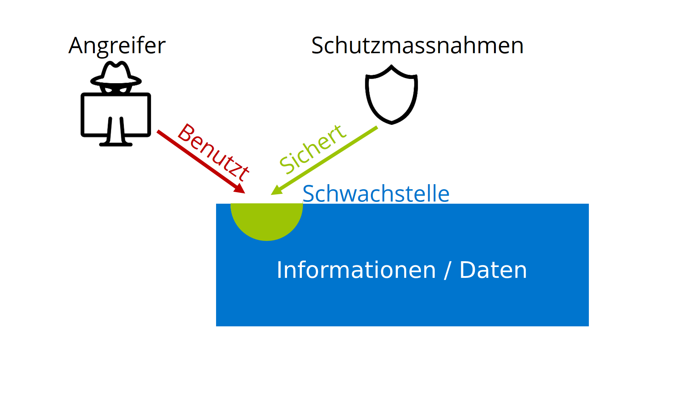
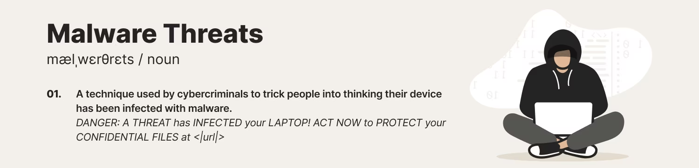
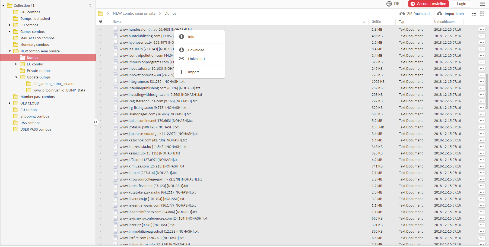

<!--
_backgroundColor: #black
_color: white
-->
<!-- _paginate: skip -->

<h1> Security Awareness Training </h1>

Carl Strömstedt

---

<!--
_backgroundColor: black
_color: white
-->

<!--
Vermutlich haben die meisten von euch schon mal solch eine SMS gekriegt
-->

---

<!--
Und oder so eine Email gekriegt oder schon mal gesehen
-->

---

<!--
Und vielleicht habt ihr auch schon von Hackerattacken und Ransomware attacken online oder in der Zeitung gelesen
-->

---

<!--
  Fakt ist: Jeden Tag werden tausende von cyber attacken ausgeführt. Und die Anzahl und komplexität dieser Attacken nimmt immer zu
-->

---

<!--
_backgroundColor: #0d3862
_color: white
-->

# 3 Blöcke

- ### Informationssicherheit
- ### Malware & Phishing
- ### Passwörter & Verhaltensweisen

<!--
Heute in dieser Schulung werden wir mal hinter die Kulissen von Cyber Attacken und Informationssicherheit schauen. 

Wir werdend die theoretischen Hintergründe von Informationssicherheit kennenlernen

Wir werden Malware und Phishing thematisieren

Und wir werden uns auch mit Passwörter und Empfehlungenen bezüglich Verhaltensweisen am Arbeitsplatz und im digitalen Umfeld beschäftigen
-->

---

<!--
_backgroundColor: #0d3862
_color: white
-->

# Carl Strömstedt

- IT Applikationsentwickler
- Hobbies
  - Bouldern
  - Lesen
  - Reisen

---

<!--
_backgroundColor: #0d3862
_color: white
-->
# Block 1
## Informationssicherheit

<!--
Wir fangen mit dem ersten Block an. Informationssicherheit
-->

  

  
Block 1 - Informationssicherheit

  
&nbsp | Block 2 - Malware & Phishing | Block 3 - Passwörter & Verhaltensweisen

---

<!--
_backgroundColor: #0d3862
_color: white
-->

# Was bedeutet Informationssicherheit?

<!--
Was verstehen wir unter Informationssicherheit? Wie definieren wir es?
-->

  

  
Block 1 - Informationssicherheit

  
&nbsp | Block 2 - Malware & Phishing | Block 3 - Passwörter & Verhaltensweisen

---

<!--
_backgroundColor: #0d3862
_color: white
-->

## Informationssicherheit

- IS beinhaltet Sicherstellung der **Vertraulichkeit**, **Integrität** und **Verfügbarkeit** von Informationen.
- IS wird gewährleistet, wenn ausreichend **technische**, **bauliche** und **organisatorische** Schutzmassnahmen getroffen wurden.
- IS wird durch jeden einzelnen beeinträchtigt, gewährleistet oder verbessert.

<!--
Wir definieren IS als die Sicherstellung von 3 Schutzzielen

Vertraulichkeit

Integrität

Verfügbarkeit

Wir gewährleisten dies durch Infrastruktur. Technisch, baulich und organisatorisch

aber auch auf der Ebene des Indiviidums liegt ein grosser Einfluss. Darum auch diese Schulung heute.

Unser Ziel wäre dass ihr sicher die Informationssicherheit gewährleisten könnt und vielleicht sogar auch verbessern?
-->

  

  
Block 1 - Informationssicherheit

  
&nbsp | Block 2 - Malware & Phishing | Block 3 - Passwörter & Verhaltensweisen

---

<!--
_backgroundColor: #0d3862
_color: white
-->

<h1>
  <i class="fa-solid fa-mask fa-xl" style="margin-right: 15px"></i> Vertraulichkeit
</h1>

<i class="fa-solid fa-pen-fancy fa-2xl" style="margin-right:20px; margin-top: 75px; margin-bottom: 35px"></i> Definition

Schutz vor unbefugtem Zugriff auf sensitive Informationen, um die Privatsphäre und Geheimhaltung zu wahren.

<i class="fa-solid fa-tools fa-2xl" style="margin-right:20px; margin-top: 75px; margin-bottom: 35px"></i> Beispiel

Nur autorisierte Mitarbeiter haben Zugang zu Finanzdaten, um sicherzustellen, dass sensible Informationen nicht öffentlich werden.

<!--
Wir werden nun die einzelnen Schutziele anschauen die IS als ganzes ausmachen

Wir fangen mit dem ersten V, Vertraulichkeit an

Vertraulichkeit definieren wir als den Schutz vor unbefugtem Zugriff auf Informationen und Daten. Dies hilft uns Privatsphäre und Geheimhaltung zu wahren

Beispiel dafür wäre das nur Finanzmitarbeiter zu gewissen Finanzdaten zugang haben. Unautorisierte mitarbeiter nicht
-->

  

  
Block 1 - Informationssicherheit

  
&nbsp | Block 2 - Malware & Phishing | Block 3 - Passwörter & Verhaltensweisen

---

<!--
_backgroundColor: #0d3862
_color: white
-->
<h1>
  <i class="fa-solid fa-file-shield fa-xl" style="margin-right: 15px"></i> Integrität
</h1>

<i class="fa-solid fa-pen-fancy fa-2xl" style="margin-right:20px; margin-top: 75px; margin-bottom: 35px"></i> Definition

Sicherstellung der Korrektheit und Unveränderlichkeit von Daten, um unautorisierte Manipulation oder Verfälschung zu verhindern.

<i class="fa-solid fa-tools fa-2xl" style="margin-right:20px; margin-top: 75px; margin-bottom: 35px"></i> Beispiel

Durch Einsatz von digitalen Signaturen wird sichergestellt, dass ein Dokument von einem bestimmten Absender stammt und unverändert ist.

<!--
Bei der Integrität geht es um korrektheit und in gewissen Situationen unveränderlichkeit von daten. Somit können wir Originalität eines Dokumentes nachweisen und uns von manipulation und Fälschung schützen

Beispiel wäre digtialeSignaturen. Man kan die identität des senders nachweisen und überprüfen

-->

  

  
Block 1 - Informationssicherheit

  
&nbsp | Block 2 - Malware & Phishing | Block 3 - Passwörter & Verhaltensweisen

---

<!--
_backgroundColor: #0d3862
_color: white
-->
<h1>
  <i class="fa-solid fa-clock fa-xl" style="margin-right: 15px"></i> Verfügbarkeit
</h1>

<i class="fa-solid fa-pen-fancy fa-2xl" style="margin-right:20px; margin-top: 75px; margin-bottom: 35px"></i> Definition

Gewährleistung der ständigen Zugänglichkeit von Informationen und Ressourcen, um Unterbrechungen und Ausfälle zu minimieren.

<i class="fa-solid fa-tools fa-2xl" style="margin-right:20px; margin-top: 75px; margin-bottom: 35px"></i> Beispiel

Durch regelmäßige Wartung und redundante Serverinfrastruktur wird sichergestellt, dass eine Webseite jederzeit erreichbar ist.

<!--
Das zweite V im VIV ist Verf¨ugbarkeit. Bei der Verfügbarkeit geht es darum Zugänglichkeit zu Daten und Informationen zu gewährleisten, innerhalb von einem definierten Zeitraum.

Muss nicht umbedingt 24/7 sein, aber innerhalb des zeitraums sollten wir Verfügbarkeit garantieren können
-->

  

  
Block 1 - Informationssicherheit

  
&nbsp | Block 2 - Malware & Phishing | Block 3 - Passwörter & Verhaltensweisen

---

<!--
_backgroundColor: #0d3862
_color: white
-->

<h2 style="margin-bottom: -20px">
Vertraulichkeit / Integrität / Verfügbarkeit - Quiz
</h2>

<!-- # Zoom Poll / Quiz
-->
---

---

---

---

---

---

---

---

---

<!--
_backgroundColor: #0d3862
_color: white
-->

<h1 style="margin-bottom:20px; font-size:55px">
Beispiele für wertvolle und sensitive Informationen
</h1>

<i class="fa-solid fa-credit-card fa-xl" style="font-size: 80px"></i> 

Zahlungsdaten

<i class="fa-solid fa-people-roof fa-xl" style="font-size: 80px"></i>

Personendaten

<i class="fa-solid fa-laptop-medical fa-xl" style="font-size: 80px"></i>

Gesundheitsdaten

<!--
Jetzt haben wir eine Grundlegende Definition von informationssicherheit und kennen das VIV trio. Wir haben die Frage beantwortet **WAS** Informationssicherhiet ist und wir werden uns jetzt anschauen *WIESO* wir Informationssicherheit brauchen?

Heutzutage haben wir Daten in riesigen Mengen, aber nicht nur Quantität ist vorhanden, sondern wir haben auch Daten mit viel wert.

Dies können zum Beispiel Finanzdaten sein, 

oder Personendaten

und auch Gesundheitsdaten in verschiedenen Formen

Der Wert dieser Daten ist natürlich eine Motivation für Angreifer
-->

  

  
Block 1 - Informationssicherheit

  
&nbsp | Block 2 - Malware & Phishing | Block 3 - Passwörter & Verhaltensweisen

---

<!--
_backgroundColor: #0d3862
_color: white
-->

<h1 style="margin-top: -30px !important">
Motivation Angreifer
</h1>

<h2>
  Wirtschaftlich <i class="fa-solid fa-sack-dollar fa-xl" style="margin-left: 15px"></i> 
</h2>

- Eigene Bereicherung
- Elimination der Konkurrenz
- Verbessern der Marktstellung

<h2>
  Politisch <i class="fa-solid fa-check-to-slot fa-xl" style="margin-left: 15px"></i> 
</h2>

- Beeinflussung von Wahlen
- Imageschaden eines Konkurrenten
- Verbreitung von religiösen oder politischen Inhalten.

<h2>
  Persönlich <i class="fa-solid fa-user fa-xl" style="margin-left: 15px;"></i> 
</h2>

- Bestätigung
- „For the LULZ“ (Amüsierung)

<!--

Die Motivationen können aber verschieden sein

Wir haben definitiv den Finanziellen aspekt, mit eigener Bereicherung und aber auch Schaden finanziell anrichten

Aber es gibt auch die politische Motivation, soziale medien spielen hier auch eine grosse Rolle

Und wir haben persönliche Motivation
-->

  

  
Block 1 - Informationssicherheit

  
&nbsp | Block 2 - Malware & Phishing | Block 3 - Passwörter & Verhaltensweisen

---

<!--
_backgroundColor: #0d3862
_color: white
-->

<h1 style="margin-top: -30px !important">
Motivation Angreifer
</h1>

<h2>
  Wirtschaftlich <i class="fa-solid fa-sack-dollar fa-xl" style="margin-left: 15px"></i> 
</h2>

- Eigene Bereicherung
- Elimination der Konkurrenz
- Verbessern der Marktstellung

<h2>
  Politisch <i class="fa-solid fa-check-to-slot fa-xl" style="margin-left: 15px"></i> 
</h2>

- Beeinflussung von Wahlen
- Imageschaden eines Konkurrenten
- Verbreitung von religiösen oder politischen Inhalten.

<h2>
  Persönlich <i class="fa-solid fa-user fa-xl" style="margin-left: 15px;"></i> 
</h2>

- Bestätigung
- „For the LULZ“ (Amüsierung)

<!--

Die Motivationen können aber verschieden sein

Wir haben definitiv den Finanziellen aspekt, mit eigener Bereicherung und aber auch Schaden finanziell anrichten

Aber es gibt auch die politische Motivation, soziale medien spielen hier auch eine grosse Rolle

Und wir haben persönliche Motivation
-->

  

  
Block 1 - Informationssicherheit

  
&nbsp | Block 2 - Malware & Phishing | Block 3 - Passwörter & Verhaltensweisen

---

<!--
_backgroundColor: #0d3862
_color: white
-->

<h1 style="margin-top: -30px !important">
Motivation Angreifer
</h1>

<h2>
  Wirtschaftlich <i class="fa-solid fa-sack-dollar fa-xl" style="margin-left: 15px"></i> 
</h2>

- Eigene Bereicherung
- Elimination der Konkurrenz
- Verbessern der Marktstellung

<h2>
  Politisch <i class="fa-solid fa-check-to-slot fa-xl" style="margin-left: 15px"></i> 
</h2>

- Beeinflussung von Wahlen
- Imageschaden eines Konkurrenten
- Verbreitung von religiösen oder politischen Inhalten.

<h2>
  Persönlich <i class="fa-solid fa-user fa-xl" style="margin-left: 15px"></i> 
</h2>

- Bestätigung
- „For the LULZ“ (Amüsierung)

<!--

Die Motivationen können aber verschieden sein

Wir haben definitiv den Finanziellen aspekt, mit eigener Bereicherung und aber auch Schaden finanziell anrichten

Aber es gibt auch die politische Motivation, soziale medien spielen hier auch eine grosse Rolle

Und wir haben persönliche Motivation
-->

  

  
Block 1 - Informationssicherheit

  
&nbsp | Block 2 - Malware & Phishing | Block 3 - Passwörter & Verhaltensweisen

---

<!--
_backgroundColor: white
_color: black
-->

<!--
Diese Gruppen / Individuen haben also ihre Motivationen und wir unsere Informationen / Daten

Diese Daten / Informationen, respektive die System auf die sie gelagert sind haben meistens schwachstellen in irgeinder Form
-->

  

  
Block 1 - Informationssicherheit

  
&nbsp | Block 2 - Malware & Phishing | Block 3 - Passwörter & Verhaltensweisen

---

<!--
_backgroundColor: white
_color: black
-->

<!--
Angreifer möchten diese Schwachstellen ausnützen um an unsere Informationen / Daten zu kommen.
-->

  

  
Block 1 - Informationssicherheit

  
&nbsp | Block 2 - Malware & Phishing | Block 3 - Passwörter & Verhaltensweisen

---

<!--
_backgroundColor: white
_color: black
-->

<!--
Wir können Schutzmassnahmen etablieren, so dass wir die Angreifer davor hindern diese Schwachstellen auszunützen
-->

  

  
Block 1 - Informationssicherheit

  
&nbsp | Block 2 - Malware & Phishing | Block 3 - Passwörter & Verhaltensweisen

---

<!--
_backgroundColor: white
_color: black
-->

<!--
Zu bemerken ist aber dass das ganze ein zyklischer prozess ist. Wir sollten immer darauf achten dass entsprechende Schutzmassnahmen im Einsatz sind.

Diese Schutzmassnahmen sollten proportional zum Wert unserer Informationen & Daten sein

Um uns dabei zu helfen unsere Daten und Informationen zu gruppieren, haben wir klassifizierungen
-->

  

  
Block 1 - Informationssicherheit

  
&nbsp | Block 2 - Malware & Phishing | Block 3 - Passwörter & Verhaltensweisen

---

<!--
_backgroundColor: #0d3862
_color: white
-->

# Klassifizierungen von Informationen

<!--

Es hilft uns anhand von verschiedenen Kriterien unsere Daten zu gruppieren..

-->

  

  
Block 1 - Informationssicherheit

  
&nbsp | Block 2 - Malware & Phishing | Block 3 - Passwörter & Verhaltensweisen

---

<!--
_backgroundColor: #0d3862
_color: white
-->

# Anforderungen an Informationen

Vertraulichkeit <i class="fa-solid fa-mask fa-xl" style="margin-left:20px"></i> 

Integrität <i class="fa-solid fa-file-shield fa-xl" style="margin-left:20px"></i> 

Verfügbarkeit <i class="fa-solid fa-clock-rotate-left fa-xl" style="margin-left:20px"></i> 

<!--
Unsere VIV Prinzipien können wir hier Anwenden um Anforderungen zu definieren. Die Informationen / Daten und ihre entsprechende Klassifizierung sollten die VIV prinzipen erfüllen
-->

  

  
Block 1 - Informationssicherheit

  
&nbsp | Block 2 - Malware & Phishing | Block 3 - Passwörter & Verhaltensweisen

---
<!--
_backgroundColor: #0d3862
_color: white
-->

# Klassifizierungen

<h2>
  Wieso? 
</h2>

Hilft uns Vorgaben zu Definieren

<h2>
  Was?
</h2>

Alle Informationen und Daten

<h2>
  Welche Klassifizierungen? 
</h2>

- Vertraulich
- Intern
- Öffentlich

<!--
Wir werden uns heute 3 Klassifizierungen anhand von ISO-Standards anschauen: Vertraulich Intern & öffentlich. Es gibt auch noch Streng Vertraulich aber dass wird nur in gewissen bereichen wie zum beispiel in der Pharmaindustrie oder im Militärischen bereich verwendet.
-->

  

  
Block 1 - Informationssicherheit

  
&nbsp | Block 2 - Malware & Phishing | Block 3 - Passwörter & Verhaltensweisen

---

<!--
_backgroundColor: #0d3862
_color: white
-->

<h1>
  Vertraulich <i class="fa-solid fa-shield fa-xl" style="margin-left: 15px"></i> 
</h1>

## Aufbewahrung

<i class="fa-solid fa-lock fa-xl" style="margin-right:20px"></i> Nur Berechtigte haben Zugriff 

## Transport

<i class="fa-solid fa-lock fa-xl" style="margin-right:20px"></i> Nur verschlüsselt und nicht telefonisch

## Bearbeitung

<i class="fa-solid fa-binoculars fa-xl" style="margin-right:20px"></i> Kopieren nicht erlaubt & überwachter Ausdruck

<!--
Wir werden die einzelnen Klassifizierungen in Bezug auf Aufbewahrung, Transport und Bearbeitung anschauen.

Bei der Vertraulichen Klassifizierung...
-->

  

  
Block 1 - Informationssicherheit

  
&nbsp | Block 2 - Malware & Phishing | Block 3 - Passwörter & Verhaltensweisen

---

<!--
_backgroundColor: #0d3862
_color: white
-->

<h1>
  Intern <i class="fa-solid fa-shield-halved fa-xl" style="margin-left: 15px"></i> 
</h1>

## Aufbewahrung

<i class="fa-solid fa-building-circle-check fa-xl" style="margin-right:20px"></i> Alle innerhalb der Firma haben Zugriff

## Transport

<i class="fa-solid fa-unlock fa-xl" style="margin-right:20px"></i>  Unverschlüsselter austausch erlaubt

## Bearbeitung

<i class="fa-solid fa-pencil fa-xl" style="margin-right:20px"></i> Ändern, Kopieren, Drucken bei Bedarf erlaubt

<!--
Änderungen sollten auch nachvollziehbar sein
-->

  

  
Block 1 - Informationssicherheit

  
&nbsp | Block 2 - Malware & Phishing | Block 3 - Passwörter & Verhaltensweisen

---

<!--
_backgroundColor: #0d3862
_color: white
-->

<h1>
  Öffentlich <i class="fa-solid fa-people-group fa-xl" style="margin-left: 15px"></i> 
</h1>

## Aufbewahrung

<i class="fa-solid fa-box-open fa-xl" style="margin-right:20px"></i> Alle haben zugriff

## Transport

<i class="fa-solid fa-people-group fa-xl" style="margin-right:20px"></i> Jeglicher Austausch erlaubt

## Bearbeitung

<i class="fa-solid fa-binoculars fa-check" style="margin-right:20px"></i> Änderungen müssen Nachvollziehbar sein

  

  
Block 1 - Informationssicherheit

  
&nbsp | Block 2 - Malware & Phishing | Block 3 - Passwörter & Verhaltensweisen

---

<!--
_backgroundColor: #0d3862
_color: white
-->

# Informationssicherheitsvorfälle

<!--
Jetzt haben wir angeschaut was Informationssicherheit ist und wie wir unsere Daten klassifizieren können.

Was passiert denn aber wenn wir einen Informationssicherheitsvorfall haben?
-->

  

  
Block 1 - Informationssicherheit

  
&nbsp | Block 2 - Malware & Phishing | Block 3 - Passwörter & Verhaltensweisen

---

<!--
_backgroundColor: white
_color: black
-->

<!--
Wir können Sicherheitsvorfälle anhand von unseren 3 Schutzielen einordnen.

Es kann ein einzelnes Schutziel verletzt sein oder mehrere aufs mal
-->

  

  
Block 1 - Informationssicherheit

  
&nbsp | Block 2 - Malware & Phishing | Block 3 - Passwörter & Verhaltensweisen

---

<!--
_backgroundColor: white
_color: black
-->

  

  
Block 1 - Informationssicherheit

  
&nbsp | Block 2 - Malware & Phishing | Block 3 - Passwörter & Verhaltensweisen

---

<!--
_backgroundColor: white
_color: black
-->

  

  
Block 1 - Informationssicherheit

  
&nbsp | Block 2 - Malware & Phishing | Block 3 - Passwörter & Verhaltensweisen

---

<!--
_backgroundColor: white
_color: black
-->

  

  
Block 1 - Informationssicherheit

  
&nbsp | Block 2 - Malware & Phishing | Block 3 - Passwörter & Verhaltensweisen

---

<!--
_backgroundColor: #cf7030
_color: white
-->

# Vorgehen bei einem Sicherheitsvorfall

<!--
Jetzt wo wir gesehen haben auf welchen Ebenen ein Sicherheitsvorfall passieren kann, schauen wir uns an wie ihr bei einem Sicherheitsvorfall vorgehen könnt.
-->

  

  
Block 1 - Informationssicherheit

  
&nbsp | Block 2 - Malware & Phishing | Block 3 - Passwörter & Verhaltensweisen

---

<!--
_backgroundColor: #cf7030
_color: white
-->

<i class="fa-solid fa-user-shield fa-2xl" style="margin-right:20px; margin-top: 30px; margin-bottom: 15px"></i> Verdacht

- Wenn du etwas Verdächtiges bemerkst, zögere nicht und melde dich bei uns.

<i class="fa-solid fa-exclamation-triangle fa-2xl" style="margin-right:20px; margin-top: 30px; margin-bottom: 15px"></i> Melden

- Am besten meldest du dich telefonisch oder erstellst ein Support-Ticket.

<i class="fa-solid fa-envelope fa-2xl" style="margin-right:20px; margin-top: 30px; margin-bottom: 15px"></i> Weiterleiten

- Verdächtige Phishing-E-Mails bitte an support@open-circle.ch weiterleiten.

<!--
Wir sind für euch da. Falls ein verdacht besteht einfach melden

Unsere Experten werden sich direkt mit dem Vorfall auseinandersetzen

- Du kannst auch Screenshots an das Ticket anhängen, um weitere Informationen bereitzustellen.
-->

  

  
Block 1 - Informationssicherheit

  
&nbsp | Block 2 - Malware & Phishing | Block 3 - Passwörter & Verhaltensweisen

---

<!--
_backgroundColor: #006951
_color: white
-->

# Was macht Open Circle dagegen?

<i class="fa-solid fa-window-maximize fa-2xl" style="margin-right:33px; margin-top: 25px; margin-bottom: 35px"></i> DNS-Filtering

<i class="fa-solid fa-envelope-open-text fa-2xl" style="margin-right:40px; margin-top: 25px; margin-bottom: 35px"></i>Spam-Filtering

<i class="fa-solid fa-sync fa-2xl" style="margin-right:40px; margin-top: 25px; margin-bottom: 35px"></i>Regelmässige Updates von Server & Clients

<i class="fa-solid fa-user-shield fa-2xl" style="margin-right:25px; margin-top: 25px; margin-bottom: 35px"></i>2-Faktor-Authentifizierung

<i class="fa-solid fa-user-pen fa-2xl" style="margin-right:20px; margin-top: 25px; margin-bottom: 35px"></i> Awareness-Schulungen

  

  
Block 1 - Informationssicherheit

  
&nbsp | Block 2 - Malware & Phishing | Block 3 - Passwörter & Verhaltensweisen

<!--
Es gibt sehr viele technische Werkzeuge aber schlussendlich habt ihr als Individuum einen grossen einfluss auf die Informationssicherheit.

Wie erwähnt haben wir daher auch heute diese Schulung:

Um euch zu senisibilisiern und mit Beispielen und informationen euere Gefahrenbewusstsein zu fördern.
-->

---

<!--
_backgroundColor: #006951
_color: white
-->

# Erster Block - Fazit

  

  
Block 1 - Informationssicherheit

  
&nbsp | Block 2 - Malware & Phishing | Block 3 - Passwörter & Verhaltensweisen

---

<!--
_backgroundColor: #006951
_color: white
-->

<h1 style="margin-top: -30px !important">
Erster Block - Fazit
</h1>

## 3 Schutzziele

- Vertraulichkeit
- Integrität
- Verfügbarkeit

## Risiko

Schwachstellen durch Schutzmassnahmen sichern

## 3 Klassifizierungen

- Vertraulich
- Intern
- Öffentlich

## Sicherheitsvorfall

Unsicher? Misstrauisch?

<i class="fa-solid fa-arrow-right fa-xl" style="margin-right: 10px"></i> Melden

<!-- 5 Minuten Pause
 -->

 

  

  
Block 1 - Informationssicherheit

  
&nbsp | Block 2 - Malware & Phishing | Block 3 - Passwörter & Verhaltensweisen

---

<!--
_backgroundColor: #006951
_color: white
-->

# Erster Block - Quiz

  

  
Block 1 - Informationssicherheit

  
&nbsp | Block 2 - Malware & Phishing | Block 3 - Passwörter & Verhaltensweisen

---

<!--
_backgroundColor: #0d3862
_color: white
-->

# Block 2

## Malware & Phishing

 

  
Block 1 - Informationssicherheit |

  
&nbsp Block 2 - Malware & Phishing

  
&nbsp | Block 3 - Passwörter & Verhaltensweisen

---

<!--
_backgroundColor: #0d3862
_color: white
-->

<i class="fa-solid fa-virus-covid fa-xl" style="font-size:120px"></i> 

Viren

<i class="fa-solid fa-horse fa-xl" style="font-size:120px"></i>

Trojaner

<i class="fa-solid fa-user-secret fa-xl" style="font-size: 120px"></i>

Spyware

<i class="fa-solid fa-arrow-down-up-lock fa-xl" style="font-size: 120px"></i>

Ransomware

<!-- 
Um euch einen Überblick von Malware zu geben, werden wir heute 4 Gruppen von Malware anschauen.

Es gibt viele untergruppen und varianten, aber diese 4 sollte man meiner Meinung nach,sicher kennen.

-->

 

  
Block 1 - Informationssicherheit |

  
&nbsp Block 2 - Malware & Phishing

  
&nbsp | Block 3 - Passwörter & Verhaltensweisen

 ---

 <!--
_backgroundColor: #0d3862
_color: white
-->

<h1>
  <i class="fa-solid fa-virus fa-xl" style="margin-right: 15px"></i> Viren  
</h1>

Schadprogramme, die sich durch Einschleusung in andere Systeme verbreiten

<i class="fa-solid fa-viruses fa-2xl" style="margin-right:20px; margin-top: 75px; margin-bottom: 35px"></i> Verbreitung

Durch infizierte Dateien, E-Mail-Anhänge oder infizierte Webseiten.

<!--
Viren, wie der name schon Hindeutet, sind software die im "Verhalten" ähnlichkeiten zu biologischen Viren besitzen.

Das Ziel von Viren ist das Einschleusen in Systemen um sich dann für Verbreitung Replizieren zu können.

Viren können auf der Softwareebene schaden an Dateisysteme versursachen, aber auch auf der Hardwareebene

Eine art von Virus, könnte man fast schon sagen, sind Würmer. Diese bewegen sich oft durch Netzwerke um sich weiter zu verbreiten.
-->

 

  
Block 1 - Informationssicherheit |

  
&nbsp Block 2 - Malware & Phishing

  
&nbsp | Block 3 - Passwörter & Verhaltensweisen

---

 <!--
_backgroundColor: #0d3862
_color: white
-->

<h1>
  <i class="fa-solid fa-horse fa-xl" style="margin-right: 15px"></i> Trojaner 
</h1>

Tarnen sich als legitime Software, um unbemerkt in Systeme einzudringen. 

Öffnet Hintertüren, stiehlt Daten oder ermöglicht Fernsteuerung.

<i class="fa-solid fa-viruses fa-2xl" style="margin-right:20px; margin-top: 75px; margin-bottom: 35px"></i> Verbreitung

Durch gefälschte E-Mail-Anhänge, infizierte Downloads oder Drive-by-Downloads.

<!--
Auch bekannt unter Malware sind die Trojaner. Der name nimmt bezug auf das trojanische Pferd auf Grund von der Technik die eingesetzt wird. Es wird Tarnung verwendet um einen Angriff auszuführen.

Legitime Software wird als Tarnung verwendet um in Systeme einzudringen.

OFt ziehen Trojaner ander Malware mit sich da sie Hintertüren öffnen.

Datendiebstahl, Identitätsmissbrauch, Systemübernahme.
-->

 

  
Block 1 - Informationssicherheit |

  
&nbsp Block 2 - Malware & Phishing

  
&nbsp | Block 3 - Passwörter & Verhaltensweisen

---

 <!--
_backgroundColor: #0d3862
_color: white
-->

<h1>
  <i class="fa-solid fa-user-secret fa-xl" style="margin-right: 15px"></i> Spyware 
</h1>

Sammelt heimlich Informationen über Nutzer*innen und ihre Aktivitäten.

<i class="fa-solid fa-viruses fa-2xl" style="margin-right:20px; margin-top: 75px; margin-bottom: 35px"></i> Verbreitung

Durch Software-Bündelung, infizierte Links oder Drive-by-Downloads.

<!--
Spyware steht oft in verbindung mit Trojaner, können aber auch selbständig vorhanden sein. 

Bei der Spyware geht es nicht darum direkt Schaden anzurichten, sondern um Datensammlung, Spionage.

Datenschutzverletzungen, Identitätsdiebstahl, finanzielle Verluste.
-->

  
Block 1 - Informationssicherheit |

  
&nbsp Block 2 - Malware & Phishing

  
&nbsp | Block 3 - Passwörter & Verhaltensweisen

---

 <!--
_backgroundColor: #0d3862
_color: white
-->

<h1>
  <i class="fa-solid fa-arrow-down-up-lock fa-xl" style="margin-right: 15px"></i> Ransomware
</h1>

Sperrt oder verschlüsselt Daten, fordert Lösegeld zur Wiederherstellung.

<i class="fa-solid fa-viruses fa-2xl" style="margin-right:20px; margin-top: 75px; margin-bottom: 35px"></i> Verbreitung

Durch infizierte E-Mail-Anhänge, Exploit-Kits oder schadhafte Downloads.

<!--
Ransomware als Begriff ist in der Einführung kurz gefallen. Was verstehen wir darunter?

Ransom auf english bedeutet Lösegeld.

DAten werden verschlüsselt. 

Datenverlust, finanzielle Verluste, Betriebsunterbrechungen.
-->

  
Block 1 - Informationssicherheit |

  
&nbsp Block 2 - Malware & Phishing

  
&nbsp | Block 3 - Passwörter & Verhaltensweisen

 ---

 <!--
_backgroundColor: #e74c3c
_color: white
-->
<h1>
  <i class="fa-solid fa-biohazard fa-xl" style="margin-right: 15px"></i> Beispiel: WannaCry-Virus
</h1>

- Ausbruch im Mai 2017
- Ransomware, die weltweit Windows-Systeme befiel.

<i class="fa-solid fa-tools fa-2xl" style="margin-right:20px; margin-top: 75px; margin-bottom: 35px"></i> Ziel und Auswirkungen

- Ausnutzung der Windows-Schwachstelle "EternalBlue"
- Betraf Organisationen wie die NHS (UK) und FedEx

<!-- 
Global Impact: WannaCry infected over 230,000 computers across 150 countries within days. It spread by exploiting a vulnerability in the Windows operating system called EternalBlue (a flaw that had already been patched by Microsoft but was unpatched in many systems).

Behavior: The ransomware encrypted users' files, demanding a ransom in Bitcoin to restore access. If users failed to pay the ransom, their data remained inaccessible.

Notable Targets: Several major institutions were severely impacted. For example:

The UK’s National Health Service (NHS) had to cancel surgeries and medical appointments because WannaCry disabled their computer systems.
Large corporations such as FedEx and Telefonica also faced major disruptions.

Prevention & Aftermath: The attack highlighted the importance of keeping systems updated with security patches, as well as implementing backup and recovery plans. It also showcased the need for increased international cooperation to combat cybercrime.
-->

 

  
Block 1 - Informationssicherheit |

  
&nbsp Block 2 - Malware & Phishing

  
&nbsp | Block 3 - Passwörter & Verhaltensweisen

---

 <!--
_backgroundColor: #e74c3c
_color: white
-->

<i class="fa-solid fa-user-secret fa-2xl" style="margin-right:20px; margin-top: 75px; margin-bottom: 35px"></i> Verbreitung und Komplexität

- Schnell weltweit verbreitet, über 230.000 Systeme in 150 Ländern
- Verschlüsselte Daten und forderte Bitcoin-Lösegeld

<i class="fa-solid fa-shield-alt fa-2xl" style="margin-right:20px; margin-top: 75px; margin-bottom: 35px"></i> Lehren

- Bedeutung von regelmässigen Updates und Backups
- Zeigt die Verwundbarkeit von Systemen ohne Sicherheits-Patches

<!-- 
Global Impact: WannaCry infected over 230,000 computers across 150 countries within days. It spread by exploiting a vulnerability in the Windows operating system called EternalBlue (a flaw that had already been patched by Microsoft but was unpatched in many systems).

Behavior: The ransomware encrypted users' files, demanding a ransom in Bitcoin to restore access. If users failed to pay the ransom, their data remained inaccessible.

Notable Targets: Several major institutions were severely impacted. For example:

The UK’s National Health Service (NHS) had to cancel surgeries and medical appointments because WannaCry disabled their computer systems.
Large corporations such as FedEx and Telefonica also faced major disruptions.

Prevention & Aftermath: The attack highlighted the importance of keeping systems updated with security patches, as well as implementing backup and recovery plans. It also showcased the need for increased international cooperation to combat cybercrime.
-->

 

  
Block 1 - Informationssicherheit |

  
&nbsp Block 2 - Malware & Phishing

  
&nbsp | Block 3 - Passwörter & Verhaltensweisen

---

<!-- link: https://www.microsoft.com/en-us/security/blog/2022/06/13/the-many-lives-of-blackcat-ransomware/
 
Die ist ein Beispiel einer Nachricht die von einer Ransomware gruppe eingebelendet wird wenn mit black cat, Ransomware, was eine variante von Ransomware ist
-->

---

 <!--
_backgroundColor: #0d3862
_color: white
-->

# Angriffskomponenten

Was verwenden die Angreifer für ihre Attacken?

<!--
Wir haben übe rMalware geredet, was die mechanismen der verschiedenen typen sind und wie sie verbreitet werden.

Auf das Verbreiten werden wir jetzt genauer eingehen indem das wir uns Angriffskomponenten die verwendet werden anschauen
-->

 

  
Block 1 - Informationssicherheit |

  
&nbsp Block 2 - Malware & Phishing

  
&nbsp | Block 3 - Passwörter & Verhaltensweisen

---

 <!--
_backgroundColor: #0d3862
_color: white
-->

<h1>
  Technik <i class="fa-solid fa-cogs fa-xl" style="margin-right: 15px; margin-left: 20px; margin-bottom: 50px;"></i> 
</h1>

<h1>
  Soziale Ebene <i class="fa-solid fa-users-line fa-xl" style="margin-right: 15px; margin-left: 20px"></i> 
</h1>

<!--
Wir werden uns die Technischen Tools / Werkzeuge anschauen

Und wir werden auf die soziale Ebene eingehen.
-->

  
Block 1 - Informationssicherheit |

  
&nbsp Block 2 - Malware & Phishing

  
&nbsp | Block 3 - Passwörter & Verhaltensweisen

---

 <!--
_backgroundColor: #0d3862
_color: white
-->

# Technik

- Drive-by-Download <i class="fa-solid fa-globe fa-xl" style="margin-left: 15px"></i>
- E-Mail-Anhänge <i class="fa-solid fa-envelope fa-xl" style="margin-left: 15px"></i>
- Software-Bündelung <i class="fa-solid fa-box fa-xl" style="margin-left: 15px"></i>

<!--
Wir werden uns 

Drive-by Downloads anschauen

Email Anhänge und

Softwarebündlung
-->

  
Block 1 - Informationssicherheit |

  
&nbsp Block 2 - Malware & Phishing

  
&nbsp | Block 3 - Passwörter & Verhaltensweisen

---

<!--
_backgroundColor: #0d3862
_color: white
-->
<h1>
  <i class="fa-solid fa-globe fa-xl" style="margin-right: 15px"></i> Drive-by-Download
</h1>

Automatischer Download von Malware beim Besuch einer infizierten Webseite.

<i class="fa-solid fa-gears fa-2xl" style="margin-right:20px; margin-top: 75px; margin-bottom: 35px"></i> Mechanismus

Ausnutzung von Sicherheitslücken im Browser oder Plugins, um Schadcode einzuschleusen.

<!--
Driveby downloads wurden vorher als eine Verbreitungstechnik kurz erwähnt.

Drive-by, also im vorbeifahren ist eine Bezeichung für das Automatische Herunterladen von Malware

Es werden Sicherheitslücken ausgenützt

Unbemerkte Infektion, Verbreitung von Viren, Trojanern oder Ransomware.
-->

  
Block 1 - Informationssicherheit |

  
&nbsp Block 2 - Malware & Phishing

  
&nbsp | Block 3 - Passwörter & Verhaltensweisen

---
<!--
_backgroundColor: #f4f1ec
_color: black
-->

<!-- link: https://us.norton.com/blog/malware/what-are-drive-by-downloads

Wir haben 2 Formen

Die Autorisierten Drive by Downloads

Der user klickt auf einen Link, oder lädt eine Datei herunter. Er ist also aktiv involviert und erlaubt den Download sozusagen. Er weiss aber vermutlich nicht das es schädlich ist
-->

  
Block 1 - Informationssicherheit |

  
&nbsp Block 2 - Malware & Phishing

  
&nbsp | Block 3 - Passwörter & Verhaltensweisen

---

<!--
_backgroundColor: #f4f1ec
_color: black
-->

<!--
Die zweite Variante ist der unautorisierte Drive by Download

Hier werden sicherheitslücken ausgenützt um scripts / code auszuführen ohne das Der user involviert ist.

Browser updaten
-->

  
Block 1 - Informationssicherheit |

  
&nbsp Block 2 - Malware & Phishing

  
&nbsp | Block 3 - Passwörter & Verhaltensweisen

---
<!--
_backgroundColor: #0d3862
_color: white
-->
<h1>
  <i class="fa-solid fa-envelope fa-xl" style="margin-right: 15px"></i> E-Mail-Anhänge
</h1>

Anhänge die beim öffnen Schwachstellen in Software (wie Dokumentenlesern) ausnützen, um Malware zu installieren.

<i class="fa-solid fa-viruses fa-2xl" style="margin-right:20px; margin-top: 75px; margin-bottom: 35px"></i> Mechanismus

Ausnutzung von Software-Schwachstellen, Ausführen von Makros

<!--
E-mail Anhänge werden bei Phishing oft eingesetzt um dann mithilfe von Schwachstellen in Software wie PDF_Readers oder Office Programmen Malware auf das System zu bringen.

Unbemerkte Infektion, Installation von Rootkits, Datendiebstahl.
-->

  
Block 1 - Informationssicherheit |

  
&nbsp Block 2 - Malware & Phishing

  
&nbsp | Block 3 - Passwörter & Verhaltensweisen

---

<!--
_backgroundColor: #0d3862
_color: white
-->
<h1>
  <i class="fa-solid fa-box fa-xl" style="margin-right: 15px"></i> Software-Bündelung
</h1>

Malware wird zusammen mit legitimer Software gebündelt und bei der Installation mit installiert.

<i class="fa-solid fa-gears fa-2xl" style="margin-right:20px; margin-top: 75px; margin-bottom: 35px"></i> Mechanismus

Nutzer:innen bemerken die Malware oft nicht, da sie vertrauenswürdige Software als Tarnung verwendet.

<!--
Wie bei den Trojanern vorher erwähnt ist es eine effektive Taktik Malware zu tarnen. Mit software Bundling bieten wir eine legitime Software an die Lauft, aber im Hintergrund haben wir noch Malware der schaden anrichtet

Unbefugter Datenzugriff, Spyware, Trojaner-Infektionen.
-->

  
Block 1 - Informationssicherheit |

  
&nbsp Block 2 - Malware & Phishing

  
&nbsp | Block 3 - Passwörter & Verhaltensweisen

---

<!--
_backgroundColor: #0d3862
_color: white
-->
<h1>
  <i class="fa-solid fa-tree fa-xl" style="margin-right: 15px"></i> Rootkits
</h1>

Rootkits sind bösartige Software, die tief in ein Computersystem eindringt und zugriff auf verschiedenen Ebenen erhält.

<i class="fa-solid fa-gears fa-2xl" style="margin-right:20px; margin-top: 75px; margin-bottom: 35px"></i> Mechanismus

Durch Zugriff auf Systemebene können Rootkits Administrationsbefugnisse erlangen und Systeme kompromittieren.

<!--
Ein bisschen technischer sind die Rootkits

Rootkits arbeiten auf der Ebene von Userberechtigungen.

Wenn die Software die erlaubnis hat andere Software auszuführen ist es einfach weitere Malware mitzuziehen oder zu tarnen.

Der begriff root kit bezieht sich auf den root user, der in gewissen dateisystemen als einziger im root des Systems berechtigungen hat. Bei UNIX systemen jedenfalls
-->

  
Block 1 - Informationssicherheit |

  
&nbsp Block 2 - Malware & Phishing

  
&nbsp | Block 3 - Passwörter & Verhaltensweisen

---

<!--
_backgroundColor: #f4f1ec
_color: white
-->

<!--
Diese rootkits können auf verschiedenen Ebenen existieren. Je tiefer im System, umso mehr Möglichkeiten haben die Angreifer
-->

---

<!--
_backgroundColor: #006951
_color: white
-->

<h1>
  <i class="fa-solid fa-shield-alt fa-xl" style="margin-right: 15px"></i> Schutz vor Malware
</h1>

<i class="fa-solid fa-arrow-rotate-left fa-2xl" style="margin-right:20px; margin-top: 30px; margin-bottom: 35px"></i> Softwareaktualisierungen

Halte dein Betriebssystem und alle Programme auf dem neuesten Stand, um bekannte Sicherheitslücken zu schließen.

<i class="fa-solid fa-envelope fa-2xl" style="margin-right:20px; margin-top: 30px; margin-bottom: 35px"></i> Vorsicht bei E-Mails

Öffne keine E-Mail-Anhänge oder klicke nicht auf Links von unbekannten oder verdächtigen Absendern.

<i class="fa-solid fa-user-shield fa-2xl" style="margin-right:20px; margin-top: 30px; margin-bottom: 5px"></i> Verhaltensbewusstsein

Sei vorsichtig beim Herunterladen von Dateien aus dem Internet und vermeide fragwürdige Webseiten.

<!--
Ok Jetzt haben wir Gruppen von Malware angeschaut und was für Techniken verwendet werden um Malware auf ein System zu kriegen.

Softwareaktualisierungen

Emails aufpassen,links und anhänge

Verhaltensbewusstsein beim browsen

Wir haben jetzt mit vorsicht und bewusstsein Begriffe erwähnt die vorallem auch auf der Sozialen Ebene relevant sind.
-->

  
Block 1 - Informationssicherheit |

  
&nbsp Block 2 - Malware & Phishing

  
&nbsp | Block 3 - Passwörter & Verhaltensweisen

---

<!--
_backgroundColor: #0d3862
_color: white
-->

# Soziale Ebene

<!--

-->

  
Block 1 - Informationssicherheit |

  
&nbsp Block 2 - Malware & Phishing

  
&nbsp | Block 3 - Passwörter & Verhaltensweisen

---

<!--
_backgroundColor: #0d3862
_color: white
-->

# Social Engineering

Manipulation von Menschen, durch ausnutzung von Vertrauen, Neugier oder Druck, um vertrauliche Informationen preiszugeben oder unerlaubte Handlungen auszuführen.

## Methoden

- Phishing 
- Vishing (Telefon)

<!--
Bei der sozialen Ebene wird social engineering angewendet, was die Manipulation von Menschen durch ausnutzung ihrer Emotionen ist.

Es wird druck ausgeübt.

Das Wird beim Phishing und Vishing sehr oft eingesetzt
-->

  
Block 1 - Informationssicherheit |

  
&nbsp Block 2 - Malware & Phishing

  
&nbsp | Block 3 - Passwörter & Verhaltensweisen

---

<!--
_backgroundColor: #0d3862
_color: white
-->
<h1>
  <i class="fa-solid fa-fish fa-xl" style="margin-right: 15px"></i> Phishing
</h1>

Täuschung von Nutzer:innen, um vertrauliche Informationen wie Passwörter oder Finanzdaten zu stehlen.

<i class="fa-solid fa-viruses fa-2xl" style="margin-right:20px; margin-top: 75px; margin-bottom: 35px"></i> Methoden

Gefälschte E-Mails, Webseiten oder soziale Medien, die echt aussehen, um Vertrauen zu erwecken.

<!--
Phishing istdie Täuschung von User um an Informationen zu kommen und um sich Zugang zu Systemen zu schaffen

Identitätsdiebstahl, finanzielle Verluste, Zugriff auf persönliche Konten.
-->

  
Block 1 - Informationssicherheit |

  
&nbsp Block 2 - Malware & Phishing

  
&nbsp | Block 3 - Passwörter & Verhaltensweisen

---

<!--
_backgroundColor: #f4f1ec
_color: white
-->

<!--
Wir werden uns ein paar verschiedene Formen von Phishing anschauen und ich werde auch noch Beispiele dazu einblenden um das ganze ein zu veranschaulichen.

Konten von Services, teils Netflix Amazon, aber auch Auf der Business ebene können solche Phishingformen auftreten
-->

---

<!--
_backgroundColor: #f4f1ec
_color: white
-->

<!--
We have account verification phishing which is when the want you to verify your account. Often from well known companies which provide services that many users use. Gives them a big net
-->

---

---

<!--
_backgroundColor: #f4f1ec
_color: white
-->

---

---

<!--
_backgroundColor: #f4f1ec
_color: white
-->

---

<!--
_backgroundColor: #f4f1ec
_color: white
-->

---

---

---

<!--
_backgroundColor: #f4f1ec
_color: white
-->

---

---
<!--
_backgroundColor: #f4f1ec
_color: white
-->

---

<!--
_backgroundColor: #c78928
_color: white
-->
<h1>
  <i class="fa-solid fa-phone-volume fa-xl" style="margin-right: 15px"></i> Vishing
</h1>

<i class="fa-solid fa-info-circle fa-2xl" style="margin-right:20px; margin-top: 45px; margin-bottom: 30px"></i> Was ist Vishing?

- Vishing steht für "Voice Phishing"
- Eine Betrugsmethode, bei der Betrüger sich am Telefon als legitime Organisationen ausgeben, um vertrauliche Informationen zu erlangen.

<i class="fa-solid fa-shield-alt fa-2xl" style="margin-right:20px; margin-top: 30px; margin-bottom: 30px"></i> Schutz

- Sei misstrauisch gegenüber unerwarteten Anrufen
- Verifiziere die Identität des Anrufers
- Gib niemals vertrauliche Informationen am Telefon preis

  
Block 1 - Informationssicherheit |

  
&nbsp Block 2 - Malware & Phishing

  
&nbsp | Block 3 - Passwörter & Verhaltensweisen

---

<!--
_backgroundColor: #0d3862
_color: white
-->
<h1>
  <i class="fa-solid fa-dumpster fa-xl" style="margin-right: 15px"></i> Dumpster Diving
</h1>

Suchen nach sensiblen Informationen in physischem Müll, um Zugriff auf vertrauliche Daten zu erhalten.

<i class="fa-solid fa-crosshairs fa-2xl" style="margin-right:20px; margin-top: 75px; margin-bottom: 35px"></i> Ziel

Papierdokumente, veraltete Hardware, ungeschredderte Informationen.

  
Block 1 - Informationssicherheit |

  
&nbsp Block 2 - Malware & Phishing

  
&nbsp | Block 3 - Passwörter & Verhaltensweisen

---

<!--
_backgroundColor: #cf7030
_color: white
-->

<h1>
  <i class="fa-solid fa-shield-alt fa-xl" style="margin-right: 15px"></i> Phishing-Erkennung
</h1>

<i class="fa-solid fa-pencil fa-2xl" style="margin-right:20px; margin-top: 30px; margin-bottom: 35px"></i> Grammatik und Anrede

Achte auf schlechte Grammatik und allgemeine Anreden wie "Sehr geehrte Damen und Herren". 

<i class="fa-solid fa-gift fa-2xl" style="margin-right:20px; margin-top: 30px; margin-bottom: 35px"></i> Unrealistische Angebote

Wenn etwas zu gut klingt, um wahr zu sein, ist es wahrscheinlich nicht echt.

<i class="fa-solid fa-envelope fa-2xl" style="margin-right:20px; margin-top: 30px; margin-bottom: 35px"></i> Sensible Datenanfragen

Gib niemals sensible Informationen aufgrund von E-Mail-Anfragen weiter. Die meisten Institutionen würden solche Informationen niemals per E-Mail anfordern.

  
Block 1 - Informationssicherheit |

  
&nbsp Block 2 - Malware & Phishing

  
&nbsp | Block 3 - Passwörter & Verhaltensweisen

---

<!--
_backgroundColor: #cf7030
_color: white
-->

<i class="fa-solid fa-user-friends fa-2xl" style="margin-right:20px; margin-top: 40px; margin-bottom: 35px"></i> Unbekannte Absender

Lösche unaufgeforderte E-Mails von unbekannten Absendern oder Diensten, die du nicht nutzt. Öffne sie nicht und klicke nicht auf Links oder Anhänge.

<i class="fa-solid fa-clock fa-2xl" style="margin-right:20px; margin-top: 40px; margin-bottom: 35px"></i> Zeitdruck

Sei misstrauisch bei E-Mails, die dringendes Handeln erfordern. Betrüger erzeugen oft künstlichen Druck, um dich zum überstürzten Handeln zu bewegen.

<i class="fa-solid fa-at fa-2xl" style="margin-right:20px; margin-top: 40px; margin-bottom: 35px"></i> Falsche E-Mail-Adressen und Domänennamen

Prüfe verdächtige E-Mails auf korrekte Absenderadressen und Domänennamen. Impulsives Handeln könnte dazu führen, subtile Details zu übersehen.

  
Block 1 - Informationssicherheit |

  
&nbsp Block 2 - Malware & Phishing

  
&nbsp | Block 3 - Passwörter & Verhaltensweisen

---

<!--
Diese Empfehlungen oder Richtlinien können wir hier bei diesem Beispiel gerade Anwenden
-->

  
Block 1 - Informationssicherheit |

  
&nbsp Block 2 - Malware & Phishing

  
&nbsp | Block 3 - Passwörter & Verhaltensweisen

---

  
Block 1 - Informationssicherheit |

  
&nbsp Block 2 - Malware & Phishing

  
&nbsp | Block 3 - Passwörter & Verhaltensweisen

---

<!--
_backgroundColor: #27ae60
_color: white
-->
<h1>
  Warum E-Mail-Signatur?
</h1>

<i class="fa-solid fa-pen-fancy fa-2xl" style="margin-right:20px; margin-top: 30px; margin-bottom: 15px"></i> Authentifizierung

- E-Mail-Signaturen dienen der Identitätsbestätigung des Absenders.

<i class="fa-solid fa-fingerprint fa-2xl" style="margin-right:20px; margin-top: 30px; margin-bottom: 15px"></i> Vertrauenswürdigkeit

- Hilft bei der Erkennung von Phishing und gefälschten E-Mails.

<i class="fa-solid fa-file-signature fa-xl" style="margin-right:20px; margin-top: 30px; margin-bottom: 15px"></i> Integrität

- Gewährleistet, dass die Nachricht unverändert beim Empfänger ankommt.

---

<!--
_backgroundColor: #3498db
_color: white
-->
<h1 style="margin-top: -25px !important">
  <i class="fa-solid fa-certificate fa-xl" style="margin-right: 15px"></i> SSL- & TLS-Zertifikate
</h1>

<i class="fa-solid fa-stamp fa-2xl" style="margin-right:20px; margin-top: 45px; margin-bottom: 20px"></i> Funktion

- SSL-Zertifikate dienen der Sicherheit und Verschlüsselung von Datenübertragungen im Internet.

<i class="fa-solid fa-check-circle fa-2xl" style="margin-right:20px; margin-top: 5px; margin-bottom: 20px"></i> Vertrauen und Validierung

- Browser vertrauen Websites mit gültigen SSL-Zertifikaten.
- Zertifikate werden von Zertifizierungsstellen (CAs) ausgestellt und validiert.

<i class="fa-solid fa-lock fa-2xl" style="margin-right:20px; margin-top: 5px; margin-bottom: 20px"></i> Visuelle Hinweise

- Browser zeigen visuelle Hinweise für sichere Verbindungen, wie ein geschlossenes Vorhängeschloss oder "https" im URL.

<!--
SSL (Secure Sockets Layer) encryption, and its more modern and secure replacement, TLS (Transport Layer Security)

uses both asymmetric and symmetric encryption

Asymmetric encryption is used to establish a secure session between a client and a server 

symmetric encryption is used to exchange data within the secured session. 

Differences tls ssl:

Cipher suites

SSL protocol offers support for Fortezza cipher suite. TLS does not offer support. TLS follows a better standardization process that makes defining of new cipher suites easier like RC4, Triple DES, AES, IDEA, etc.
Alert messages

SSL has the “No certificate” alert message. TLS protocol removes the alert message and replaces it with several other alert messages.
Record Protocol

SSL uses Message Authentication Code (MAC) after encrypting each message while TLS on the other hand uses HMAC — a hash-based message authentication code after each message encryption.
Handshake process

In SSL, the hash calculation also comprises the master secret and pad while in TLS, the hashes are calculated over handshake message.
-->

  
Block 1 - Informationssicherheit |

  
&nbsp Block 2 - Malware & Phishing

  
&nbsp | Block 3 - Passwörter & Verhaltensweisen

---

---

<!--
_backgroundColor: #3498db
_color: white
-->

<h2 style="margin-bottom: -2px">
  Wie funktioniert Verschlüsselung?
</h2>

<i class="fa-solid fa-lock fa-xl" style="margin-right:20px; margin-top: 15px; margin-bottom: 15px"></i> Verschlüsselung

- Schutz von vertraulichen Informationen vor unbefugtem Zugriff.
- Nachrichten werden in eine nicht lesbare Form umgewandelt.

<i class="fa-solid fa-key fa-2xl" style="margin-right:20px; margin-top: 15px; margin-bottom: 15px"></i> Schlüssel

- Ein Schlüssel wird benötigt, um die verschlüsselte Nachricht zu entschlüsseln.
- Öffentliche Schlüssel für Verschlüsselung, private Schlüssel für Entschlüsselung.

<i class="fa-solid fa-code fa-2xl" style="margin-right:20px; margin-top: 15px; margin-bottom: 15px"></i> Verfahren

- Symmetrische Verschlüsselung: Derselbe Schlüssel für Verschlüsselung und Entschlüsselung.
- Asymmetrische Verschlüsselung: Zwei Schlüssel, öffentlich und privat.

  
Block 1 - Informationssicherheit |

  
&nbsp Block 2 - Malware & Phishing

  
&nbsp | Block 3 - Passwörter & Verhaltensweisen

---

<!--
_backgroundColor: #f4f3f3
_color: white
-->

---

<!--
_backgroundColor: #3498db
_color: white
-->

<!--
<h1>
  <i class="fa-solid fa-envelope fa-xl" style="margin-right: 15px"></i> E-Mails & Postkarten
</h1>

<i class="fa-solid fa-envelope-open-text fa-2xl" style="margin-right:20px; margin-top: 75px; margin-bottom: 35px"></i> E-Mails

- Ähnlich wie Postkarten: Inhalte können von Dritten gelesen werden.
- Unverschlüsselte E-Mails können auf dem Weg abgefangen und gelesen werden.

<i class="fa-solid fa-lock fa-2xl" style="margin-right:20px; margin-top: 75px; margin-bottom: 35px"></i> Verschlüsselte E-Mails

- Verschlüsselung macht E-Mails zu einer persönlichen Lieferung
- Kontrolle der Identität bevor Inhalt eingesehen werden kann

  
Block 1 - Informationssicherheit |

  
&nbsp Block 2 - Malware & Phishing

  
&nbsp | Block 3 - Passwörter & Verhaltensweisen

---
-->

<!--
_backgroundColor: #3498db
_color: white
-->
<h1>
  <i class="fa-solid fa-key fa-xl" style="margin-right: 15px"></i> Verschlüsselung - Anwendungsbereiche
</h1>

<h2>
<i class="fa-solid fa-lock fa-xl" style="margin-right:20px; margin-top: 50px; margin-bottom: 50px"></i> SSL / TLS
</h2>

<h2>
  <i class="fa-solid fa-envelope fa-xl" style="margin-right:20px; margin-top: 15px; margin-bottom: 50px"></i> Verschlüsselte E-Mails
</h2>

<h2>
  <i class="fa-solid fa-car-tunnel fa-xl" style="margin-right:20px; margin-top: 15px; margin-bottom: 15px"></i> SSL / TLS
</h2>

  
Block 1 - Informationssicherheit |

  
&nbsp Block 2 - Malware & Phishing

  
&nbsp | Block 3 - Passwörter & Verhaltensweisen

---

<!--
_backgroundColor: #006951
_color: white
-->

# Zweiter Block - Fazit

  
Block 1 - Informationssicherheit |

  
&nbsp Block 2 - Malware & Phishing

  
&nbsp | Block 3 - Passwörter & Verhaltensweisen

---

<!--
_backgroundColor: #006951
_color: white
-->

<h1 style="margin-top:-30px !important; margin-bottom: -10px">
Zweiter Block - Fazit
</h1>

## Malware

- Viren
- Trojaner
- Spyware
- Ransomware

## Technik

- Drive-by-Download 
- Drive-by-Installer 
- E-Mail-Anhänge 
- Software-Bündelung 

## Soziale Ebene

- Phishing
- Vishing (Telefon)

## Social Engineering

Manipulation von Menschen durch ausnutzung von Emotionen

<!-- 5 Minuten Pause
 -->

  
Block 1 - Informationssicherheit |

  
&nbsp Block 2 - Malware & Phishing

  
&nbsp | Block 3 - Passwörter & Verhaltensweisen

---

<!--
_backgroundColor: #006951
_color: white
-->

# Zweiter Block - Quiz

  
Block 1 - Informationssicherheit |

  
&nbsp Block 2 - Malware & Phishing

  
&nbsp | Block 3 - Passwörter & Verhaltensweisen

---

<!--
_backgroundColor: #0d3862
_color: white
-->

# Block 3
## Passwörter & Verhaltensweisen

  
Block 1 - Informationssicherheit | Block 2 - Malware & Phishing |

  
&nbsp Block 3 - Passwörter & Verhaltensweisen

  

---

<!--
_backgroundColor: #0d3862
_color: white
-->

# Authentisierung 

Benutzer*in gibt Benutzernamen und Passwort ein

**Behauptung einer Identität**

# Authentifizierung 

Server prüft bestehende Nutzer*innen auf Benutzername und Passwort 

**Überprüfung der Identität**

# Autorisierung

Welche Aktionen oder Ressourcen ein authentifizierter Benutzer ausführen darf

<!--

Authentisierung: Vorlegen eines Nachweises für die Identität des Nutzers gegenüber dem IT-System oder der IT-Ressource, an der er sich anmelden möchte

Authentifizierung prüft, ob die bereitgestellten Informationen mit den in einem Sicherheitssystem hinterlegten Daten übereinstimmen. Wenn die Überprüfung erfolgreich ist, wird der Benutzer oder das Gerät als authentisch betrachtet und erhält Zugriff auf die entsprechenden Ressourcen oder Dienste. 

autorisierung:

Sobald ein Benutzer authentifiziert ist, bestimmt die Autorisierung, welche Berechtigungen dieser Benutzer hat. 
-->

  
Block 1 - Informationssicherheit | Block 2 - Malware & Phishing |

  
&nbsp Block 3 - Passwörter & Verhaltensweisen

  

---

<!--
_backgroundColor: #2c3e50
_color: white
-->

<h1>
  <i class="fa-solid fa-fingerprint fa-md" style="margin-right: 15px"></i> Formen
</h1>

<i class="fa-solid fa-brain fa-xl" style="margin-right:20px; margin-top: 15px; margin-bottom: 35px"></i> Wissen (Passwörter)

- Benutzername und geheimes Passwort
- Anfällig für Phishing und soziale Ingenieurstechniken

<i class="fa-solid fa-key fa-xl" style="margin-right:20px; margin-top: 15px; margin-bottom: 35px"></i> Besitz (Physische Keys)

- Hardware-Token, Smartcards, USB-Schlüssel
- Erhöhte Sicherheit, benötigt physischen Zugriff

<i class="fa-solid fa-eye-slash fa-xl" style="margin-right:20px; margin-top: 15px; margin-bottom: 35px"></i> Biometrie

- Fingerabdruck, Gesichtserkennung, Iris-Scan
- Einzigartige körperliche Merkmale als Identifikation

  
Block 1 - Informationssicherheit | Block 2 - Malware & Phishing |

  
&nbsp Block 3 - Passwörter & Verhaltensweisen

  

---

<!--
_backgroundColor: #2c3e50
_color: white
-->
<h1>
  <i class="fa-solid fa-hammer fa-xl" style="margin-right: 15px"></i> Brute Forcing
</h1>

<i class="fa-solid fa-clock fa-2xl" style="margin-right:20px; margin-top: 45px; margin-bottom: 35px"></i> Was ist Brute Forcing?

- Methode, bei der alle möglichen Kombinationen ausprobiert werden
- Ziel: Passwort oder geheime Informationen erraten

<i class="fa-solid fa-hourglass-half fa-2xl" style="margin-right:20px; margin-top: 35px; margin-bottom: 35px"></i> Beispiel

- Passwort: "Secure123-"
- Theoretische zeit zum Knacken: Seconds

 <i class="fa-solid fa-triangle-exclamation fa-2xl" style="margin-top:25px; margin-left:25px; margin-right:15px"></i> Wörterlisten kürzen die Zeit drastisch

  
Block 1 - Informationssicherheit | Block 2 - Malware & Phishing |

  
&nbsp Block 3 - Passwörter & Verhaltensweisen

  

<!--

Passwords we said are vulnerable to phishing and social engineering, but they can also be vulnerable to brute forcing

I wont provide any concrete times on password brute forcing since it can change very quickly in either direction.

What i will say, is that wordlists have a significant influence on the time it takes to brute force

-->

---

  
Block 1 - Informationssicherheit | Block 2 - Malware & Phishing |

  
&nbsp Block 3 - Passwörter & Verhaltensweisen

  

---

  
Block 1 - Informationssicherheit | Block 2 - Malware & Phishing |

  
&nbsp Block 3 - Passwörter & Verhaltensweisen

  

---

<!--
_backgroundColor: #d16258
_color: white
-->
<h1>
  <i class="fa-solid fa-lines-leaning fa-xl" style="margin-right: 15px"></i> Dominoeffekt bei Mehrfachverwendung 
</h1>

<i class="fa-solid fa-lock fa-2xl" style="margin-right:20px; margin-top: 30px; margin-bottom: 25px"></i> Was verursacht den Dominoeffekt?

- Verwendung desselben Passworts für verschiedene Konten

<i class="fa-solid fa-warning fa-2xl" style="margin-right:20px; margin-top: 30px; margin-bottom: 25px"></i> Gefahren
- Angreifer nützen diese Schwachstelle aus
- Ein geknacktes Passwort ermöglicht Zugriff auf andere Konten

  
Block 1 - Informationssicherheit | Block 2 - Malware & Phishing |

  
&nbsp Block 3 - Passwörter & Verhaltensweisen

  

---

---

<!--
in January 2019, a large collection of credential stuffing lists (combinations of email addresses and passwords used to hijack accounts on other services) was discovered being distributed on a popular hacking forum. The data contained almost 2.7 billion records including 773 million unique email addresses alongside passwords

Gewisse Passwortmanager haben eine ähnliche Funktion eingebaut wo Sie die hinterlegeten Passwörter kontrollieren können. 
-->

---

<!--
_backgroundColor: #006951
_color: white
-->

<h1 style="margin-top: -25px !important;">
<i class="fa-solid fa-circle-check fa-2xl" style="margin-right:20px; margin-top: 25px; margin-bottom: 35px"></i> Passwortempfehlungen
</h1>

<i class="fa-solid fa-1 fa-2xl" style="margin-right:4px; margin-top: 40px; margin-bottom: 25px"></i><i class="fa-solid fa-2 fa-2xl" style="margin-right:20px; margin-top: 40px; margin-bottom: 25px"></i> Mindestlänge von 12 Zeichen

<i class="fa-solid fa-hashtag fa-2xl" style="margin-right:20px; margin-top: 40px; margin-bottom: 25px"></i> Klein- und Gross-Buchstaben, Zahlen und Sonderzeichen

<i class="fa-solid fa-bridge fa-2xl" style="margin-right:20px; margin-top: 40px; margin-bottom: 25px"></i> Benutze Eselsbrücken mit Anfangsbuchstaben anstatt Wörter

<i class="fa-solid fa-dice-one fa-2xl" style="margin-right:20px; margin-top: 40px; margin-bottom: 25px"></i> Verwende für jedes Konto ein einzigartiges Passwort

<i class="fa-solid fa-list-check fa-2xl" style="margin-right:20px; margin-top: 40px; margin-bottom: 25px"></i>Nutze Passwort-Manager zur Verwaltung

<i class="fa-solid fa-key fa-xl" style="margin-right:20px; margin-top: 40px; margin-bottom: 25px"></i><i class="fa-solid fa-key fa-xl" style="margin-right:20px; margin-top: 40px; margin-bottom: 25px"></i> Multi-Faktor-Authentifizierung (MFA) verwenden

<!--
mnemonic

So you could use: my favorite movie is top gun 2 from 2023 + Tom Cruise

MYFMITG2F2023+tc

a device such as a pattern of letters, ideas, or associations that assists in remembering something, for example Richard Of York Gave Battle In Vain for the colours of the spectrum (red, orange, yellow, green, blue, indigo, violet).
-->

  
Block 1 - Informationssicherheit | Block 2 - Malware & Phishing |

  
&nbsp Block 3 - Passwörter & Verhaltensweisen

  

---

<!--
_backgroundColor: #0d3862
_color: white
-->

<h1 style="margin-top: -35px !important;">
  <i class="fa-solid fa-key fa-md" style="margin-right: 15px"></i> Passwort-Manager
</h1>

<i class="fa-solid fa-question fa-2xl" style="margin-right:20px; margin-top: 15px; margin-bottom: 25px"></i> Warum Passwort-Manager?

- Speichert und verwaltet sichere Passwörter
- Erzeugt zufällige, komplexe Passwörter

<i class="fa-solid fa-plus fa-2xl" style="margin-right:20px; margin-top: 15px; margin-bottom: 25px"></i> Vorteile

- Kein Auswendiglernen nötig
- Schützt vor Mehrfachverwendung von Passwörtern

<i class="fa-solid fa-gears fa-2xl" style="margin-right:20px; margin-top: 15px; margin-bottom: 25px"></i> Funktionsweise

- Master-Passwort für den Zugriff
- Sichere Speicherung verschlüsselter Passwortdaten

  
Block 1 - Informationssicherheit | Block 2 - Malware & Phishing |

  
&nbsp Block 3 - Passwörter & Verhaltensweisen

  

---

<!--
_backgroundColor: #0d3862
_color: white
-->

# Verhaltensweisen

## Verhalten in öffentlichen Netzwerken <i class="fa-solid fa-wifi fa-xl" style="margin-left: 15px"></i>

## Clean-Desk-Policy <i class="fa-solid fa-spray-can-sparkles fa-xl" style="margin-left: 15px"></i>

  
Block 1 - Informationssicherheit | Block 2 - Malware & Phishing |

  
&nbsp Block 3 - Passwörter & Verhaltensweisen

  

---

<!--
_backgroundColor: #2980b9
_color: white
-->
<h1 style="margin-top: -25px !important;">
  <i class="fa-solid fa-wifi fa-xl" style="margin-right: 15px"></i> Verhalten in öffentlichen Netzwerken
</h1>

<i class="fa-solid fa-lock fa-2xl" style="margin-right:20px; margin-top: 15px; margin-bottom: 25px"></i> Öffentliche Netzwerke

- Gefahr von MitM-Angriffen und Datenspionage
- Vermeide Online-Banking und sensitive Aktivitäten

<i class="fa-solid fa-user-shield fa-2xl" style="margin-right:20px; margin-top: 15px; margin-bottom: 25px"></i> Verhaltenstipps

- Deaktiviere Dateifreigabe und Netzwerkfreigaben
- Verwende sichere Websites (HTTPS)
- Nutze VPN für verschlüsselte Verbindung

<i class="fa-solid fa-car-tunnel fa-2xl" style="margin-right:20px; margin-top: 15px; margin-bottom: 25px"></i> Virtuelles Privates Netzwerk (VPN)

- Verschlüsselt Internetverkehr über sicheren Tunnel

  
Block 1 - Informationssicherheit | Block 2 - Malware & Phishing |

  
&nbsp Block 3 - Passwörter & Verhaltensweisen

  

---

<!--
_backgroundColor: #5f8f9e
_color: white
-->
<h1 style="margin-top: -35px !important;">
  <i class="fa-solid fa-spray-can-sparkles fa-xl" style="margin-right: 15px"></i> Clean Desk Policy
</h1>

<i class="fa-solid fa-question-circle fa-2xl" style="margin-right:20px; margin-top:15px; margin-bottom: 35px"></i> Warum eine Clean Desk Policy?

Die Clean Desk Policy hilft bei der Wahrung der VIV-Prinzipien:

- Vertraulichkeit
- Integrität
- Verfügbarkeit

<i class="fa-solid fa-lock fa-2xl" style="margin-right:20px; margin-top: 15px; margin-bottom: 35px"></i> Sicherheitsrisiken

Ein nicht aufgeräumter Arbeitsplatz kann Sicherheitsrisiken bergen:

- Benutzung eines eingeloggten Nutzerkontos
- Einblick in vertrauliche Unterlagen

  
Block 1 - Informationssicherheit | Block 2 - Malware & Phishing |

  
&nbsp Block 3 - Passwörter & Verhaltensweisen

  

---

<!--
_backgroundColor: #5f8f9e
_color: white
-->

<i class="fa-solid fa-trash fa-2xl" style="margin-right:20px; margin-top: -50px; margin-bottom: 35px"></i> Umsetzung

Die Policy beinhaltet:

- Regelmäßiges Aufräumen des Arbeitsplatzes
- Ausloggen bei Verlassen
- Keine Hinweise auf vertrauliche Daten

<i class="fa-solid fa-user-secret fa-2xl" style="margin-right:20px; margin-top: 40px; margin-bottom: 35px"></i> Schutz vor Spionage

Verhindert Spionage durch:

- Eigene Angestellte
- Anheuerung von Drittpersonen
- Identitätsmissbrauch

  
Block 1 - Informationssicherheit | Block 2 - Malware & Phishing |

  
&nbsp Block 3 - Passwörter & Verhaltensweisen

  

---

  
Block 1 - Informationssicherheit | Block 2 - Malware & Phishing |

  
&nbsp Block 3 - Passwörter & Verhaltensweisen

  

---

<!--
_backgroundColor: #006951
_color: white
-->

# Dritter Block - Fazit

  
Block 1 - Informationssicherheit | Block 2 - Malware & Phishing |

  
&nbsp Block 3 - Passwörter & Verhaltensweisen

  

---

<!--
_backgroundColor: #006951
_color: white
-->

# Dritter Block - Fazit

## Passwortempfehlungen

- Verwende für jedes Konto ein einzigartiges Passwort

- Nutze Passwort-Manager zur Verwaltung

- Multi-Faktor-Authentifizierung (MFA) verwenden

## Clean-Desk-Policy

Die Clean Desk Policy hilft bei der Wahrung der VIV-Prinzipien

## Bildschirm sperren!

<!-- 5 Minuten Pause
 -->

  
Block 1 - Informationssicherheit | Block 2 - Malware & Phishing |

  
&nbsp Block 3 - Passwörter & Verhaltensweisen

  

---
<!--
_backgroundColor: #006951
_color: white
-->

# Dritter Block - Quiz

  
Block 1 - Informationssicherheit | Block 2 - Malware & Phishing |

  
&nbsp Block 3 - Passwörter & Verhaltensweisen

  

---

<!--
_backgroundColor: #006951
_color: white
-->

<h1 style="margin-top: -35px !important;"> Links </h1>

- E-Mail Adresse prüfen 
https://haveibeenpwned.com
- Passwort prüfen 
https://haveibeenpwned.com/passwords
- Nationales Zentrum für Cybersicherheit: https://www.ncsc.admin.ch/ncsc/de/home.html
- Information is beautiful https://www.informationisbeautiful.net/visualizations/worlds-biggest-data-breaches-hacks/
- Phishing quiz 
https://phishingquiz.withgoogle.com/

  
Block 1 - Informationssicherheit | Block 2 - Malware & Phishing |

  
&nbsp Block 3 - Passwörter & Verhaltensweisen

  

---

