<!--
_backgroundColor: #black
_color: white
-->
<!-- _paginate: skip -->

# Security Awareness Training

Carl Strömstedt

---

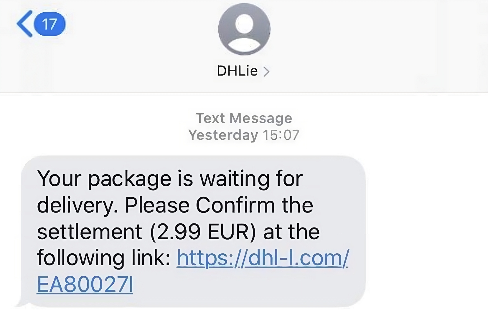

---

---

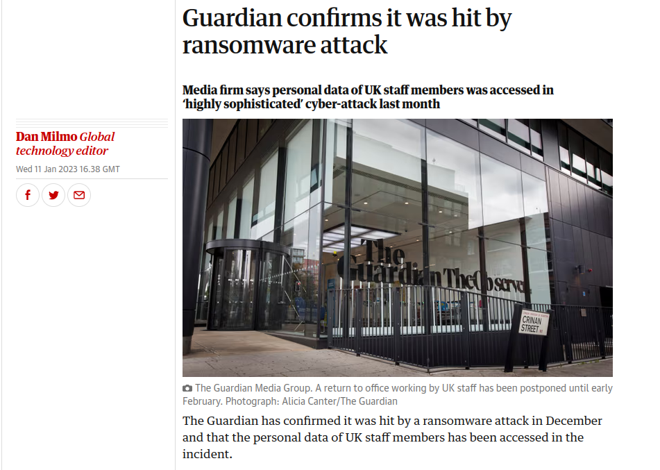

---

---

<!-- 
_backgroundColor: #0d3862 
_color: white -->

# 3 Parts

- ### Information Security
- ### Malware & Phishing
- ### Authentication & Behaviors

---

<!--
_backgroundColor: #0d3862
_color: white
-->

# Carl Strömstedt

- IT software developer
- Hobbies
  - Bouldering
  - Reading
  - Travel

---

<!-- 
_backgroundColor: #0d3862 
_color: white 
-->
# Part 1
## Information Security

---

<!--
_backgroundColor: #0d3862
_color: white
-->

# What is Information Security?

---

<!--
_backgroundColor: #0d3862
_color: white
-->

## Information Security

- Information security encompasses ensuring **confidentiality**, **integrity**, and **availability** of information.
- Information security is ensured when sufficient **technical**, **physical**, and **organizational** protective measures have been implemented.
- Information security is influenced, ensured, or improved by each individual.

---

<!--
_backgroundColor: #0d3862
_color: white
-->

<h1>
  <i class="fa-solid fa-mask fa-xl" style="margin-right: 15px"></i> Confidentiality
</h1>

<i class="fa-solid fa-pen-fancy fa-2xl" style="margin-right:20px; margin-top: 75px; margin-bottom: 35px"></i> Definition

Protection against unauthorized access to sensitive information to maintain privacy and confidentiality.

<i class="fa-solid fa-tools fa-2xl" style="margin-right:20px; margin-top: 75px; margin-bottom: 35px"></i> Example

The use of digital signatures guarantees that a document originates from a specific sender and remains unaltered.

<!--

CIA triad

Security goals, and basic building blocks

-->

---

<!--
_backgroundColor: #0d3862
_color: white
-->
<h1>
  <i class="fa-solid fa-file-shield fa-xl" style="margin-right: 15px"></i> Integrity
</h1>

<i class="fa-solid fa-pen-fancy fa-2xl" style="margin-right:20px; margin-top: 75px; margin-bottom: 35px"></i> Definition

Ensuring accuracy and consistency of data as well as the completeness and reliability of systems

<i class="fa-solid fa-tools fa-2xl" style="margin-right:20px; margin-top: 75px; margin-bottom: 35px"></i> Example

Digital signatures for emails ensure that a document originates from a specific sender

---

<!--
_backgroundColor: #0d3862
_color: white
-->
<h1>
  <i class="fa-solid fa-clock fa-xl" style="margin-right: 15px"></i> Availability
</h1>

<i class="fa-solid fa-pen-fancy fa-2xl" style="margin-right:20px; margin-top: 75px; margin-bottom: 35px"></i> Definition

Ensuring the constant accessibility of information and resources to minimize interruptions and failures.

<i class="fa-solid fa-tools fa-2xl" style="margin-right:20px; margin-top: 75px; margin-bottom: 35px"></i> Example

Regular maintenance and redundant server infrastructure ensure that a website is accessible at all times.

---

<!--
_backgroundColor: #0d3862
_color: white
-->

<h1 style="margin-bottom: -20px">
 Case studies
</h1>

1. An employee discovers an error in an approved protocol after a meeting. Rectifying this error would alter the content of the decision. Despite this, the employee makes the change, saves the modified protocol without informing colleagues, and without noting the change in the company repository.

2. A sales employee talks loudly about the details of an offer on a train. This discussion makes it possible for fellow passengers to know the affected company, key individuals, the scope, and the costs of the project.

3. Important business data becomes inaccessible due to an unplanned, short-notice maintenance window carried out by the IT service provider for software updates.

4. An employee clicks on a link in a message claiming they've won a lottery prize. They confirm the installation of a certificate in their browser to access the desired page. All data they send and receive is now decrypted, accessed, and altered by a third party for fraudulent purposes.

---

<!--
_backgroundColor: #0d3862
_color: white
-->

# Zoom Poll / Quiz

---

---

---

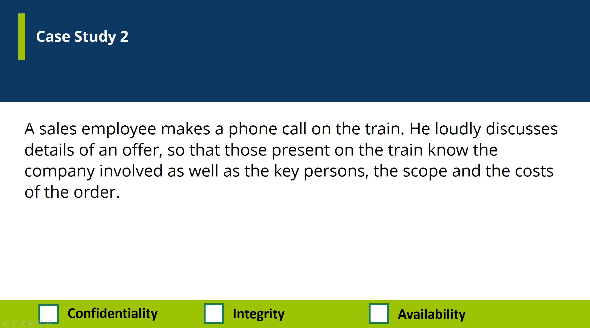

---

---

---

---

---

---

<!--
_backgroundColor: #0d3862
_color: white
-->

<h1 style="margin-bottom:20px; font-size:55px">
Examples of sensitive and valuable data
</h1>

<i class="fa-solid fa-credit-card fa-xl" style="font-size:100px"></i> 

Payment data

<i class="fa-solid fa-people-roof fa-xl" style="font-size:100px"></i>

Personal data

<i class="fa-solid fa-laptop-medical fa-xl" style="font-size: 100px"></i>

Health data

---

<!--
_backgroundColor: #0d3862
_color: white
-->

# Motivation of Attackers

<h2>
  Economic <i class="fa-solid fa-sack-dollar fa-xl" style="margin-left: 15px"></i> 
</h2>

- Personal Enrichment
- Elimination of Competitors
- Enhancement of Market Position

<h2>
  Political <i class="fa-solid fa-check-to-slot fa-xl" style="margin-left: 15px"></i> 
</h2>

- Influencing Elections
- Causing Reputation Damage to Competitors
- Spreading Religious or Political Content

<h2>
  Personal <i class="fa-solid fa-user fa-xl" style="margin-left: 15px"></i> 
</h2>

- Validation
- "For the LULZ" (Amusement)

---

<!--
_backgroundColor: white
_color: black
-->

---

<!--
_backgroundColor: white
_color: black
-->

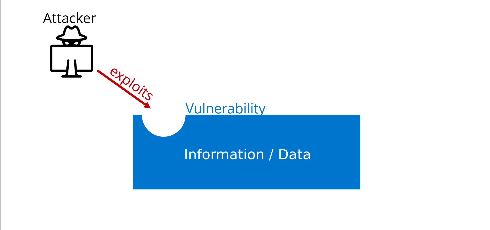

---

<!--
_backgroundColor: white
_color: black
-->

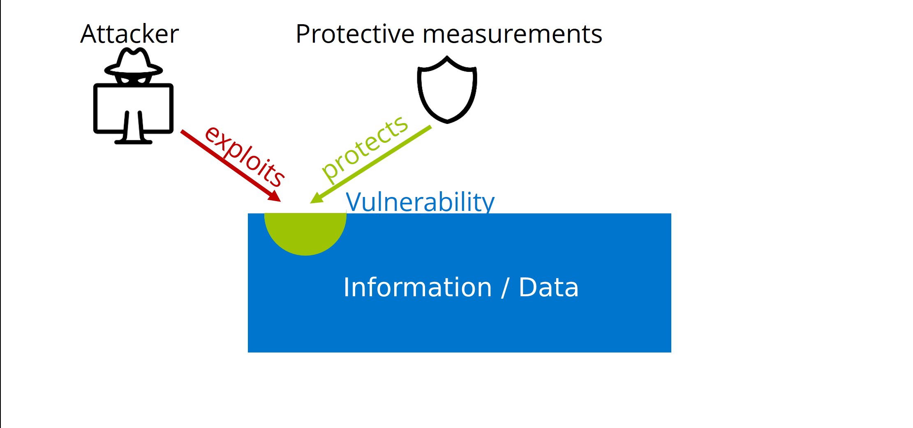

---

<!--
_backgroundColor: white
_color: black
-->

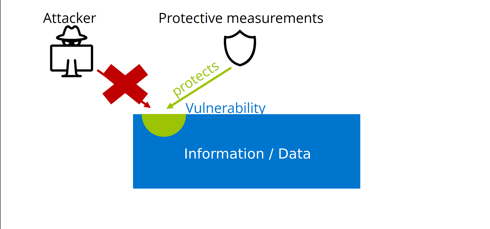

---

<!--
_backgroundColor: #0d3862
_color: white
-->

# Classification of information & data

<!--

To help us with our protective measurements / safeguarding our data it is helpful to use classifications

-->

---

<!--
_backgroundColor: #0d3862
_color: white
-->

# Information  requirements

Confidentiality <i class="fa-solid fa-mask fa-xl" style="margin-left:20px"></i> 

Integrity <i class="fa-solid fa-file-shield fa-xl" style="margin-left:20px"></i> 

Availability <i class="fa-solid fa-clock-rotate-left fa-xl" style="margin-left:20px"></i> 

<!--
security attributes
-->

---
<!--
_backgroundColor: #0d3862
_color: white
-->

# Classifications

<h2>
  Why?
</h2>

Helps us define guidelines

<h2>
  What do we classify?
</h2>

All data and assets

<h2>
  Which classifications do we use?
</h2>

- Confidential
- Internal
- Public

<!--
Today we will focus on 3 classifications according to ISO-Standards: Confidential Internal & Public. There is also the classification top secret, but that is mainly used in pharmaceutical companies and the military industy so we will not discuss that today.
-->

---

<!--
_backgroundColor: #0d3862
_color: white
-->

<h1>
  Confidential <i class="fa-solid fa-shield fa-xl" style="margin-left: 15px"></i> 
</h1>

## Storage

<i class="fa-solid fa-lock fa-xl" style="margin-right:20px"></i> Only authorized personnel have access 

## Transport

<i class="fa-solid fa-lock fa-xl" style="margin-right:20px"></i> Only encrypted and not via phone

## Processing

<i class="fa-solid fa-binoculars fa-xl" style="margin-right:20px"></i> Copying not allowed & printing is monitored

---

<!--
_backgroundColor: #0d3862
_color: white
-->

<h1>
  Internal <i class="fa-solid fa-shield-halved fa-xl" style="margin-left: 15px"></i> 
</h1>

## Storage

<i class="fa-solid fa-building-circle-check fa-xl" style="margin-right:20px"></i> All within the company have access

## Transport

<i class="fa-solid fa-unlock fa-xl" style="margin-right:20px"></i>  Unencrypted exchange is allowed

## Processing

<i class="fa-solid fa-pencil fa-xl" style="margin-right:20px"></i> Changes, copying, and printing allowed as needed

---

<!--
_backgroundColor: #0d3862
_color: white
-->

<h1>
  Public <i class="fa-solid fa-people-group fa-xl" style="margin-left: 15px"></i> 
</h1>

## Storage

<i class="fa-solid fa-box-open fa-xl" style="margin-right:20px"></i> Everyone has access

## Transport

<i class="fa-solid fa-people-group fa-xl" style="margin-right:20px"></i> Any type of exchange is allowed

## Processing

<i class="fa-solid fa-binoculars fa-check" style="margin-right:20px"></i> Changes should be comprehensible and traceable

---

<!--
_backgroundColor: #0d3862
_color: white
-->

# Information security incidents

<!--
So what happens when we have a security incident?
-->

---

<!--
_backgroundColor: white
_color: black
-->

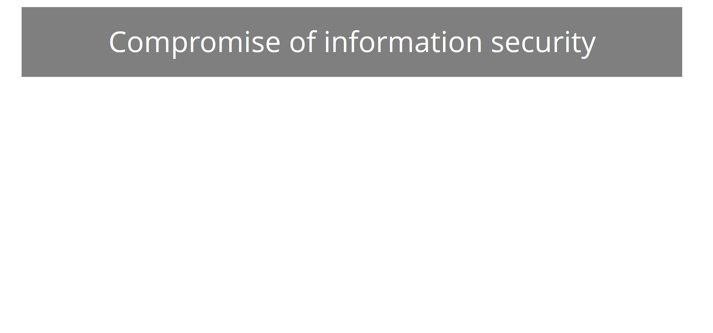

<!--
We can define a compromise of information security based on our CIA triad / our security goals.

It can be a compromise of one area or multiple of these three areas at the same time
-->

---

<!--
_backgroundColor: white
_color: black
-->

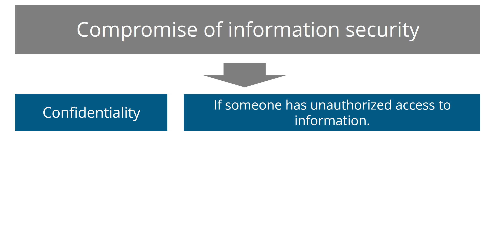

---

<!--
_backgroundColor: white
_color: black
-->

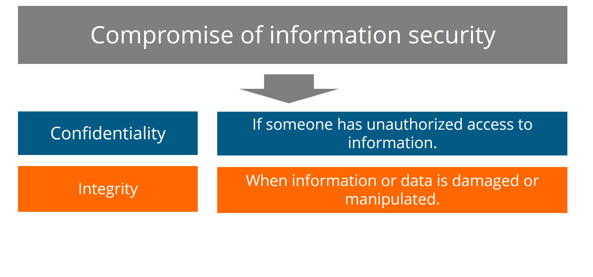

---

<!--
_backgroundColor: white
_color: black
-->

---

<!--
_backgroundColor: #cf7030
_color: white
-->

# Responding to a Security Incident

---

<!--
_backgroundColor: #cf7030
_color: white
-->

<i class="fa-solid fa-user-shield fa-2xl" style="margin-right:20px; margin-top: 30px; margin-bottom: 15px"></i> Suspicions

- If you observe anything suspicious, don't hesistate to report it to us

<i class="fa-solid fa-exclamation-triangle fa-2xl" style="margin-right:20px; margin-top: 30px; margin-bottom: 15px"></i> Reporting

- It's recommended to report via phone or create a support ticket.

<i class="fa-solid fa-envelope fa-2xl" style="margin-right:20px; margin-top: 30px; margin-bottom: 15px"></i> Forwarding

- Kindly forward suspicious phishing emails to support@open-circle.ch.

<!--
We are here for you

Our experts will take the necessary actions to deal with the incident

You can also add screenshots to a ticket to provide us with more information
-->

---

<!--
_backgroundColor: #187d4d
_color: white
-->

# How does Open Circle prevent inicidents?

<i class="fa-solid fa-window-maximize fa-2xl" style="margin-right:33px; margin-top: 25px; margin-bottom: 35px"></i> DNS-Filtering

<i class="fa-solid fa-envelope-open-text fa-2xl" style="margin-right:40px; margin-top: 25px; margin-bottom: 35px"></i>Spam-Filtering

<i class="fa-solid fa-sync fa-2xl" style="margin-right:40px; margin-top: 25px; margin-bottom: 35px"></i>Regular Server & Client Updates

<i class="fa-solid fa-user-shield fa-2xl" style="margin-right:25px; margin-top: 25px; margin-bottom: 35px"></i>2-Factor Authentication

<i class="fa-solid fa-user-pen fa-2xl" style="margin-right:20px; margin-top: 25px; margin-bottom: 35px"></i> Awareness Training

- Raise user awareness
- Promote threat awareness

<!--
There are a lot of technical tools. but in the end you as individuals have a big influence on information security.

This is also the reason why we're having this training today:

To raise your awareness as a user and to give an understanding of some of the threats that exist.
-->

---

<!--
_backgroundColor: #187d4d
_color: white
-->

# Part 1 - Conclusions

---

<!--
_backgroundColor: #187d4d
_color: white
-->

# Part 1 - Conclusions

## 3 security objectives

- Confidentiality
- Integrity
- Availability

## Risk

Secure vulnerabilities with protective measures

## 3 classifications

- Confidential
- Internal
- Public

## Security Incident

Feeling Uncertain? Suspicious?

<i class="fa-solid fa-arrow-right fa-xl" style="margin-right: 10px"></i> Report

<!-- 5 Minuten Pause
 -->

---

<!--
_backgroundColor: #0d3862
_color: white
-->

# Part 2

## Malware

---

<!--
_backgroundColor: #0d3862
_color: white
-->

<i class="fa-solid fa-virus-covid fa-xl" style="font-size:120px"></i> 

Viruses

<i class="fa-solid fa-horse fa-xl" style="font-size:120px"></i>

Trojans

<i class="fa-solid fa-user-secret fa-xl" style="font-size: 120px"></i>

Spyware

<i class="fa-solid fa-arrow-down-up-lock fa-xl" style="font-size: 120px"></i>

Ransomware

<!-- 
So we will look at four groups of malware today. There are many subgroups and variants but we will focus on these as they are some of the most important ones to know
-->

 ---

 <!--
_backgroundColor: #0d3862
_color: white
-->

<h1>
  <i class="fa-solid fa-virus fa-xl" style="margin-right: 15px"></i> Viruses
</h1>

Malicious programs that attach to other files and can replicate themselves.

<i class="fa-solid fa-viruses fa-2xl" style="margin-right:20px; margin-top: 75px; margin-bottom: 35px"></i> Spread

Through infected files, email attachments, or infected websites.

<!--

The name virus itself indicates that there are similiarities to biological viruses,

Viruses are software that focus on infiltrating files and systems and to replicate themselves.

Damage: Data destruction, system crashes, network propagation.

-->

---

 <!--
_backgroundColor: #e74c3c
_color: white
-->
<h1>
  <i class="fa-solid fa-biohazard fa-xl" style="margin-right: 15px"></i> Case study: Stuxnet Virus
</h1>

<i class="fa-solid fa-virus-slash fa-2xl" style="margin-right:20px; margin-top: 75px; margin-bottom: 35px"></i> Stuxnet Virus

- Discovered in 2010
- A complex computer worm targeting industrial systems.

<i class="fa-solid fa-tools fa-2xl" style="margin-right:20px; margin-top: 75px; margin-bottom: 35px"></i> Ziel und Auswirkungen

- Mainly targeted Iranian nuclear reactors
- Manipulated control systems and caused damage to 1/5 of Irans reactors

<!-- 
Stuxnet, discovered by Sergey Ulasen, initially spread via Microsoft Windows, and targeted Siemens industrial control systems.

Stuxnet has three modules: a worm that executes all routines related to the main payload of the attack; 

a link file that automatically executes the propagated copies of the worm; 

and a rootkit component responsible for hiding all malicious files and processes, to prevent detection of Stuxnet.[11] 

It is typically introduced to the target environment via an infected USB flash drive, thus crossing any air gap. The worm then propagates across the network, scanning for Siemens Step7 software on computers controlling a PLC

Stuxnet reportedly compromised Iranian PLCs, collecting information on industrial systems and causing the fast-spinning centrifuges to tear themselves apart.

PLC (Programmable Logic Controllers)
-->

---

 <!--
_backgroundColor: #e74c3c
_color: white
-->

<i class="fa-solid fa-user-secret fa-2xl" style="margin-right:20px; margin-top: 75px; margin-bottom: 35px"></i> Complexity

- Exploited zero-day vulnerabilities
- Utilized multiple attack vectors

<i class="fa-solid fa-shield-alt fa-2xl" style="margin-right:20px; margin-top: 75px; margin-bottom: 35px"></i> Lehren

- Demonstrates the potential for targeted attacks on critical infrastructure
- Emphasizes the importance of security awareness and protective measures

<!-- 
Stuxnet, discovered by Sergey Ulasen, initially spread via Microsoft Windows, and targeted Siemens industrial control systems.

Stuxnet has three modules: a worm that executes all routines related to the main payload of the attack; 

a link file that automatically executes the propagated copies of the worm; 

and a rootkit component responsible for hiding all malicious files and processes, to prevent detection of Stuxnet.[11] 

It is typically introduced to the target environment via an infected USB flash drive, thus crossing any air gap. The worm then propagates across the network, scanning for Siemens Step7 software on computers controlling a PLC

Stuxnet reportedly compromised Iranian PLCs, collecting information on industrial systems and causing the fast-spinning centrifuges to tear themselves apart.

PLC (Programmable Logic Controllers)
-->

---

<iframe width="1100" height="800" src="https://www.youtube.com/embed/7VgIayOpjEc" title="YouTube video player" frameborder="0" allow="accelerometer; autoplay; clipboard-write; encrypted-media; gyroscope; picture-in-picture; web-share" allowfullscreen></iframe>

<!-- 
To give some visual context we'll look at a short movie trailer for a documentary about stuxnet. It may be a bit hollywody / sensationalized but i still think it is interesting to have a look at
-->

---

 <!--
_backgroundColor: #0d3862
_color: white
-->

<h1>
  <i class="fa-solid fa-horse fa-xl" style="margin-right: 15px"></i> Trojans
</h1>

Malicious programs that disguise themselves as legitimate software to infiltrate systems unnoticed.

<i class="fa-solid fa-viruses fa-2xl" style="margin-right:20px; margin-top: 75px; margin-bottom: 35px"></i> Spread

Can spread through fake email attachments, infected downloads, or drive-by downloads.

<!--
Data theft, identity theft, complete system takeovers
-->

---

 <!--
_backgroundColor: #0d3862
_color: white
-->

<h1>
  <i class="fa-solid fa-user-secret fa-xl" style="margin-right: 15px"></i> Spyware 
</h1>

Secretly gathers information about users and their activities.

<i class="fa-solid fa-viruses fa-2xl" style="margin-right:20px; margin-top: 75px; margin-bottom: 35px"></i> Spread

Through software bundling, infected links, or drive-by downloads.

<!--
Privacy breaches, identity theft, financial losses.
-->

---

 <!--
_backgroundColor: #0d3862
_color: white
-->

<h1>
  <i class="fa-solid fa-arrow-down-up-lock fa-xl" style="margin-right: 15px"></i> Ransomware
</h1>

Locks or encrypts data, demands ransom for restoration.

<i class="fa-solid fa-viruses fa-2xl" style="margin-right:20px; margin-top: 75px; margin-bottom: 35px"></i> Spread

Through infected email attachments, exploit kits, or malicious downloads.

<!--
Data loss, financial losses, business interruptions.
-->

---

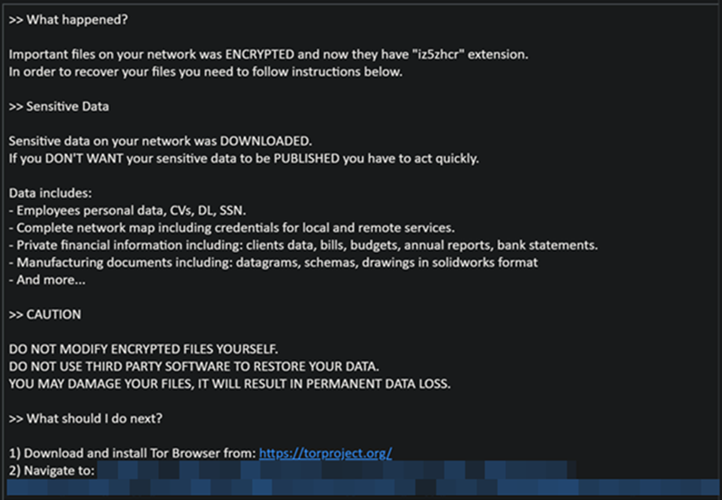

<!-- link: https://www.microsoft.com/en-us/security/blog/2022/06/13/the-many-lives-of-blackcat-ransomware/
 -->

---

 <!--
_backgroundColor: #0d3862
_color: white
-->

# Attack components

What do attackers use for their attacks?

---

 <!--
_backgroundColor: #0d3862
_color: white
-->

<h1>
  Technical aspects <i class="fa-solid fa-cogs fa-xl" style="margin-right: 15px; margin-left: 20px; margin-bottom: 50px;"></i> 
</h1>

<h1>
  Social aspects <i class="fa-solid fa-users-line fa-xl" style="margin-right: 15px; margin-left: 20px"></i> 
</h1>

---

 <!--
_backgroundColor: #0d3862
_color: white
-->

# Technical aspects

- Drive-by-Download <i class="fa-solid fa-globe fa-xl" style="margin-left: 15px"></i>
- Drive-by-Installer <i class="fa-solid fa-arrow-down fa-xl" style="margin-left: 15px"></i>
- Email Attachments <i class="fa-solid fa-envelope fa-xl" style="margin-left: 15px"></i>
- Software Bundling <i class="fa-solid fa-box fa-xl" style="margin-left: 15px"></i>

---

<!--
_backgroundColor: #0d3862
_color: white
-->
<h1>
  <i class="fa-solid fa-globe fa-xl" style="margin-right: 15px"></i> Drive-by-Download
</h1>

Automatic download of malware when visiting an infected website.

<i class="fa-solid fa-gears fa-2xl" style="margin-right:20px; margin-top: 75px; margin-bottom: 35px"></i> Mechanism

Exploiting security vulnerabilities in the browser or plugins to inject malicious code.

<!--
Unnoticed infection, propagation of viruses, trojans, or ransomware.
-->

---
<!--
_backgroundColor: #f4f1ec
_color: black
-->

<!-- link: https://us.norton.com/blog/malware/what-are-drive-by-downloads
 -->

---

<!--
_backgroundColor: #f4f1ec
_color: black
-->

---
<!--
_backgroundColor: #0d3862
_color: white
-->
<h1>
  <i class="fa-solid fa-envelope fa-xl" style="margin-right: 15px"></i> Email Attachments
</h1>

Attachments that exploit vulnerabilities in software (such as document readers) when opened, to install malware.

<i class="fa-solid fa-cogs fa-2xl" style="margin-right:20px; margin-top: 75px; margin-bottom: 35px"></i> Mechanism

Exploiting software vulnerabilities, executing macros.

<i class="fa-solid fa-house-chimney-crack fa-2xl" style="margin-right:20px; margin-top: 75px; margin-bottom: 35px"></i> Risiken

Unnoticed infection, installation of rootkits, data theft.

---

<!--
_backgroundColor: #0d3862
_color: white
-->
<h1>
  <i class="fa-solid fa-box fa-xl" style="margin-right: 15px"></i> Software Bundling
</h1>

Malware is bundled with legitimate software and installed alongside it.

<i class="fa-solid fa-gears fa-2xl" style="margin-right:20px; margin-top: 75px; margin-bottom: 35px"></i> Mechanism

Users often do not notice the malware as it uses trusted software as a disguise.

---

<!--
_backgroundColor: #0d3862
_color: white
-->
<h1>
  <i class="fa-solid fa-tree fa-xl" style="margin-right: 15px"></i> Rootkits
</h1>

Rootkits are malicious software that deeply infiltrates a computer system and gains access at various levels.

<i class="fa-solid fa-gears fa-2xl" style="margin-right:20px; margin-top: 75px; margin-bottom: 35px"></i> Mechanism

By accessing the system level, rootkits can acquire administrative privileges and compromise systems.

<i class="fa-solid fa-house-chimney-crack fa-2xl" style="margin-right:20px; margin-top: 75px; margin-bottom: 35px"></i> Risiks

Unauthorized data access, masking of malware.

---

<!--
_backgroundColor: #f4f1ec
_color: white
-->

---

<!--
_backgroundColor: #187d4d
_color: white
-->

<h1>
  <i class="fa-solid fa-shield-alt fa-xl" style="margin-right: 15px"></i> Protection against Malware
</h1>

<i class="fa-solid fa-arrow-rotate-left fa-2xl" style="margin-right:20px; margin-top: 40px; margin-bottom: 35px"></i> Software updates

Keep your operating system and all software up to date to protect against known security vulnerabilities.

<i class="fa-solid fa-envelope fa-2xl" style="margin-right:20px; margin-top: 40px; margin-bottom: 35px"></i> Caution with emails

Do not open email attachments or click on links from unknown or suspicious senders.

<i class="fa-solid fa-user-shield fa-2xl" style="margin-right:20px; margin-top: 40px; margin-bottom: 35px"></i> Behavioral Awareness

Be cautious when downloading files from the internet and avoid questionable websites.

---

<!--
_backgroundColor: #0d3862
_color: white
-->

# Social aspects

---

<!--
_backgroundColor: #0d3862
_color: white
-->

# Social Engineering

Manipulation of individuals by exploiting trust, curiosity, or pressure to reveal confidential information or perform unauthorized actions.

## Methods

- Phishing
- Vishing (Phone)

---

<!--
_backgroundColor: #0d3862
_color: white
-->
<h1>
  <i class="fa-solid fa-fish fa-xl" style="margin-right: 15px"></i> Phishing
</h1>

Deception of users to steal confidential information such as passwords or financial data.

<i class="fa-solid fa-viruses fa-2xl" style="margin-right:20px; margin-top: 75px; margin-bottom: 35px"></i> Methods

Fake emails, websites, or social media that appear genuine to build trust.

<!--
Identity theft, financial losses, unauthorized access to personal accounts.
-->

---

<!--
_backgroundColor: #f4f1ec
_color: white
-->

---

<!--
_backgroundColor: #f4f1ec
_color: white
-->

---

---

<!--
_backgroundColor: #f4f1ec
_color: white
-->

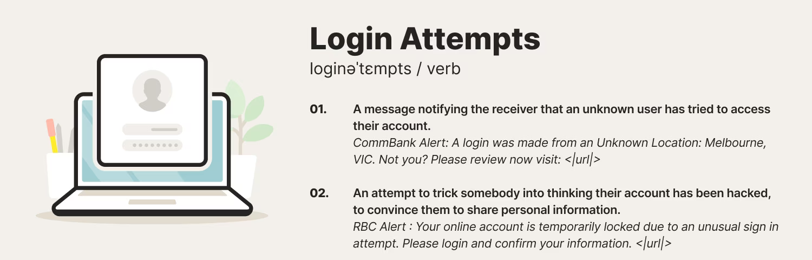

---

---

<!--
_backgroundColor: #f4f1ec
_color: white
-->

---

<!--
_backgroundColor: #f4f1ec
_color: white
-->

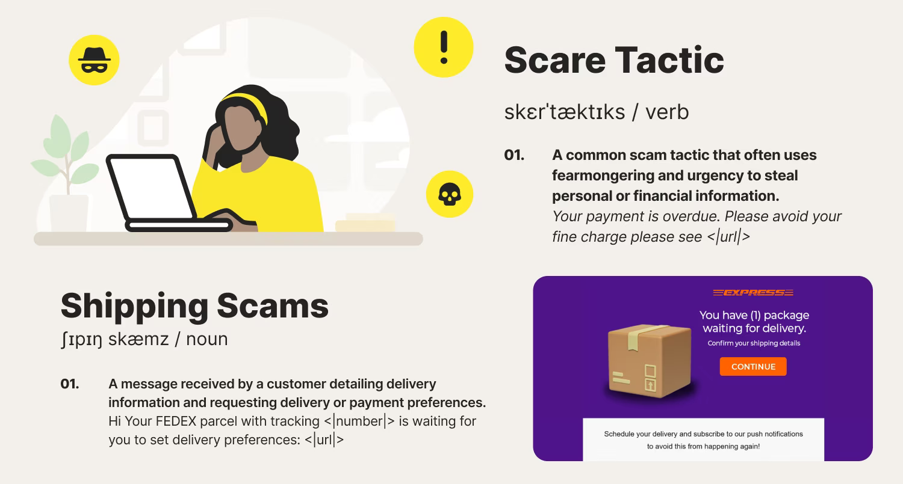

---

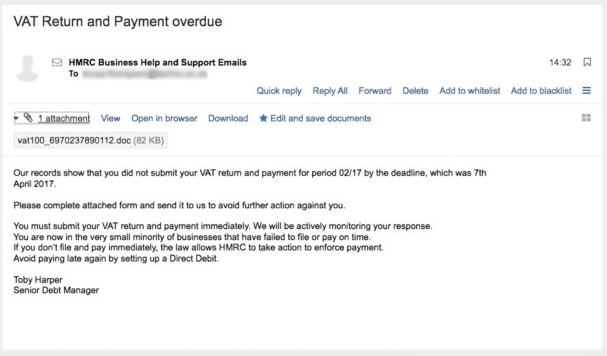

---

---

<!--
_backgroundColor: #f4f1ec
_color: white
-->

---

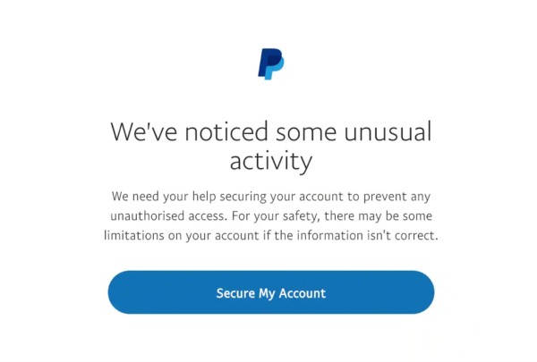

---

<!--
_backgroundColor: #c78928
_color: white
-->
<h1>
  <i class="fa-solid fa-phone-volume fa-xl" style="margin-right: 15px"></i> Vishing: Voice Phishing
</h1>

<i class="fa-solid fa-info-circle fa-2xl" style="margin-right:20px; margin-top: 45px; margin-bottom: 30px"></i> What is Vishing?

Vishing, short for "Voice Phishing," involves scammers impersonating legitimate organizations over the phone to extract confidential information.

<i class="fa-solid fa-shield-alt fa-2xl" style="margin-right:20px; margin-top: 30px; margin-bottom: 30px"></i> Safeguarding

- Approach unexpected calls with skepticism.
- Verify the caller's identity.
- Avoid revealing sensitive information over the phone.

---

<!--
_backgroundColor: #0d3862
_color: white
-->
<h1>
  <i class="fa-solid fa-dumpster fa-xl" style="margin-right: 15px"></i> Dumpster Diving
</h1>

Searching for sensitive information in physical trash to gain unauthorized access to confidential data.

<i class="fa-solid fa-crosshairs fa-2xl" style="margin-right:20px; margin-top: 75px; margin-bottom: 35px"></i> Goal

Examining paper documents, outdated hardware, overlooked information.

<i class="fa-solid fa-check fa-2xl" style="margin-right:20px; margin-top: 75px; margin-bottom: 35px"></i> How to avoid

Dispose old hardware and documents according to company standards

<!--
Potential theft of confidential data, risk of identity theft.
-->

---

<!--
_backgroundColor: #cf7030
_color: white
-->

<h1>
  <i class="fa-solid fa-shield-alt fa-xl" style="margin-right: 15px"></i> Phishing Detection
</h1>

<i class="fa-solid fa-pencil fa-2xl" style="margin-right:20px; margin-top: 40px; margin-bottom: 35px"></i> Grammar and Greetings

Be alert to incorrect grammar and generic salutations such as "Dear Sir or Madam."

<i class="fa-solid fa-gift fa-2xl" style="margin-right:20px; margin-top: 40px; margin-bottom: 35px"></i> Unrealistic Promises

If an offer seems too good to be true, it's likely not genuine.

<i class="fa-solid fa-envelope fa-2xl" style="margin-right:20px; margin-top: 40px; margin-bottom: 35px"></i> Requests for Confidential Data

Never share sensitive information in response to email requests. Legitimate institutions typically don't ask for such details through email.

---

<!--
_backgroundColor: #cf7030
_color: white
-->

<i class="fa-solid fa-user-friends fa-2xl" style="margin-right:20px; margin-top: 40px; margin-bottom: 35px"></i> Unknown Senders

Delete unsolicited emails from unfamiliar senders or services you're not familiar with. Refrain from opening them or clicking on links or attachments.

<i class="fa-solid fa-clock fa-2xl" style="margin-right:20px; margin-top: 40px; margin-bottom: 35px"></i> Time Constraints

Exercise caution with emails that pressure you for urgent actions. Scammers often create artificial urgency to coerce quick responses.

<i class="fa-solid fa-at fa-2xl" style="margin-right:20px; margin-top: 40px; margin-bottom: 35px"></i> Incorrect Email Addresses and Domain Names

Inspect suspicious emails for accurate sender addresses and domain names. Acting impulsively might cause you to overlook subtle details.

---

<!--
_backgroundColor: white
_color: white
-->

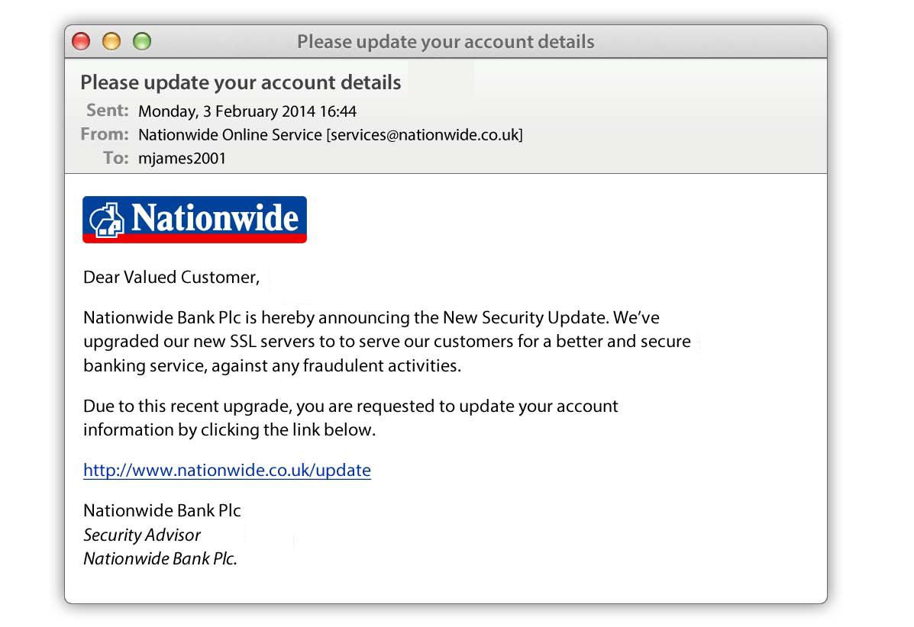

---

<!--
_backgroundColor: white
_color: white
-->

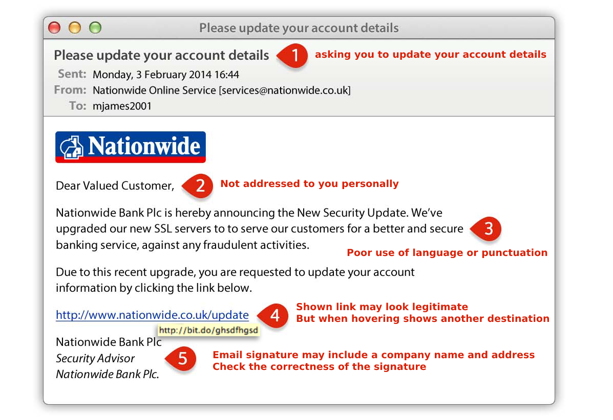

---

<!--
_backgroundColor: #27ae60
_color: white
-->
# Why Use Email Signatures?

<i class="fa-solid fa-pen-fancy fa-2xl" style="margin-right:20px; margin-top: 30px; margin-bottom: 15px"></i> Verification

- Email signatures confirm the sender's identity.
- Recipients can validate the message's authenticity.

<i class="fa-solid fa-fingerprint fa-2xl" style="margin-right:20px; margin-top: 30px; margin-bottom: 15px"></i> Trust

- Enhances recipients' confidence in the message's source.
- Helps detect phishing and counterfeit emails.

<i class="fa-solid fa-file-signature fa-xl" style="margin-right:20px; margin-top: 30px; margin-bottom: 15px"></i> Integrity

- Guards against unauthorized changes to the message.
- Ensures the message remains unaltered for recipients.

---

<!--
_backgroundColor: #3498db
_color: white
-->
<h1>
  <i class="fa-solid fa-certificate fa-xl" style="margin-right: 15px"></i> SSL- & TLS Certificates
</h1>

<i class="fa-solid fa-stamp fa-2xl" style="margin-right:20px; margin-top: 45px; margin-bottom: 20px"></i> Function

- SSL certificates are used for the security and encryption of data transmissions on the internet.

<i class="fa-solid fa-check-circle fa-2xl" style="margin-right:20px; margin-top: 5px; margin-bottom: 20px"></i> Trust and Validation

- Browsers trust websites with valid SSL certificates.
- Certificates are issued and validated by Certification Authorities (CAs).

<i class="fa-solid fa-lock fa-2xl" style="margin-right:20px; margin-top: 5px; margin-bottom: 20px"></i> Visual Indications

- Browsers provide visual cues for secure connections, such as a closed padlock or "https" in the URL.

---

---
<!--
_backgroundColor: #3498db
_color: white
-->
# How Encryption Works

<i class="fa-solid fa-lock fa-xl" style="margin-right:20px; margin-top: 30px; margin-bottom: 15px"></i> Encryption

- Safeguards confidential data from unauthorized access.
- Messages are converted into an unreadable format.

<i class="fa-solid fa-key fa-2xl" style="margin-right:20px; margin-top: 25px; margin-bottom: 15px"></i> Keys

- A decryption key is required to revert encrypted messages.
- Public keys for encryption, private keys for decryption.

<i class="fa-solid fa-code fa-2xl" style="margin-right:20px; margin-top: 25px; margin-bottom: 15px"></i> Techniques

- Symmetric Encryption: Same key for encrypting and decrypting.
- Asymmetric Encryption: Two keys, public and private.

---

<!--
_backgroundColor: #f4f3f3
_color: white
-->

---

<!--
_backgroundColor: #3498db
_color: white
-->
<h1>
  <i class="fa-solid fa-envelope fa-xl" style="margin-right: 15px"></i> Emails & Postcards
</h1>

<i class="fa-solid fa-envelope-open-text fa-2xl" style="margin-right:20px; margin-top: 75px; margin-bottom: 35px"></i> Standard Emails

- Similar to postcards: Contents can be accessed by third parties.
- Unencrypted emails can be intercepted and read during transmission.

<i class="fa-solid fa-lock fa-2xl" style="margin-right:20px; margin-top: 75px; margin-bottom: 35px"></i> Encrypted Emails

- Encrypted mails comparable to personal deliveries.
- Ensures identity verification before content is accessed.

---
<!--
_backgroundColor: black
_color: white
-->

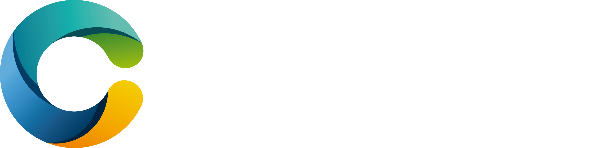</img> 

<h1 style="margin-bottom: -20px" > Secure-E-Mail </h1>
<h3> Communicate Securely via Email </h3>

With Secure Email, you can easily send signed and encrypted emails.

- Email Signing
- Spam Filter
- Outlook Add-In

---

<!--
_backgroundColor: #187d4d
_color: white
-->

# Part 2- Conclusions

---

<!--
_backgroundColor: #187d4d
_color: white
-->

<h1 style="margin-bottom:-20px">
Part 2 - Conclusions
</h1>

## Malware

- Viruses
- Trojans
- Spyware
- Ransomware

## Technology

- Drive-by Download 
- Drive-by Installer 
- Email Attachments 
- Software Bundling 

## Social Aspect

- Phishing
- Vishing (Phone)

## Social Engineering

Manipulation of people through exploitation of emotions

<!-- 5 Minuten Pause
 -->

---

<!--
_backgroundColor: #0d3862
_color: white
-->

# Block 3
## Authentication & Behaviors

---

<!--
_backgroundColor: #0d3862
_color: white
-->

## Authentication

Credentials such as a username and password are provided

Server then verifies the identity of the person, device, or system

## Authorization

What actions or resources a user or entity is allowed to access or perform

Permissions and privileges associated with a specific identity
<!--
If the verification is successful, the user or device is considered authentic and is granted access to the relevant resources or services.

There is also authorization after they have been authenticated. 

It defines the permissions and privileges associated with a specific identity. 
-->

---

<!--
_backgroundColor: #2c3e50
_color: white
-->
<h1>
  <i class="fa-solid fa-fingerprint fa-xl" style="margin-right: 15px"></i> Forms of Authentication
</h1>

<i class="fa-solid fa-brain fa-2xl" style="margin-right:20px; margin-top: 40px; margin-bottom: 35px"></i> Knowledge (Passwords)

- Username and secret password
- Vulnerable to phishing and social engineering techniques

<i class="fa-solid fa-key fa-2xl" style="margin-right:20px; margin-top: 40px; margin-bottom: 35px"></i> Possession (Physical Keys)

- Hardware tokens, smartcards, USB keys
- Enhanced security, requires physical access

<i class="fa-solid fa-eye-slash fa-2xl" style="margin-right:20px; margin-top: 40px; margin-bottom: 35px"></i> Biometrics

- Fingerprint, facial recognition, iris scan
- Unique physical characteristics for identification
---

<!--
_backgroundColor: #2c3e50
_color: white
-->
<h1>
  <i class="fa-solid fa-hammer fa-xl" style="margin-right: 15px"></i> Brute Forcing
</h1>

<i class="fa-solid fa-clock fa-2xl" style="margin-right:20px; margin-top: 75px; margin-bottom: 35px"></i> What is Brute Forcing?

- Method of trying all possible combinations
- Objective: Guessing passwords or secret information

<i class="fa-solid fa-hourglass-half fa-2xl" style="margin-right:20px; margin-top: 75px; margin-bottom: 35px"></i> Example

- Password: "secure123"
- Estimated time to crack: Weeks to months

<i class="fa-solid fa-triangle-exclamation fa-2xl" style="margin-top:25px; margin-left:25px; margin-right:15px"></i> Wordlists significantly reduce this time

<!--

I wont provide any concrete times on password brute forcing since it can change very quickly in either direction.

What i will say, is that wordlists have a significant influence on the time it takes to brute force

-->

---

<!--
_backgroundColor: #d16258
_color: white
-->
<h1>
  <i class="fa-solid fa-lines-leaning fa-xl" style="margin-right: 15px"></i> Domino Effect
</h1>

<i class="fa-solid fa-lock fa-2xl" style="margin-right:20px; margin-top: 30px; margin-bottom: 25px"></i> What causes the Domino Effect?

- Reusing the same password for different accounts

<i class="fa-solid fa-warning fa-2xl" style="margin-right:20px; margin-top: 30px; margin-bottom: 25px"></i> Risks

- Attackers exploit this vulnerability.
- A cracked password grants access to multiple accounts.

---

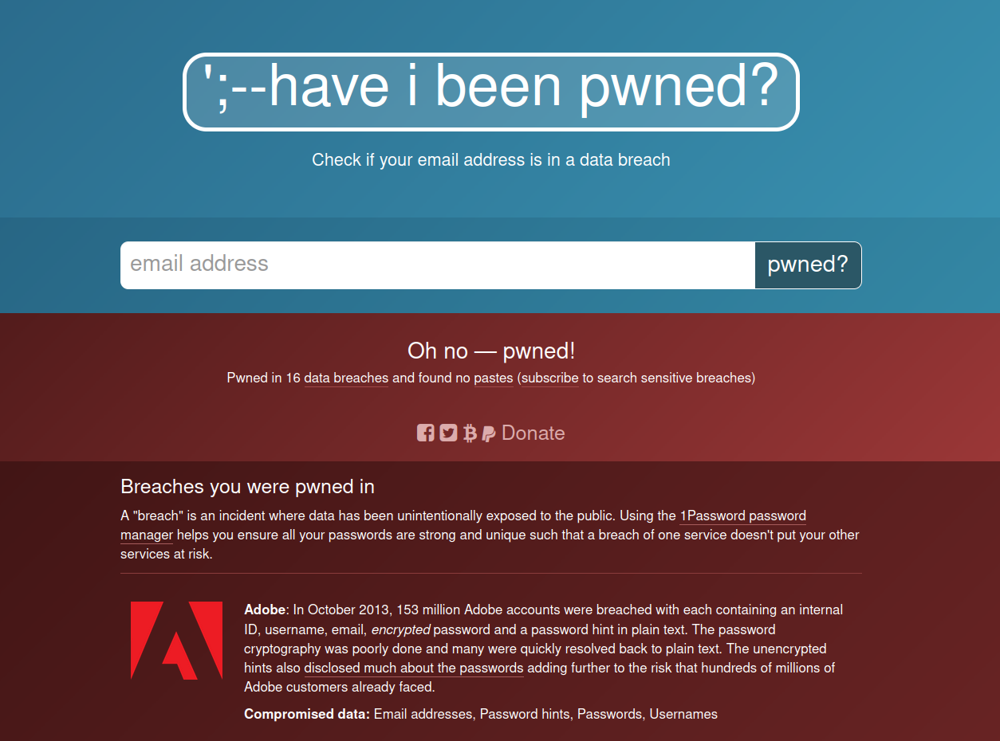

---

<!--
in January 2019, a large collection of credential stuffing lists (combinations of email addresses and passwords used to hijack accounts on other services) was discovered being distributed on a popular hacking forum. The data contained almost 2.7 billion records including 773 million unique email addresses alongside passwords

Some Passwordmanagers have a function built in which lets you check if your password is in a leaked list.
-->

---
<!--
_backgroundColor: #187d4d
_color: white
-->

<h1>
<i class="fa-solid fa-circle-check fa-2xl" style="margin-right:20px; margin-top: 75px; margin-bottom: 35px"></i> Password recommendations
</h1>

<i class="fa-solid fa-1 fa-2xl" style="margin-right:4px; margin-top: 40px; margin-bottom: 25px"></i><i class="fa-solid fa-2 fa-2xl" style="margin-right:20px; margin-top: 40px; margin-bottom: 25px"></i> Use at least 12 characters

<i class="fa-solid fa-hashtag fa-2xl" style="margin-right:20px; margin-top: 40px; margin-bottom: 25px"></i> Combination of uppercase letters, lowercase letters, numbers, and symbols.

<i class="fa-solid fa-bridge fa-2xl" style="margin-right:20px; margin-top: 40px; margin-bottom: 25px"></i> Use mnemonics instead of Words

<i class="fa-solid fa-dice-one fa-2xl" style="margin-right:20px; margin-top: 40px; margin-bottom: 25px"></i> Employ a unique password for each account.

<i class="fa-solid fa-list-check fa-2xl" style="margin-right:20px; margin-top: 40px; margin-bottom: 25px"></i> Use password managers for effective management.

<i class="fa-solid fa-key fa-xl" style="margin-right:20px; margin-top: 40px; margin-bottom: 25px"></i><i class="fa-solid fa-key fa-xl" style="margin-right:20px; margin-top: 40px; margin-bottom: 25px"></i> Use Multi-Factor Authentication (MFA) if available.

<!--
mnemonic

a device such as a pattern of letters, ideas, or associations that assists in remembering something, for example Richard Of York Gave Battle In Vain for the colours of the spectrum (red, orange, yellow, green, blue, indigo, violet).
-->

---

<iframe width="1100" height="800" src="https://www.youtube.com/embed/opRMrEfAIiI" title="YouTube video player" frameborder="0" allow="accelerometer; autoplay; clipboard-write; encrypted-media; gyroscope; picture-in-picture; web-share" allowfullscreen></iframe>

---

<!--
_backgroundColor: #0d3862
_color: white
-->

<h1>
  <i class="fa-solid fa-key fa-xl" style="margin-right: 15px"></i> Passwort-Manager
</h1>

<i class="fa-solid fa-question fa-2xl" style="margin-right:20px; margin-top: 35px; margin-bottom: 25px"></i> What is a Password Manager?

- Stores and manages secure passwords
- Generates random, complex passwords

<i class="fa-solid fa-plus fa-2xl" style="margin-right:20px; margin-top: 35px; margin-bottom: 25px"></i> Benefits

- No need to memorize
- Prevents password reuse

<i class="fa-solid fa-gears fa-2xl" style="margin-right:20px; margin-top: 30px; margin-bottom: 25px"></i> How They Work

- Master password for access
- Secure storage of encrypted password data

---

<!--
_backgroundColor: black
_color: white
-->

</img> 

# Password-Manager

With the Password Manager Safe, you can save, manage, and share logins, passwords, and other sensitive data.

- Browser Plugin

- Hosted in Switzerland

- 2-Factor Authentication

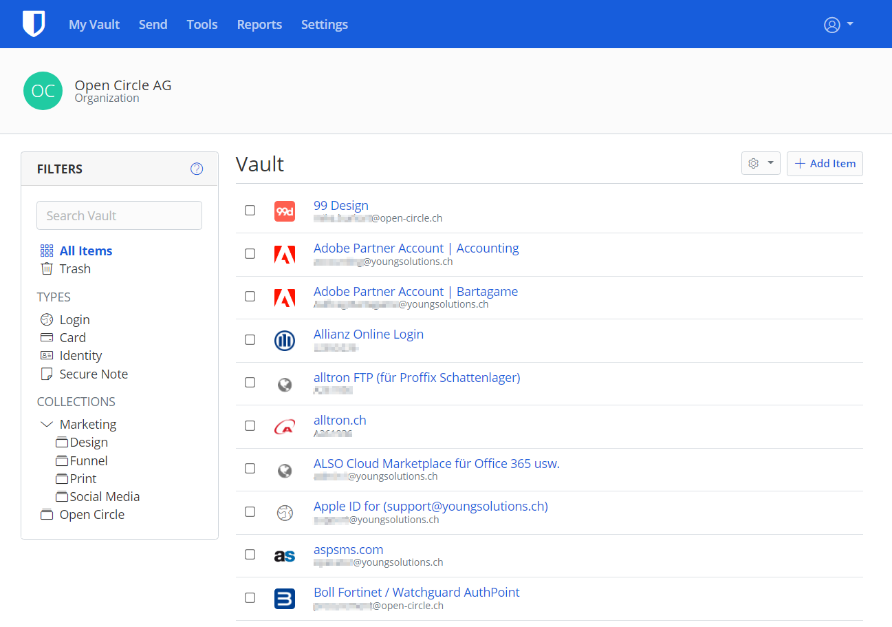

---

<!--
_backgroundColor: #0d3862
_color: white
-->

# Behaviors

## Behavior in Public Networks <i class="fa-solid fa-wifi fa-xl" style="margin-left: 15px"></i>

## Clean Desk Policy <i class="fa-solid fa-spray-can-sparkles fa-xl" style="margin-left: 15px"></i>

---

<!--
_backgroundColor: #2980b9
_color: white
-->
<h1>
  <i class="fa-solid fa-wifi fa-xl" style="margin-right: 15px"></i> Behavior in public networks
</h1>

<i class="fa-solid fa-lock fa-2xl" style="margin-right:20px; margin-top: 40px; margin-bottom: 25px"></i> Using Public Networks

- Risk of Man-in-the-Middle attacks and data snooping.
- Avoid online banking and sensitive activities.

<i class="fa-solid fa-user-shield fa-2xl" style="margin-right:20px; margin-top: 40px; margin-bottom: 25px"></i> Tips

- Disable file and network sharing.
- Use secure websites (HTTPS).
- Employ VPN for encrypted connection.

<i class="fa-solid fa-car-tunnel fa-2xl" style="margin-right:20px; margin-top: 40px; margin-bottom: 25px"></i> Virtual Private Network (VPN)

- Encrypts internet traffic through a secure tunnel.

---

<!--
_backgroundColor: #5f8f9e
_color: white
-->
<h1>
  <i class="fa-solid fa-spray-can-sparkles fa-xl" style="margin-right: 15px"></i> Clean Desk Policy
</h1>

<i class="fa-solid fa-question-circle fa-2xl" style="margin-right:20px; margin-top: 40px; margin-bottom: 35px"></i> Purpose of a Clean Desk Policy

The Clean Desk Policy upholds the CIA principles:

- Confidentiality
- Integrity
- Availability

<i class="fa-solid fa-lock fa-2xl" style="margin-right:20px; margin-top: 40px; margin-bottom: 35px"></i> Security Concerns

An unorganized workspace can pose security risks:

- Unauthorized use of logged-in user accounts
- Access to sensitive documents

---

<!--
_backgroundColor: #5f8f9e
_color: white
-->

<i class="fa-solid fa-trash fa-2xl" style="margin-right:20px; margin-top: 40px; margin-bottom: 35px"></i> Implementation

The policy encompasses:

- Regular workspace cleaning
- Logging out before leaving
- Concealing confidential data

<i class="fa-solid fa-user-secret fa-2xl" style="margin-right:20px; margin-top: 40px; margin-bottom: 35px"></i> Defense against Espionage

Safeguards against:

- Employees
- Third-party personnel (e.g., cleaning staff)
- Misuse of identities

---

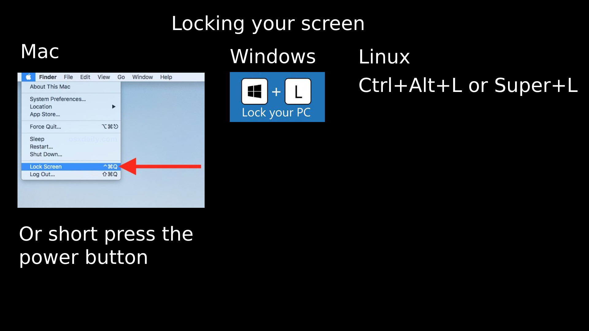

---

<!--
_backgroundColor: #187d4d
_color: white
-->

# Part 3 - Conclusion

---

<!--
_backgroundColor: #187d4d
_color: white
-->

# Part 3 - Conclusion

## Password Recommendations

- Use a unique password for each account
- Utilize password managers for management
- Employ Multi-Factor Authentication (MFA)

## Clean Desk Policy

- The Clean Desk Policy supports the VIV principles

## Lock your screen!

<!-- 5 Minuten Pause
 -->

---

<!--
_backgroundColor: #187d4d
_color: white
-->

# Links

- Check Email Address
https://haveibeenpwned.com
- Check Password
https://haveibeenpwned.com/passwords
- National Cybersecurity Centre:
https://www.melani.admin.ch/melani/en/home.html
- Password Safe
https://www.open-circle.ch/passwort-manager/
- Information is Beautiful
    https://www.informationisbeautiful.net/visualizations/worlds-biggest-data-breaches-hacks/

---

<!--
_backgroundColor: #187d4d
_color: white
-->

- Phishing quiz 
https://phishingquiz.withgoogle.com/

--- 

