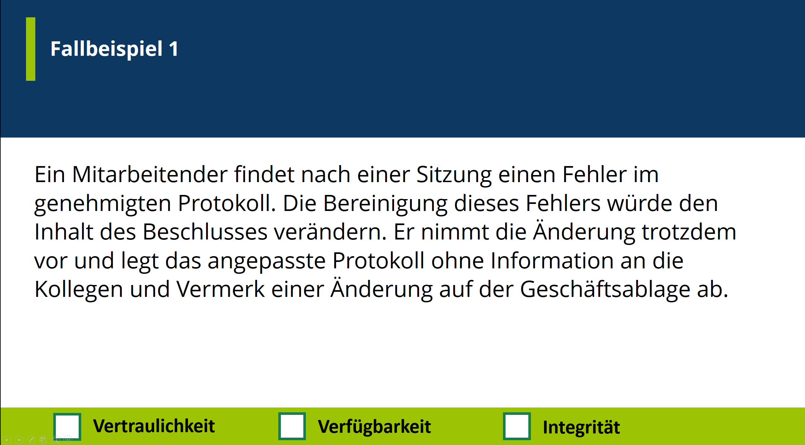

<!--
_backgroundColor: #black
_color: white 
-->
<!-- _paginate: skip -->

<h1> Security Awareness Training </h1>

Carl Strömstedt

---

<!--
_backgroundColor: black
_color: white
-->

<!--
Vermutlich haben die meisten von euch schon mal solch eine SMS gekriegt
-->

---

<!--
Und oder so eine Email gekriegt oder schon mal gesehen
-->

---

<!--
Und vielleicht habt ihr auch schon von Hackerattacken und Ransomware attacken online oder in der Zeitung gelesen
-->

---

<!--
  Fakt ist: Jeden Tag werden tausende von cyber attacken ausgeführt. Und die Anzahl und komplexität dieser Attacken nimmt immer zu
-->

---

<!--
_backgroundColor: white
_color: black
-->

---

<!--
_backgroundColor: white
_color: black
-->

---

<!--
_backgroundColor: white
_color: black
-->

---

<!--
_backgroundColor: white
_color: black
-->

---

<!--
_backgroundColor: white
_color: black
-->

---

<!--
_backgroundColor: white
_color: black
-->

---

<!--
_backgroundColor: white
_color: black
-->

---

<!--
_backgroundColor: white
_color: black
-->

---

<!--
_backgroundColor: #0d3862
_color: white
-->
# Block 1
## Informationssicherheit

<!--
Wir fangen mit dem ersten Block an. Informationssicherheit
-->

  

  
Block 1 - Informationssicherheit

  
&nbsp | Block 2 - Malware & Phishing | Block 3 - Passwörter & Verhaltensweisen

---

<!--
_backgroundColor: #0d3862
_color: white
-->

# Was bedeutet Informationssicherheit?

<i class="hgi hgi-stroke hgi-security-lock"></i>

<!--
Was verstehen wir unter Informationssicherheit? Wie definieren wir es?
-->

  

  
Block 1 - Informationssicherheit

  
&nbsp | Block 2 - Malware & Phishing | Block 3 - Passwörter & Verhaltensweisen

---

<!--
_backgroundColor: #003360
_color: white
-->

## Informationssicherheit

- Sicherstellung der **Vertraulichkeit**, **Integrität** und **Verfügbarkeit** von Informationen

<!--
Wir definieren IS als die Sicherstellung von 3 Schutzzielen

Vertraulichkeit

Integrität

Verfügbarkeit

Wir gewährleisten dies durch Infrastruktur. Technisch, baulich und organisatorisch

aber auch auf der Ebene des Indiviidums liegt ein grosser Einfluss. Darum auch diese Schulung heute.

Unser Ziel wäre dass ihr sicher die Informationssicherheit gewährleisten könnt und vielleicht sogar auch verbessern?
-->

---

<!--
_backgroundColor: #0d3862
_color: white
-->

# Beispiele

<h3>
  <i class="fa-solid fa-mask fa-xl" style="margin-right: 15px"></i> Vertraulichkeit
</h3>

Nur autorisierte Mitarbeiter haben Zugang zu Finanzdaten, um sicherzustellen, dass **sensible** Informationen nicht öffentlich werden.

<h3>
  <i class="fa-solid fa-file-shield fa-xl" style="margin-right: 15px"></i> Integrität
</h3>

Durch Einsatz von digitalen Signaturen wird sichergestellt, dass ein Dokument von einem bestimmten Absender stammt und **unverändert** ist.

<h3>
  <i class="fa-solid fa-clock fa-xl" style="margin-right: 15px"></i> Verfügbarkeit
</h3>

Durch regelmäßige Wartung und redundante Serverinfrastruktur wird sichergestellt, dass eine Webseite jederzeit **erreichbar** ist.

<!--
Das zweite V im VIV ist Verf¨ugbarkeit. Bei der Verfügbarkeit geht es darum Zugänglichkeit zu Daten und Informationen zu gewährleisten, innerhalb von einem definierten Zeitraum.

Muss nicht umbedingt 24/7 sein, aber innerhalb des zeitraums sollten wir Verfügbarkeit garantieren können
-->

  

  
Block 1 - Informationssicherheit

  
&nbsp | Block 2 - Malware & Phishing | Block 3 - Passwörter & Verhaltensweisen

---

<!--
_backgroundColor: #0d3862
_color: white
-->

<h2 style="margin-bottom: -20px">
Vertraulichkeit / Integrität / Verfügbarkeit - Quiz
</h2>

<!-- # Zoom Poll / Quiz
-->
---

---

---

---

---

---

---

---

---

<!--
_backgroundColor: #003360
_color: white
-->

## Wertvolle / sensitive Daten

<i class="fa-solid fa-credit-card fa-xl" style="font-size: 80px"></i> 

Zahlungsdaten

<i class="fa-solid fa-people-roof fa-xl" style="font-size: 80px"></i>

Personendaten

<i class="fa-solid fa-laptop-medical fa-xl" style="font-size: 80px"></i>

Gesundheitsdaten

<!--
Jetzt haben wir eine Grundlegende Definition von informationssicherheit und kennen das VIV trio. Wir haben die Frage beantwortet **WAS** Informationssicherhiet ist und wir werden uns jetzt anschauen *WIESO* wir Informationssicherheit brauchen?

Heutzutage haben wir Daten in riesigen Mengen, aber nicht nur Quantität ist vorhanden, sondern wir haben auch Daten mit viel wert.

Dies können zum Beispiel Finanzdaten sein, 

oder Personendaten

und auch Gesundheitsdaten in verschiedenen Formen

Der Wert dieser Daten ist natürlich eine Motivation für Angreifer
-->

---

<!--
_backgroundColor: #003360
_color: white
-->

## Wertvolle / sensitive Daten

<i class="fa-solid fa-credit-card fa-xl" style="font-size: 80px"></i> 

Zahlungsdaten

<i class="fa-solid fa-people-roof fa-xl" style="font-size: 80px"></i>

Personendaten

<i class="fa-solid fa-laptop-medical fa-xl" style="font-size: 80px"></i>

Gesundheitsdaten

<!--
Jetzt haben wir eine Grundlegende Definition von informationssicherheit und kennen das VIV trio. Wir haben die Frage beantwortet **WAS** Informationssicherhiet ist und wir werden uns jetzt anschauen *WIESO* wir Informationssicherheit brauchen?

Heutzutage haben wir Daten in riesigen Mengen, aber nicht nur Quantität ist vorhanden, sondern wir haben auch Daten mit viel wert.

Dies können zum Beispiel Finanzdaten sein, 

oder Personendaten

und auch Gesundheitsdaten in verschiedenen Formen

Der Wert dieser Daten ist natürlich eine Motivation für Angreifer
-->

---

<!--
_backgroundColor: #006951
_color: white
-->

# Was macht Open Circle dagegen?

<i class="fa-solid fa-window-maximize fa-2xl" style="margin-right:34px; margin-top: 25px; margin-bottom: 35px"></i> - DNS-Filtering

<i class="fa-solid fa-envelope-open-text fa-2xl" style="margin-right:40px; margin-top: 25px; margin-bottom: 35px"></i> - Spam-Filtering

<i class="fa-solid fa-sync fa-2xl" style="margin-right:40px; margin-top: 25px; margin-bottom: 35px"></i> - Regelmässige Updates von Server & Clients

<i class="fa-solid fa-user-shield fa-2xl" style="margin-right:25px; margin-top: 25px; margin-bottom: 35px"></i> - 2-Faktor-Authentifizierung

<i class="fa-solid fa-user-pen fa-2xl" style="margin-right:20px; margin-top: 25px; margin-bottom: 35px"></i> - Awareness-Schulungen

  

  
Block 1 - Informationssicherheit

  
&nbsp | Block 2 - Malware & Phishing | Block 3 - Passwörter & Verhaltensweisen

<!--
Es gibt sehr viele technische Werkzeuge aber schlussendlich habt ihr als Individuum einen grossen einfluss auf die Informationssicherheit.

Wie erwähnt haben wir daher auch heute diese Schulung:

Um euch zu senisibilisiern und mit Beispielen und informationen euere Gefahrenbewusstsein zu fördern.
-->

---

<!--
_backgroundColor: #006951
_color: white
-->

# Was könnt ihr dagegen machen?

<i class="fa-solid fa-user-shield fa-2xl" style="margin-right:34px; margin-top: 25px; margin-bottom: 35px"></i> - Bewusstsein / Threat-Awareness

<i class="fa-solid fa-sync fa-2xl" style="margin-right:40px; margin-top: 25px; margin-bottom: 35px"></i> - Regelmässige Updates

<i class="fa-solid fa-shield fa-2xl" style="margin-right:25px; margin-top: 25px; margin-bottom: 35px"></i> - 2-Faktor-Authentifizierung

<i class="fa-solid fa-key fa-2xl" style="margin-right:25px; margin-top: 25px; margin-bottom: 35px"></i> - Passwortmanager

  

  
Block 1 - Informationssicherheit

  
&nbsp | Block 2 - Malware & Phishing | Block 3 - Passwörter & Verhaltensweisen

<!--
Es gibt sehr viele technische Werkzeuge aber schlussendlich habt ihr als Individuum einen grossen einfluss auf die Informationssicherheit.

Wie erwähnt haben wir daher auch heute diese Schulung:

Um euch zu senisibilisiern und mit Beispielen und informationen euere Gefahrenbewusstsein zu fördern.
-->

---

<!--
_backgroundColor: #0d3862
_color: white
-->

# Informationssicherheitsvorfälle

<!--
Jetzt haben wir angeschaut was Informationssicherheit ist und wie wir unsere Daten klassifizieren können.

Was passiert denn aber wenn wir einen Informationssicherheitsvorfall haben?
-->

  

  
Block 1 - Informationssicherheit

  
&nbsp | Block 2 - Malware & Phishing | Block 3 - Passwörter & Verhaltensweisen

---

<!--
_backgroundColor: white
_color: black
-->

  

  
Block 1 - Informationssicherheit

  
&nbsp | Block 2 - Malware & Phishing | Block 3 - Passwörter & Verhaltensweisen

---

<!--
_backgroundColor: #cf7030
_color: white
-->

# Vorgehen bei einem Sicherheitsvorfall

<!--
Jetzt wo wir gesehen haben auf welchen Ebenen ein Sicherheitsvorfall passieren kann, schauen wir uns an wie ihr bei einem Sicherheitsvorfall vorgehen könnt.
-->

  

  
Block 1 - Informationssicherheit

  
&nbsp | Block 2 - Malware & Phishing | Block 3 - Passwörter & Verhaltensweisen

---

<!--
_backgroundColor: #cf7030
_color: white
-->

<i class="fa-solid fa-user-shield fa-2xl" style="margin-right:20px; margin-top: 30px; margin-bottom: 15px"></i> Verdacht

- Wenn du etwas Verdächtiges bemerkst, zögere nicht und melde dich bei uns.

<i class="fa-solid fa-exclamation-triangle fa-2xl" style="margin-right:20px; margin-top: 30px; margin-bottom: 15px"></i> Melden

- Am besten meldest du dich telefonisch oder erstellst ein Support-Ticket.

<i class="fa-solid fa-envelope fa-2xl" style="margin-right:20px; margin-top: 30px; margin-bottom: 15px"></i> Weiterleiten

- Verdächtige Phishing-E-Mails bitte an support@open-circle.ch weiterleiten.

<!--
Wir sind für euch da. Falls ein verdacht besteht einfach melden

Unsere Experten werden sich direkt mit dem Vorfall auseinandersetzen

- Du kannst auch Screenshots an das Ticket anhängen, um weitere Informationen bereitzustellen.
-->

  

  
Block 1 - Informationssicherheit

  
&nbsp | Block 2 - Malware & Phishing | Block 3 - Passwörter & Verhaltensweisen

---

<!--
_backgroundColor: white
_color: black
-->

---

<!--
_backgroundColor: #006951
_color: white
-->

# Erster Block - Fazit

  

  
Block 1 - Informationssicherheit

  
&nbsp | Block 2 - Malware & Phishing | Block 3 - Passwörter & Verhaltensweisen

---

<!--
_backgroundColor: #006951
_color: white
-->

<h1 style="margin-top: -30px !important">
Erster Block - Fazit
</h1>

## 3 Schutzziele

- Vertraulichkeit
- Integrität
- Verfügbarkeit

## Risiko

Schwachstellen durch Schutzmassnahmen sichern

## Sicherheitsvorfall

Unsicher? Misstrauisch?

<i class="fa-solid fa-arrow-right fa-xl" style="margin-right: 10px"></i> Melden

<!-- 5 Minuten Pause
 -->

 

  

  
Block 1 - Informationssicherheit

  
&nbsp | Block 2 - Malware & Phishing | Block 3 - Passwörter & Verhaltensweisen

---

<!--
_backgroundColor: #0d3862
_color: white
-->

# Block 2

## Malware & Phishing

 

  
Block 1 - Informationssicherheit |

  
&nbsp Block 2 - Malware & Phishing

  
&nbsp | Block 3 - Passwörter & Verhaltensweisen

---

<!--
_backgroundColor: #0d3862
_color: white
-->

<h1>
  <i class="fa-solid fa-hexagon-nodes-bolt fa-xl" style="margin-right: 15px"></i> Malware 
</h1>
Software, die mit dem Ziel entwickelt wurde, unerwünschte und schädliche Funktionen auf einem IT-System auszuführen

---

<!--
_backgroundColor: #0d3862
_color: white
-->

<i class="fa-solid fa-virus-covid fa-xl" style="font-size:120px"></i>  Viren

Schadprogramme, die sich durch Einschleusung in andere Systeme verbreiten

<i class="fa-solid fa-horse fa-xl" style="font-size:120px"></i> Trojaner

Tarnen sich als legitime Software, um unbemerkt in Systeme einzudringen. 

<i class="fa-solid fa-user-secret fa-xl" style="font-size: 120px"></i> Spyware

Sammelt heimlich Informationen über Nutzer*innen und ihre Aktivitäten.

<i class="fa-solid fa-arrow-down-up-lock fa-xl" style="font-size: 120px"></i> Ransomware

Sperrt oder verschlüsselt Daten, fordert Lösegeld zur Wiederherstellung.

<!-- 
Um euch einen Überblick von Malware zu geben, werden wir heute 4 Gruppen von Malware anschauen.

Es gibt viele untergruppen und varianten, aber diese 4 sollte man meiner Meinung nach,sicher kennen.

-->

 

  
Block 1 - Informationssicherheit |

  
&nbsp Block 2 - Malware & Phishing

  
&nbsp | Block 3 - Passwörter & Verhaltensweisen

 ---

 <!--
_backgroundColor: #0d3862
_color: white
-->

<h1>
  <i class="fa-solid fa-viruses fa-xl" style="margin-right: 15px"></i> Verbreitung
</h1>

- Infizierte Dateien
- E-Mail-Anhänge
- Infizierte Webseiten

<!--
Viren, wie der name schon Hindeutet, sind software die im "Verhalten" ähnlichkeiten zu biologischen Viren besitzen.

Das Ziel von Viren ist das Einschleusen in Systemen um sich dann für Verbreitung Replizieren zu können.

Viren können auf der Softwareebene schaden an Dateisysteme versursachen, aber auch auf der Hardwareebene

Eine art von Virus, könnte man fast schon sagen, sind Würmer. Diese bewegen sich oft durch Netzwerke um sich weiter zu verbreiten.
-->

 

  
Block 1 - Informationssicherheit |

  
&nbsp Block 2 - Malware & Phishing

  
&nbsp | Block 3 - Passwörter & Verhaltensweisen

---

 <!--
_backgroundColor: #e74c3c
_color: white
-->
<h1>
  <i class="fa-solid fa-biohazard fa-xl" style="margin-right: 15px"></i> Beispiel: WannaCry-Virus
</h1>

- Ausbruch im Mai 2017
- Ausnutzung der Windows-Schwachstelle "EternalBlue"
- Betraf Organisationen wie die NHS (UK) und FedEx

<!-- 
Global Impact: WannaCry infected over 230,000 computers across 150 countries within days. It spread by exploiting a vulnerability in the Windows operating system called EternalBlue (a flaw that had already been patched by Microsoft but was unpatched in many systems).

Behavior: The ransomware encrypted users' files, demanding a ransom in Bitcoin to restore access. If users failed to pay the ransom, their data remained inaccessible.

Notable Targets: Several major institutions were severely impacted. For example:

The UK’s National Health Service (NHS) had to cancel surgeries and medical appointments because WannaCry disabled their computer systems.
Large corporations such as FedEx and Telefonica also faced major disruptions.

Prevention & Aftermath: The attack highlighted the importance of keeping systems updated with security patches, as well as implementing backup and recovery plans. It also showcased the need for increased international cooperation to combat cybercrime.
-->

 

  
Block 1 - Informationssicherheit |

  
&nbsp Block 2 - Malware & Phishing

  
&nbsp | Block 3 - Passwörter & Verhaltensweisen

---

 <!--
_backgroundColor: #e74c3c
_color: white
-->

<i class="fa-solid fa-user-secret fa-2xl" style="margin-right:20px; margin-top: 75px; margin-bottom: 35px"></i> Verbreitung und Komplexität

- Schnell weltweit verbreitet, über 230.000 Systeme in 150 Ländern

<i class="fa-solid fa-shield-alt fa-2xl" style="margin-right:20px; margin-top: 75px; margin-bottom: 35px"></i> Lehren

- Bedeutung von regelmässigen Updates und Backups

<!-- 
Global Impact: WannaCry infected over 230,000 computers across 150 countries within days. It spread by exploiting a vulnerability in the Windows operating system called EternalBlue (a flaw that had already been patched by Microsoft but was unpatched in many systems).

Behavior: The ransomware encrypted users' files, demanding a ransom in Bitcoin to restore access. If users failed to pay the ransom, their data remained inaccessible.

Notable Targets: Several major institutions were severely impacted. For example:

The UK’s National Health Service (NHS) had to cancel surgeries and medical appointments because WannaCry disabled their computer systems.
Large corporations such as FedEx and Telefonica also faced major disruptions.

Prevention & Aftermath: The attack highlighted the importance of keeping systems updated with security patches, as well as implementing backup and recovery plans. It also showcased the need for increased international cooperation to combat cybercrime.
-->

 

  
Block 1 - Informationssicherheit |

  
&nbsp Block 2 - Malware & Phishing

  
&nbsp | Block 3 - Passwörter & Verhaltensweisen

---

<!-- link: https://www.microsoft.com/en-us/security/blog/2022/06/13/the-many-lives-of-blackcat-ransomware/
 
Die ist ein Beispiel einer Nachricht die von einer Ransomware gruppe eingebelendet wird wenn mit black cat, Ransomware, was eine variante von Ransomware ist
-->

---

 <!--
_backgroundColor: #0d3862
_color: white
-->

# Angriffskomponenten

Was verwenden die Angreifer für ihre Attacken?

<!--
Wir haben übe rMalware geredet, was die mechanismen der verschiedenen typen sind und wie sie verbreitet werden.

Auf das Verbreiten werden wir jetzt genauer eingehen indem das wir uns Angriffskomponenten die verwendet werden anschauen
-->

 

  
Block 1 - Informationssicherheit |

  
&nbsp Block 2 - Malware & Phishing

  
&nbsp | Block 3 - Passwörter & Verhaltensweisen

---

 <!--
_backgroundColor: #0d3862
_color: white
-->

<h1>
  Technik <i class="fa-solid fa-cogs fa-xl" style="margin-right: 15px; margin-left: 20px; margin-bottom: 50px;"></i> 
</h1>

<h1>
  Soziale Ebene <i class="fa-solid fa-users-line fa-xl" style="margin-right: 15px; margin-left: 20px"></i> 
</h1>

<!--
Wir werden uns die Technischen Tools / Werkzeuge anschauen

Und wir werden auf die soziale Ebene eingehen.
-->

  
Block 1 - Informationssicherheit |

  
&nbsp Block 2 - Malware & Phishing

  
&nbsp | Block 3 - Passwörter & Verhaltensweisen

---

 <!--
_backgroundColor: #0d3862
_color: white
-->

# Technik

- Drive-by-Download <i class="fa-solid fa-globe fa-xl" style="margin-left: 15px"></i>
- E-Mail-Anhänge <i class="fa-solid fa-envelope fa-xl" style="margin-left: 15px"></i>
- Software-Bündelung / infizierte Downloads <i class="fa-solid fa-box fa-xl" style="margin-left: 15px"></i>

<!--
Wir werden uns 

Drive-by Downloads anschauen

Email Anhänge und

Softwarebündlung
-->

  
Block 1 - Informationssicherheit |

  
&nbsp Block 2 - Malware & Phishing

  
&nbsp | Block 3 - Passwörter & Verhaltensweisen

---

<!--
_backgroundColor: #0d3862
_color: white
-->

<i class="fa-solid fa-globe fa-xl" style="font-size:120px"></i>  Drive-by-Download

Automatischer Download von Malware beim Besuch einer infizierten Webseite.

<i class="fa-solid fa-envelope fa-xl" style="font-size:120px"></i> E-Mail-Anhänge

Anhänge die beim öffnen Schwachstellen in Software (wie Dokumentenlesern) ausnützen, um Malware zu installieren.

<i class="fa-solid fa-box fa-xl" style="font-size: 120px"></i> Software-Bündelung / infizierte Downloads

Malware wird zusammen mit legitimer Software gebündelt und bei der Installation mit installiert.

<!-- 
Um euch einen Überblick von Malware zu geben, werden wir heute 4 Gruppen von Malware anschauen.

Es gibt viele untergruppen und varianten, aber diese 4 sollte man meiner Meinung nach,sicher kennen.

-->

 

  
Block 1 - Informationssicherheit |

  
&nbsp Block 2 - Malware & Phishing

  
&nbsp | Block 3 - Passwörter & Verhaltensweisen

 ---

<!--
_backgroundColor: #0d3862
_color: white
-->

<h2>
  <i class="fa-solid fa-gears fa-xl" style="margin-right: 15px"></i> Mechanismen
</h2>

- Ausnutzung von Schwachstellen in Software um Schadcode einzuschleusen
  - Browser
  - Dokumentenlesern
  - Office-Software
  -> Regelmässige Updates

- Infizierte Downloads / Software-Bündelung
  -> Bewusstsein: Was lade ich von wo herunter?
<!--
Driveby downloads wurden vorher als eine Verbreitungstechnik kurz erwähnt.

Drive-by, also im vorbeifahren ist eine Bezeichung für das Automatische Herunterladen von Malware

Es werden Sicherheitslücken ausgenützt

Unbemerkte Infektion, Verbreitung von Viren, Trojanern oder Ransomware.
-->

  
Block 1 - Informationssicherheit |

  
&nbsp Block 2 - Malware & Phishing

  
&nbsp | Block 3 - Passwörter & Verhaltensweisen

---

<!--
_backgroundColor: #006951
_color: white
-->

<h1>
  <i class="fa-solid fa-shield-alt fa-xl" style="margin-right: 15px"></i> Schutz vor Malware
</h1>

<i class="fa-solid fa-arrow-rotate-left fa-2xl" style="margin-right:20px; margin-top: 30px; margin-bottom: 35px"></i> Softwareaktualisierungen

Halte dein Betriebssystem und alle Programme auf dem neuesten Stand, um bekannte Sicherheitslücken zu schließen.

<i class="fa-solid fa-envelope fa-2xl" style="margin-right:20px; margin-top: 30px; margin-bottom: 35px"></i> Vorsicht bei E-Mails

Öffne keine E-Mail-Anhänge oder klicke nicht auf Links von unbekannten oder verdächtigen Absendern.

<i class="fa-solid fa-user-shield fa-2xl" style="margin-right:20px; margin-top: 30px; margin-bottom: 5px"></i> Verhaltensbewusstsein

Sei vorsichtig beim Herunterladen von Dateien aus dem Internet und vermeide fragwürdige Webseiten.

<!--
Ok Jetzt haben wir Gruppen von Malware angeschaut und was für Techniken verwendet werden um Malware auf ein System zu kriegen.

Softwareaktualisierungen

Emails aufpassen,links und anhänge

Verhaltensbewusstsein beim browsen

Wir haben jetzt mit vorsicht und bewusstsein Begriffe erwähnt die vorallem auch auf der Sozialen Ebene relevant sind.
-->

  
Block 1 - Informationssicherheit |

  
&nbsp Block 2 - Malware & Phishing

  
&nbsp | Block 3 - Passwörter & Verhaltensweisen

---

<!--
_backgroundColor: #0d3862
_color: white
-->

# Soziale Ebene

<!--

-->

  
Block 1 - Informationssicherheit |

  
&nbsp Block 2 - Malware & Phishing

  
&nbsp | Block 3 - Passwörter & Verhaltensweisen

---

<!--
_backgroundColor: #0d3862
_color: white
-->

# Social Engineering

Manipulation von Menschen, durch ausnutzung von Vertrauen, Neugier oder Druck, um vertrauliche Informationen preiszugeben oder unerlaubte Handlungen auszuführen.

## Methoden

- Phishing 
- Vishing (Telefon)

<!--
Bei der sozialen Ebene wird social engineering angewendet, was die Manipulation von Menschen durch ausnutzung ihrer Emotionen ist.

Es wird druck ausgeübt.

Das Wird beim Phishing und Vishing sehr oft eingesetzt
-->

  
Block 1 - Informationssicherheit |

  
&nbsp Block 2 - Malware & Phishing

  
&nbsp | Block 3 - Passwörter & Verhaltensweisen

---

<!--
_backgroundColor: #0d3862
_color: white
-->
<h1>
  <i class="fa-solid fa-fish fa-xl" style="margin-right: 15px"></i> Phishing
</h1>

Täuschung von Nutzer:innen, um vertrauliche Informationen wie Passwörter oder Finanzdaten zu stehlen.

<i class="fa-solid fa-viruses fa-2xl" style="margin-right:20px; margin-top: 75px; margin-bottom: 35px"></i> Methoden

Gefälschte E-Mails, Webseiten oder soziale Medien, die echt aussehen, um Vertrauen zu erwecken.

<!--
Phishing istdie Täuschung von User um an Informationen zu kommen und um sich Zugang zu Systemen zu schaffen

Identitätsdiebstahl, finanzielle Verluste, Zugriff auf persönliche Konten.
-->

  
Block 1 - Informationssicherheit |

  
&nbsp Block 2 - Malware & Phishing

  
&nbsp | Block 3 - Passwörter & Verhaltensweisen

---

<!--
_backgroundColor: #b3740d
_color: white
-->
<h1>
  <i class="fa-solid fa-user-lock fa-xl" style="margin-right: 15px"></i> Konto-Phishing
</h1>

- Hinweis auf Kontoänderungen
- Aufforderung zur Verifizierung oder "Aktualisierung" von Profildaten
- Androhung einer Kontosperrung
- Abonnement abgelaufen
-> 📧 Gefälschte E-Mails von Netflix, PayPal, Amazon & Co.

<i class="fa-solid fa-shield-alt fa-2xl" style="margin-right:20px; margin-top: 30px; margin-bottom: 30px"></i> Schutz

- Kontozugang über die offizielle Website

  
Block 1 - Informationssicherheit |

  
&nbsp Block 2 - Malware & Phishing

  
&nbsp | Block 3 - Passwörter & Verhaltensweisen

---

---

---

<!--
_backgroundColor: #b3740d
_color: white
-->
<h1>
  <i class="fa-solid fa-key fa-xl" style="margin-right: 15px"></i> Sicherheitswarnungen
</h1>

- Login-Versuch (z.B. aus dem Ausland)
- Aufforderung zur Rücksetzung der 2-Faktor-Authentifizierung
- Fake-Antiviruswarnung (z.B. McAfee, Norton)

<i class="fa-solid fa-shield-alt fa-2xl" style="margin-right:20px; margin-top: 30px; margin-bottom: 30px"></i> Schutz

- Kontozugang über die offizielle Website

  
Block 1 - Informationssicherheit |

  
&nbsp Block 2 - Malware & Phishing

  
&nbsp | Block 3 - Passwörter & Verhaltensweisen

---

---

---

---

<!--
_backgroundColor: #b3740d
_color: white
-->
<h1>
  <i class="fa-solid fa-box-open fa-xl" style="margin-right: 15px"></i> Versand-Phishing
</h1>

- „Ihr Paket konnte nicht zugestellt werden – jetzt nachverfolgen“
- „Zollgebühr ausstehend – klicken Sie zur Zahlung“
- Gefälschte Tracking-Links (UPS, DHL, Swiss Post)

<i class="fa-solid fa-shield-alt fa-2xl" style="margin-right:20px; margin-top: 30px; margin-bottom: 30px"></i> Schutz

- Ohne Bestätigung keine Zahlung!
- Tracking über offizielle Websites

  
Block 1 - Informationssicherheit |

  
&nbsp Block 2 - Malware & Phishing

  
&nbsp | Block 3 - Passwörter & Verhaltensweisen

---

<!--
_backgroundColor: black
_color: white
-->

---

<!--
_backgroundColor: black
_color: white
-->

---

<!--
_backgroundColor: #b3740d
_color: white
-->
<h1>
  <i class="fa-solid fa-money-bill-wave fa-xl" style="margin-right: 15px"></i> Zahlungsbetrug
</h1>

- „Ihre Rechnung ist überfällig – bitte jetzt bezahlen“
- „Ihr Abo läuft ab – hier verlängern“

<i class="fa-solid fa-shield-alt fa-2xl" style="margin-right:20px; margin-top: 0px; margin-bottom: 30px"></i> Schutz

- Telefonisch oder über offizielle Webseite bestätigen!

  
Block 1 - Informationssicherheit |

  
&nbsp Block 2 - Malware & Phishing

  
&nbsp | Block 3 - Passwörter & Verhaltensweisen

---

<!--
_backgroundColor: black
_color: white
-->

---

<!--
_backgroundColor: #c78928
_color: white
-->
<h1>
  <i class="fa-solid fa-bomb fa-xl" style="margin-right: 15px"></i> Bedrohungs-Phishing
</h1>

- Erpressungsmail: „Wir haben Sie bei xxx aufgenommen – zahlen Sie in Bitcoin!“
- „Sie sind Ziel einer polizeilichen Ermittlung“

<i class="fa-solid fa-shield-alt fa-2xl" style="margin-right:20px; margin-top: 30px; margin-bottom: 30px"></i> Schutz

- Keine Zahlungen leisten!

  
Block 1 - Informationssicherheit |

  
&nbsp Block 2 - Malware & Phishing

  
&nbsp | Block 3 - Passwörter & Verhaltensweisen

---

<!--
_backgroundColor: black
_color: white
-->

---

<!--
_backgroundColor: #c78928
_color: white
-->
<h1>
  <i class="fa-solid fa-briefcase fa-xl" style="margin-right: 15px"></i> Geschäftsbezogenes-Phishing
</h1>

- CEO-Fraud - CEO oder Vorgesetzter braucht etwas und schnell!
- Mahnungen / Zahlungen

<i class="fa-solid fa-shield-alt fa-2xl" style="margin-right:20px; margin-top: 30px; margin-bottom: 30px"></i> Schutz

- Bei Unsicherheit über alternativen Kommunikationsweg bestätigen 

  
Block 1 - Informationssicherheit |

  
&nbsp Block 2 - Malware & Phishing

  
&nbsp | Block 3 - Passwörter & Verhaltensweisen

---

---
<!--
_backgroundColor: #f4f1ec
_color: white
-->

---

---

---

<!--
_backgroundColor: #c78928
_color: white
-->
<h1>
  <i class="fa-solid fa-phone-volume fa-xl" style="margin-right: 15px"></i> Vishing
</h1>

<i class="fa-solid fa-info-circle fa-2xl" style="margin-right:20px; margin-top: 45px; margin-bottom: 30px"></i> Was ist Vishing?

- Vishing steht für "Voice Phishing"
- Eine Betrugsmethode, bei der Betrüger sich am Telefon als legitime Organisationen ausgeben, um vertrauliche Informationen zu erlangen.

<i class="fa-solid fa-shield-alt fa-2xl" style="margin-right:20px; margin-top: 30px; margin-bottom: 30px"></i> Schutz

- Sei misstrauisch gegenüber unerwarteten Anrufen
- Verifiziere die Identität des Anrufers
- Gib niemals vertrauliche Informationen am Telefon preis

  
Block 1 - Informationssicherheit |

  
&nbsp Block 2 - Malware & Phishing

  
&nbsp | Block 3 - Passwörter & Verhaltensweisen

---

<!--
_backgroundColor: #cf7030
_color: white
-->

<h1>
  <i class="fa-solid fa-shield-alt fa-xl" style="margin-right: 15px"></i> Phishing-Erkennung
</h1>

<i class="fa-solid fa-pencil fa-2xl" style="margin-right:20px; margin-top: 30px; margin-bottom: 35px"></i> Grammatik und Anrede

Achte auf schlechte Grammatik und allgemeine Anreden wie "Sehr geehrte Damen und Herren". 

<i class="fa-solid fa-gift fa-2xl" style="margin-right:20px; margin-top: 30px; margin-bottom: 35px"></i> Unrealistische Angebote

Wenn etwas zu gut klingt, um wahr zu sein, ist es wahrscheinlich nicht echt.

<i class="fa-solid fa-envelope fa-2xl" style="margin-right:20px; margin-top: 30px; margin-bottom: 35px"></i> Sensible Datenanfragen

Gib niemals sensible Informationen aufgrund von E-Mail-Anfragen weiter. Die meisten Institutionen würden solche Informationen niemals per E-Mail anfordern.

  
Block 1 - Informationssicherheit |

  
&nbsp Block 2 - Malware & Phishing

  
&nbsp | Block 3 - Passwörter & Verhaltensweisen

---

<!--
_backgroundColor: #cf7030
_color: white
-->

<i class="fa-solid fa-user-friends fa-2xl" style="margin-right:20px; margin-top: 40px; margin-bottom: 35px"></i> Unbekannte Absender

Lösche unaufgeforderte E-Mails von unbekannten Absendern oder Diensten, die du nicht nutzt. Öffne sie nicht und klicke nicht auf Links oder Anhänge.

<i class="fa-solid fa-clock fa-2xl" style="margin-right:20px; margin-top: 40px; margin-bottom: 35px"></i> Zeitdruck

Sei misstrauisch bei E-Mails, die dringendes Handeln erfordern. Betrüger erzeugen oft künstlichen Druck, um dich zum überstürzten Handeln zu bewegen.

<i class="fa-solid fa-at fa-2xl" style="margin-right:20px; margin-top: 40px; margin-bottom: 35px"></i> Falsche E-Mail-Adressen und Domänennamen

Prüfe verdächtige E-Mails auf korrekte Absenderadressen und Domänennamen. Impulsives Handeln könnte dazu führen, subtile Details zu übersehen.

  
Block 1 - Informationssicherheit |

  
&nbsp Block 2 - Malware & Phishing

  
&nbsp | Block 3 - Passwörter & Verhaltensweisen

---

<!--
_backgroundColor: #006951
_color: white
-->

# Zweiter Block - Fazit

  
Block 1 - Informationssicherheit |

  
&nbsp Block 2 - Malware & Phishing

  
&nbsp | Block 3 - Passwörter & Verhaltensweisen

---

<!--
_backgroundColor: #006951
_color: white
-->

<h1 style="margin-top:-30px !important; margin-bottom: -10px">
Zweiter Block - Fazit
</h1>

## Malware

- Viren
- Trojaner / Spyware
- Ransomware

## Technik

- Drive-by-Download 
- E-Mail-Anhänge 
- Software-Bündelung 

## Soziale Ebene

- Phishing
- Vishing (Telefon)

## Social Engineering

Manipulation von Menschen durch ausnutzung von Emotionen

<!-- 5 Minuten Pause
 -->

  
Block 1 - Informationssicherheit |

  
&nbsp Block 2 - Malware & Phishing

  
&nbsp | Block 3 - Passwörter & Verhaltensweisen

---

<!--
_backgroundColor: #006951
_color: white
-->

# Zweiter Block - Quiz

  
Block 1 - Informationssicherheit |

  
&nbsp Block 2 - Malware & Phishing

  
&nbsp | Block 3 - Passwörter & Verhaltensweisen

---

<!--
_backgroundColor: #0d3862
_color: white
-->

# Block 3
## Passwörter & Verhaltensweisen

  
Block 1 - Informationssicherheit | Block 2 - Malware & Phishing |

  
&nbsp Block 3 - Passwörter & Verhaltensweisen

  

---

<!--
_backgroundColor: #0d3862
_color: white
-->

# Passwörter - Risiken
- <i class="fa-solid fa-hammer fa-xl" style="margin-right: 15px"></i> Brute Forcing
- <i class="fa-solid fa-lines-leaning fa-xl" style="margin-right: 15px"></i> Domino-Effekt

---

<!--
_backgroundColor: #2c3e50
_color: white
-->
<h1>
  <i class="fa-solid fa-hammer fa-xl" style="margin-right: 15px"></i> Brute Forcing
</h1>

<i class="fa-solid fa-clock fa-2xl" style="margin-right:20px; margin-top: 45px; margin-bottom: 35px"></i> Was ist Brute Forcing?

- Methode, bei der alle möglichen Kombinationen ausprobiert werden
- Ziel: Passwort oder geheime Informationen erraten

<i class="fa-solid fa-hourglass-half fa-2xl" style="margin-right:20px; margin-top: 35px; margin-bottom: 35px"></i> Beispiel

- Passwort: "Secure123-"
- Theoretische zeit zum Knacken: Sekunden

 <i class="fa-solid fa-triangle-exclamation fa-2xl" style="margin-top:25px; margin-left:25px; margin-right:15px"></i> Wörterlisten kürzen die Zeit drastisch

  
Block 1 - Informationssicherheit | Block 2 - Malware & Phishing |

  
&nbsp Block 3 - Passwörter & Verhaltensweisen

  

<!--

Passwords we said are vulnerable to phishing and social engineering, but they can also be vulnerable to brute forcing

I wont provide any concrete times on password brute forcing since it can change very quickly in either direction.

What i will say, is that wordlists have a significant influence on the time it takes to brute force

-->

---

  
Block 1 - Informationssicherheit | Block 2 - Malware & Phishing |

  
&nbsp Block 3 - Passwörter & Verhaltensweisen

  

---

  
Block 1 - Informationssicherheit | Block 2 - Malware & Phishing |

  
&nbsp Block 3 - Passwörter & Verhaltensweisen

  

---

<!--
in January 2019, a large collection of credential stuffing lists (combinations of email addresses and passwords used to hijack accounts on other services) was discovered being distributed on a popular hacking forum. The data contained almost 2.7 billion records including 773 million unique email addresses alongside passwords

Gewisse Passwortmanager haben eine ähnliche Funktion eingebaut wo Sie die hinterlegeten Passwörter kontrollieren können. 
-->

---

<!--
_backgroundColor: #d16258
_color: white
-->
<h1>
  <i class="fa-solid fa-lines-leaning fa-xl" style="margin-right: 15px"></i> Dominoeffekt bei Mehrfachverwendung 
</h1>

<i class="fa-solid fa-lock fa-2xl" style="margin-right:20px; margin-top: 30px; margin-bottom: 25px"></i> Was verursacht den Dominoeffekt?

- Verwendung desselben Passworts für verschiedene Konten

<i class="fa-solid fa-warning fa-2xl" style="margin-right:20px; margin-top: 30px; margin-bottom: 25px"></i> Gefahren
- Angreifer nützen diese Schwachstelle aus
- Ein geknacktes Passwort ermöglicht Zugriff auf andere Konten

  
Block 1 - Informationssicherheit | Block 2 - Malware & Phishing |

  
&nbsp Block 3 - Passwörter & Verhaltensweisen

  

---

---

<!--
_backgroundColor: #006951
_color: white
-->

<h1 style="margin-top: -25px !important;">
<i class="fa-solid fa-circle-check fa-2xl" style="margin-right:20px; margin-top: 25px; margin-bottom: 35px"></i> Passwortempfehlungen
</h1>

<i class="fa-solid fa-1 fa-2xl" style="margin-right:4px; margin-top: 40px; margin-bottom: 25px"></i><i class="fa-solid fa-2 fa-2xl" style="margin-right:20px; margin-top: 40px; margin-bottom: 25px"></i> Mindestlänge von 12 Zeichen

<i class="fa-solid fa-hashtag fa-2xl" style="margin-right:20px; margin-top: 40px; margin-bottom: 25px"></i> Klein- und Gross-Buchstaben, Zahlen und Sonderzeichen

<i class="fa-solid fa-bridge fa-2xl" style="margin-right:20px; margin-top: 40px; margin-bottom: 25px"></i> Benutze Eselsbrücken mit Anfangsbuchstaben anstatt Wörter

<i class="fa-solid fa-dice-one fa-2xl" style="margin-right:20px; margin-top: 40px; margin-bottom: 25px"></i> Verwende für jedes Konto ein einzigartiges Passwort

<i class="fa-solid fa-key fa-xl" style="margin-right:20px; margin-top: 40px; margin-bottom: 25px"></i><i class="fa-solid fa-key fa-xl" style="margin-right:20px; margin-top: 40px; margin-bottom: 25px"></i> Multi-Faktor-Authentifizierung (MFA) verwenden

<!--
mnemonic

So you could use: my favorite movie is top gun 2 from 2023 + Tom Cruise

MYFMITG2F2023+tc

a device such as a pattern of letters, ideas, or associations that assists in remembering something, for example Richard Of York Gave Battle In Vain for the colours of the spectrum (red, orange, yellow, green, blue, indigo, violet).
-->

  
Block 1 - Informationssicherheit | Block 2 - Malware & Phishing |

  
&nbsp Block 3 - Passwörter & Verhaltensweisen

  

---

<!--
_backgroundColor: #0d3862
_color: white
-->

# Passwortmanager nutzen!

---

<!--
_backgroundColor: #003360
_color: white
-->

---

<!--
_backgroundColor: #0d3862
_color: white
-->

<h1 style="margin-top: -35px !important;">
  <i class="fa-solid fa-key fa-md" style="margin-right: 15px"></i> Passwort-Manager
</h1>

<i class="fa-solid fa-question fa-2xl" style="margin-right:20px; margin-top: 15px; margin-bottom: 25px"></i> Warum Passwort-Manager?

- Speichert und verwaltet sichere Passwörter
- Erzeugt zufällige, komplexe Passwörter

<i class="fa-solid fa-plus fa-2xl" style="margin-right:20px; margin-top: 15px; margin-bottom: 25px"></i> Vorteile

- Kein Auswendiglernen nötig
- Schützt vor Mehrfachverwendung von Passwörtern

<i class="fa-solid fa-gears fa-2xl" style="margin-right:20px; margin-top: 15px; margin-bottom: 25px"></i> Funktionsweise

- Master-Passwort für den Zugriff
- Sichere Speicherung verschlüsselter Passwortdaten

  
Block 1 - Informationssicherheit | Block 2 - Malware & Phishing |

  
&nbsp Block 3 - Passwörter & Verhaltensweisen

  

---

<!--
_backgroundColor: #0d3862
_color: white
-->

# Verhaltensweisen

## Verhalten in öffentlichen Netzwerken <i class="fa-solid fa-wifi fa-xl" style="margin-left: 15px"></i>

## Clean-Desk-Policy <i class="fa-solid fa-spray-can-sparkles fa-xl" style="margin-left: 15px"></i>

  
Block 1 - Informationssicherheit | Block 2 - Malware & Phishing |

  
&nbsp Block 3 - Passwörter & Verhaltensweisen

  

---

<!--
_backgroundColor: #0d3862
_color: white
-->

# Verhaltensweisen

## Verhalten in öffentlichen Netzwerken

- Vermeide Online-Banking und sensitive Aktivitäten
- Verwende Mobile-Hotspot oder VPN

## Clean Desk Policy

- Risiko:
  - Benutzung eines eingeloggten Nutzerkontos
  - Einsicht in vertrauliche Unterlagen
-  Korrekte Verwahrung von Unterlagen
-  Bildschirm sperren beim Verlassen des Arbeitsplatzes

-> Verhindert Identitätsmissbrauch

  
Block 1 - Informationssicherheit | Block 2 - Malware & Phishing |

  
&nbsp Block 3 - Passwörter & Verhaltensweisen

  

---

<!--
_backgroundColor: #006951
_color: white
-->

# Dritter Block - Fazit

  
Block 1 - Informationssicherheit | Block 2 - Malware & Phishing |

  
&nbsp Block 3 - Passwörter & Verhaltensweisen

  

---

<!--
_backgroundColor: #006951
_color: white
-->

# Dritter Block - Fazit

## Passwortempfehlungen

- Verwende für jedes Konto ein einzigartiges Passwort

- Nutze Passwort-Manager zur Verwaltung

- Multi-Faktor-Authentifizierung (MFA) verwenden

## Clean-Desk-Policy

Die Clean Desk Policy hilft bei der Wahrung der VIV-Prinzipien

## Bildschirm sperren!

<!-- 5 Minuten Pause
 -->

  
Block 1 - Informationssicherheit | Block 2 - Malware & Phishing |

  
&nbsp Block 3 - Passwörter & Verhaltensweisen

  

---
<!--
_backgroundColor: #006951
_color: white
-->

# Dritter Block - Quiz

  
Block 1 - Informationssicherheit | Block 2 - Malware & Phishing |

  
&nbsp Block 3 - Passwörter & Verhaltensweisen

  

---

<!--
_backgroundColor: #006951
_color: white
-->

<h1 style="margin-top: -35px !important;"> Links </h1>

- E-Mail Adresse prüfen 
https://haveibeenpwned.com
- Passwort prüfen 
https://haveibeenpwned.com/passwords
- Nationales Zentrum für Cybersicherheit: https://www.ncsc.admin.ch/ncsc/de/home.html
- Information is beautiful https://www.informationisbeautiful.net/visualizations/worlds-biggest-data-breaches-hacks/
- Phishing quiz 
https://phishingquiz.withgoogle.com/

  
Block 1 - Informationssicherheit | Block 2 - Malware & Phishing |

  
&nbsp Block 3 - Passwörter & Verhaltensweisen

  

---

