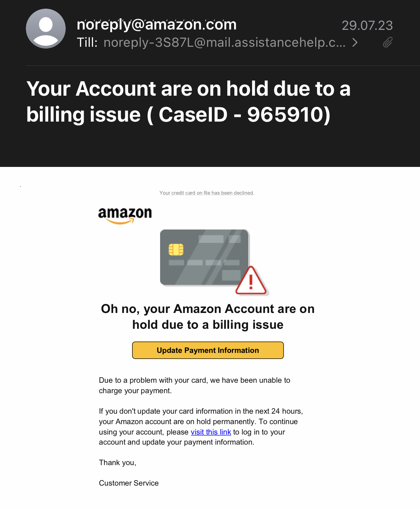
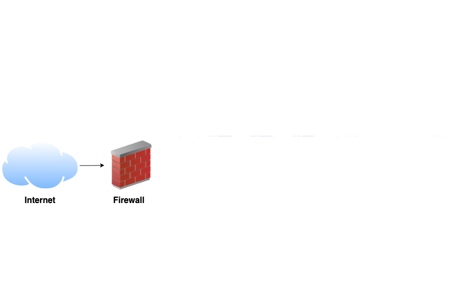
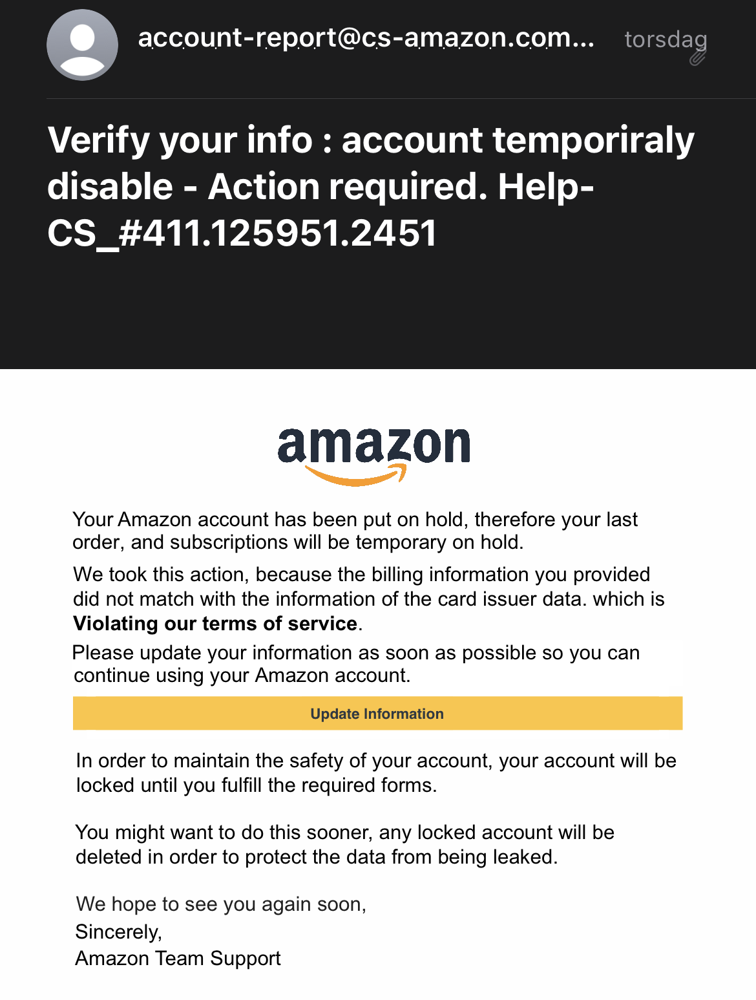
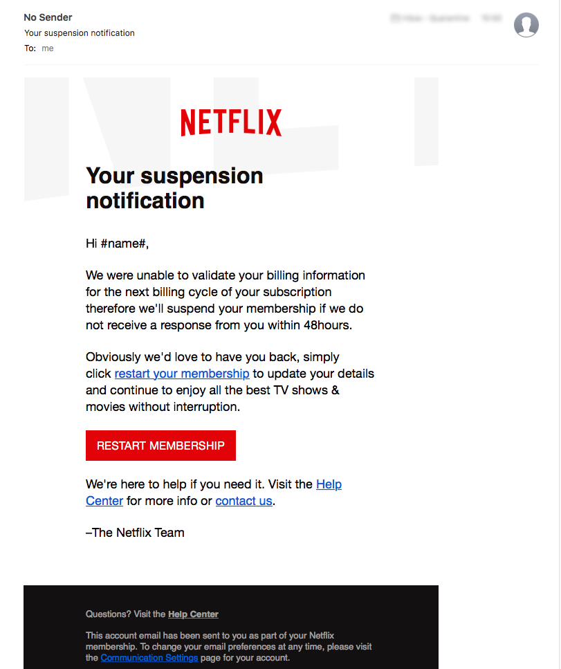
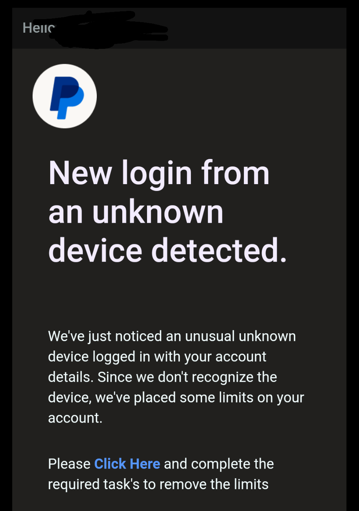
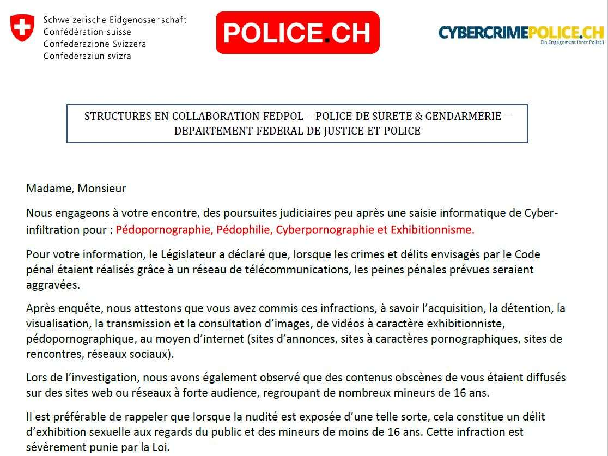

<!--
_backgroundColor: #black
_color: white
-->
<!-- _paginate: skip -->

<h1> Security Awareness Training </h1>

Carl Strömstedt

---

<!--
Some of you have probably received an SMS like this or similar
-->

---

<!--
Many of you have probably received an email like this or similar
-->

---

<!--
And have probably also read about ransomware or other cyber attacks online or in the newspaper
-->

---

<!--
Fact is: There are thousands of cyber attacks happening every day
-->

---

<!--
_backgroundColor: white
_color: black
-->

---

<!--
_backgroundColor: white
_color: black
-->

---

<!--
_backgroundColor: white
_color: black
-->

---

<!--
_backgroundColor: white
_color: black
-->

.png)

---

<!--
_backgroundColor: white
_color: black
-->

.png)

---

<!--
_backgroundColor: white
_color: black
-->

.png)

---

<!--
_backgroundColor: white
_color: black
-->

.png)

---

<!--
_backgroundColor: white
_color: black
-->

.png)

---

<!-- 
_backgroundColor: #0d3862 
_color: white -->

# 3 Parts

- ### Information Security
- ### Malware & Phishing
- ### Authentication & Behaviors

<!--
Today we will take a look behind these attacks.

We will look at the theoretical parts of information sercurity in the first part

We will then look at malware and phishing with technical processes including social aspects

And to finishour training we will look at authentication & behaviours in digital spaces and in the workplace
-->

---

<!-- 
_backgroundColor: #0d3862 
_color: white 
-->
# Part 1
## Information Security

  

  
Part 1 - Information Security

  
&nbsp | Part 2 - Malware & Phishing | Part 3 - Authentication & Behaviors 

---

<!--
_backgroundColor: #0d3862
_color: white
-->

# What is Information Security?

<!--
What do we actually mean when we are talking about information security?
-->

  

  
Part 1 - Information Security

  
&nbsp | Part 2 - Malware & Phishing | Part 3 - Authentication & Behaviors

---

<!--
_backgroundColor: #003360
_color: white
-->

## Information Security

- Ensuring **confidentiality**, **integrity**, and **availability** of information

<!--
We usually define information Security as security centered around the three components Security, Confidentiality and Availability of information

We call it the CIA triad and it is a longstanding concept of Information Security.

And we can ensure that these security goals are met when we provide infrastructure. Infrastructure in the form of technical physical and organizational protective measures.

You as individuals however, also have a big influence on information security.

The goal of todays training is that you should at least be able to ensure information security and maybe even improve it?
-->

---

<!--
_backgroundColor: #0d3862
_color: white
-->

<!--
_backgroundColor: #0d3862
_color: white
-->

# Examples

<h3>
  <i class="fa-solid fa-mask fa-xl" style="margin-right: 15px"></i> Confidentiality
</h3>

Employees outside of the financial department do not have access or only have restricted access to financial documents.

<h3>
  <i class="fa-solid fa-file-shield fa-xl" style="margin-right: 15px"></i> Integrity
</h3>

Digital signatures for emails ensure that a document originates from a specific sender

<h3>
  <i class="fa-solid fa-clock fa-xl" style="margin-right: 15px"></i> Availability
</h3>

Regular maintenance and redundant server infrastructure ensure that a website is **accessible** at all times.

  

  
Part 1 - Information Security

  
&nbsp | Part 2 - Malware & Phishing | Part 3 - Authentication & Behaviors

---

<!--
_backgroundColor: #0d3862
_color: white
-->

<h2 style="margin-bottom: -20px">
Confidentiality / Integrity / Availability - Quiz
</h2>

<!-- # Zoom Poll / Quiz
-->
---

<!--
_backgroundColor: #0d3862
_color: white
-->

<!-- 
# Zoom Poll / Quiz
-->

<!--
So we will now go through each of the case studies and have look at what the answers would be
-->

---

---

---

---

---

---

---

---

<!--
_backgroundColor: #0d3862
_color: white
-->

<h1 style="margin-bottom:20px; font-size:55px">
Examples of sensitive and valuable data
</h1>

<i class="fa-solid fa-credit-card fa-xl" style="font-size:80px"></i> 

Payment data

<i class="fa-solid fa-people-roof fa-xl" style="font-size:80px"></i>

Personal data

<i class="fa-solid fa-laptop-medical fa-xl" style="font-size: 80px"></i>

Health data

<!--
So we've established a defintion of Information Security and of it's components. Which i hope you were able to understand

Now that we have answered the question of **what** information security is? We will talk about the **why**

We have a lot of data nowadays and not only in quantity but the data we have is often also very valuable

So this can be for example:

- financial data
- personal data
- health data

The value of this data naturally provides an incentive and motivation
-->

  

  
Part 1 - Information Security

  
&nbsp | Part 2 - Malware & Phishing | Part 3 - Authentication & Behaviors

---

<!--
_backgroundColor: #003360
_color: white
-->

## Sensitive / valuable data

<i class="fa-solid fa-credit-card fa-xl" style="font-size: 80px"></i> 

Payment data

<i class="fa-solid fa-people-roof fa-xl" style="font-size: 80px"></i>

Personal data

<i class="fa-solid fa-laptop-medical fa-xl" style="font-size: 80px"></i>

Health Data

<!--
Jetzt haben wir eine Grundlegende Definition von informationssicherheit und kennen das VIV trio. Wir haben die Frage beantwortet **WAS** Informationssicherhiet ist und wir werden uns jetzt anschauen *WIESO* wir Informationssicherheit brauchen?

Heutzutage haben wir Daten in riesigen Mengen, aber nicht nur Quantität ist vorhanden, sondern wir haben auch Daten mit viel wert.

Dies können zum Beispiel Finanzdaten sein, 

oder Personendaten

und auch Gesundheitsdaten in verschiedenen Formen

Der Wert dieser Daten ist natürlich eine Motivation für Angreifer
-->

---

<!--
_backgroundColor: #003360
_color: white
-->

## Sensitive / valuable data

<i class="fa-solid fa-credit-card fa-xl" style="font-size: 80px"></i> 

Payment data

<i class="fa-solid fa-people-roof fa-xl" style="font-size: 80px"></i>

Personal data

<i class="fa-solid fa-laptop-medical fa-xl" style="font-size: 80px"></i>

Health Data

<!--
Jetzt haben wir eine Grundlegende Definition von informationssicherheit und kennen das VIV trio. Wir haben die Frage beantwortet **WAS** Informationssicherhiet ist und wir werden uns jetzt anschauen *WIESO* wir Informationssicherheit brauchen?

Heutzutage haben wir Daten in riesigen Mengen, aber nicht nur Quantität ist vorhanden, sondern wir haben auch Daten mit viel wert.

Dies können zum Beispiel Finanzdaten sein, 

oder Personendaten

und auch Gesundheitsdaten in verschiedenen Formen

Der Wert dieser Daten ist natürlich eine Motivation für Angreifer
-->

---

<!--
_backgroundColor: #006951
_color: white
-->

# How does Open Circle prevent inicidents?

<i class="fa-solid fa-window-maximize fa-2xl" style="margin-right:33px; margin-top: 25px; margin-bottom: 35px"></i> - DNS-Filtering

<i class="fa-solid fa-envelope-open-text fa-2xl" style="margin-right:40px; margin-top: 25px; margin-bottom: 35px"></i> - Spam-Filtering

<i class="fa-solid fa-sync fa-2xl" style="margin-right:40px; margin-top: 25px; margin-bottom: 35px"></i> - Regular Server & Client Updates

<i class="fa-solid fa-user-shield fa-2xl" style="margin-right:25px; margin-top: 25px; margin-bottom: 35px"></i> - 2-Factor Authentication

<i class="fa-solid fa-user-pen fa-2xl" style="margin-right:20px; margin-top: 25px; margin-bottom: 35px"></i> - Awareness Training

<!--
There are a lot of technical tools. but in the end you as individuals have a big influence on information security.

This is also the reason why we're having this training today:

To raise your awareness as a user and to give an understanding of some of the threats that exist.
-->

  

  
Part 1 - Information Security

  
&nbsp | Part 2 - Malware & Phishing | Part 3 - Authentication & Behaviors

---

<!--
_backgroundColor: #006951
_color: white
-->

# Was can the user do to prevent incidents?

<i class="fa-solid fa-user-shield fa-2xl" style="margin-right:34px; margin-top: 25px; margin-bottom: 35px"></i> - Threat-Awareness

<i class="fa-solid fa-sync fa-2xl" style="margin-right:40px; margin-top: 25px; margin-bottom: 35px"></i> - Updates

<i class="fa-solid fa-shield fa-2xl" style="margin-right:25px; margin-top: 25px; margin-bottom: 35px"></i> - 2-Factor Authentication

<i class="fa-solid fa-key fa-2xl" style="margin-right:25px; margin-top: 25px; margin-bottom: 35px"></i> - Password manager

<!--
There are a lot of technical tools. but in the end you as individuals have a big influence on information security.

This is also the reason why we're having this training today:

To raise your awareness as a user and to give an understanding of some of the threats that exist.
-->

  

  
Part 1 - Information Security

  
&nbsp | Part 2 - Malware & Phishing | Part 3 - Authentication & Behaviors

---

<!--
_backgroundColor: #0d3862
_color: white
-->

# Information security incidents

<!--
So what happens when we are actually attacked and 
have a security incident?
-->

  

  
Part 1 - Information Security

  
&nbsp | Part 2 - Malware & Phishing | Part 3 - Authentication & Behaviors

---

<!--
_backgroundColor: white
_color: black
-->

  

  
Part 1 - Information Security

  
&nbsp | Part 2 - Malware & Phishing | Part 3 - Authentication & Behaviors

---

<!--
_backgroundColor: #cf7030
_color: white
-->

# Responding to a Security Incident

<!--
And if we have a Security incident, how do we respond?
-->

  

  
Part 1 - Information Security

  
&nbsp | Part 2 - Malware & Phishing | Part 3 - Authentication & Behaviors

---

<!--
_backgroundColor: #cf7030
_color: white
-->

<i class="fa-solid fa-user-shield fa-2xl" style="margin-right:20px; margin-top: 30px; margin-bottom: 15px"></i> Suspicions

- If you observe anything suspicious, don't hesistate to report it to us

<i class="fa-solid fa-exclamation-triangle fa-2xl" style="margin-right:20px; margin-top: 30px; margin-bottom: 15px"></i> Reporting

- It's recommended to report via phone or create a support ticket.

<i class="fa-solid fa-envelope fa-2xl" style="margin-right:20px; margin-top: 30px; margin-bottom: 15px"></i> Forwarding

- Kindly forward suspicious phishing emails to support@open-circle.ch.

<!--
We are here for you

Our experts will take the necessary actions to deal with the incident

You can also add screenshots to a ticket to provide us with more information
-->

  

  
Part 1 - Information Security

  
&nbsp | Part 2 - Malware & Phishing | Part 3 - Authentication & Behaviors

---

<!--
_backgroundColor: #0d3862
_color: white
-->

---

<!--
_backgroundColor: #006951
_color: white
-->

# Part 1 - Conclusions

<!--
So we are concluding the first part
-->

  

  
Part 1 - Information Security

  
&nbsp | Part 2 - Malware & Phishing | Part 3 - Authentication & Behaviors

---

<!--
_backgroundColor: #006951
_color: white
-->

# Part 1 - Conclusions

## 3 security objectives

- Confidentiality
- Integrity
- Availability

## Security Incident

Feeling Uncertain? Suspicious?

<i class="fa-solid fa-arrow-right fa-xl" style="margin-right: 10px"></i> Report

<!-- 5 Minuten Pause
 -->

  

  
Part 1 - Information Security

  
&nbsp | Part 2 - Malware & Phishing | Part 3 - Authentication & Behaviors

---

<!--
_backgroundColor: #0d3862
_color: white
-->

# Part 2

## Malware & Social Engineering

<!--
In our second part of this training we will look at technologies leveraged by attackers

What do they use? How does itwork and this also helps us to understand what we need to do to protect ourselves
-->

 

  
Part 1 - Information Security |

  
&nbsp Part 2 - Malware & Phishing

  
&nbsp | Part 3 - Authentication & Behaviors

---

<!--
_backgroundColor: #0d3862
_color: white
-->

<h1>
  <i class="fa-solid fa-hexagon-nodes-bolt fa-xl" style="margin-right: 15px"></i> Malware
</h1>
Software that is specifically designed to disrupt, damage, or gain unauthorized access to a computer system.

---

<!--
_backgroundColor: #0d3862
_color: white
-->

<i class="fa-solid fa-virus-covid fa-xl" style="font-size:120px"></i>  Viruses 

Malicious programs that attach to other files and can replicate themselves.

<i class="fa-solid fa-horse fa-xl" style="font-size:120px"></i> Trojans

Malicious programs that disguise themselves as legitimate software to infiltrate systems unnoticed.

<i class="fa-solid fa-user-secret fa-xl" style="font-size: 120px"></i> Spyware

Secretly gathers information about users and their activities.

<i class="fa-solid fa-arrow-down-up-lock fa-xl" style="font-size: 120px"></i> Ransomware

Locks or encrypts data, demands ransom for restoration.

<!-- 
So we will look at four groups of malware today. There are many subgroups and variants but we will focus on these as they are some of the most important ones to know
-->

 

  
Part 1 - Information Security |

  
&nbsp Part 2 - Malware & Phishing

  
&nbsp | Part 3 - Authentication & Behaviors

---

 <!--
_backgroundColor: #0d3862
_color: white
-->

<h1>
  <i class="fa-solid fa-viruses fa-xl" style="margin-right: 15px"></i> Spread
</h1>

- Infected files
- Email attachments
- Infected Websites

<!--
Viren, wie der name schon Hindeutet, sind software die im "Verhalten" ähnlichkeiten zu biologischen Viren besitzen.

Das Ziel von Viren ist das Einschleusen in Systemen um sich dann für Verbreitung Replizieren zu können.

Viren können auf der Softwareebene schaden an Dateisysteme versursachen, aber auch auf der Hardwareebene

Eine art von Virus, könnte man fast schon sagen, sind Würmer. Diese bewegen sich oft durch Netzwerke um sich weiter zu verbreiten.
-->

 

  
Part 1 - Information Security |

  
&nbsp Part 2 - Malware & Phishing

  
&nbsp | Part 3 - Authentication & Behaviors

---

 <!--
_backgroundColor: #e74c3c
_color: white
-->

<h1> <i class="fa-solid fa-biohazard fa-xl" style="margin-right: 15px"></i> Example: WannaCry Virus </h1>

- Outbreak in May 2017
- Exploitation of the Windows vulnerability "EternalBlue"
- Affected organizations such as the NHS (UK) and FedEx

<!-- 
Global Impact: WannaCry infected over 230,000 computers across 150 countries within days. It spread by exploiting a vulnerability in the Windows operating system called EternalBlue (a flaw that had already been patched by Microsoft but was unpatched in many systems).

Behavior: The ransomware encrypted users' files, demanding a ransom in Bitcoin to restore access. If users failed to pay the ransom, their data remained inaccessible.

Notable Targets: Several major institutions were severely impacted. For example:

The UK’s National Health Service (NHS) had to cancel surgeries and medical appointments because WannaCry disabled their computer systems.
Large corporations such as FedEx and Telefonica also faced major disruptions.

Prevention & Aftermath: The attack highlighted the importance of keeping systems updated with security patches, as well as implementing backup and recovery plans. It also showcased the need for increased international cooperation to combat cybercrime.
-->

  
Part 1 - Information Security |

  
&nbsp Part 2 - Malware & Phishing

  
&nbsp | Part 3 - Authentication & Behaviors

---

 <!--
_backgroundColor: #e74c3c
_color: white
-->

<i class="fa-solid fa-user-secret fa-2xl" style="margin-right:20px; margin-top: 75px; margin-bottom: 35px"></i> Spread

- Spread rapidly worldwide, affecting over 230,000 systems in 150 countries

<i class="fa-solid fa-shield-alt fa-2xl" style="margin-right:20px; margin-top: 75px; margin-bottom: 35px"></i> Lessons Learned

- Importance of regular updates and backups

<!-- 
Global Impact: WannaCry infected over 230,000 computers across 150 countries within days. It spread by exploiting a vulnerability in the Windows operating system called EternalBlue (a flaw that had already been patched by Microsoft but was unpatched in many systems).

Behavior: The ransomware encrypted users' files, demanding a ransom in Bitcoin to restore access. If users failed to pay the ransom, their data remained inaccessible.

Notable Targets: Several major institutions were severely impacted. For example:

The UK’s National Health Service (NHS) had to cancel surgeries and medical appointments because WannaCry disabled their computer systems.
Large corporations such as FedEx and Telefonica also faced major disruptions.

Prevention & Aftermath: The attack highlighted the importance of keeping systems updated with security patches, as well as implementing backup and recovery plans. It also showcased the need for increased international cooperation to combat cybercrime.
-->

  
Part 1 - Information Security |

  
&nbsp Part 2 - Malware & Phishing

  
&nbsp | Part 3 - Authentication & Behaviors

---

<!-- link: https://www.microsoft.com/en-us/security/blog/2022/06/13/the-many-lives-of-blackcat-ransomware/
 
Die ist ein Beispiel einer Nachricht die von einer Ransomware gruppe eingebelendet wird wenn mit black cat, Ransomware, was eine variante von Ransomware ist
-->

---

 <!--
_backgroundColor: #0d3862
_color: white
-->

# Attack components

What do attackers use for their attacks?

<!--
So we talked about malware and i commented on the spread of it.

So attackers use different attack components to get malware on systems
-->

  
Part 1 - Information Security |

  
&nbsp Part 2 - Malware & Phishing

  
&nbsp | Part 3 - Authentication & Behaviors

---

 <!--
_backgroundColor: #0d3862
_color: white
-->

<h1>
  Technical aspects <i class="fa-solid fa-cogs fa-xl" style="margin-right: 15px; margin-left: 20px; margin-bottom: 50px;"></i> 
</h1>

<h1>
  Social aspects <i class="fa-solid fa-users-line fa-xl" style="margin-right: 15px; margin-left: 20px"></i> 
</h1>

  
Part 1 - Information Security |

  
&nbsp Part 2 - Malware & Phishing

  
&nbsp | Part 3 - Authentication & Behaviors

---

 <!--
_backgroundColor: #0d3862
_color: white
-->

# Technical aspects

- Drive-by-Download <i class="fa-solid fa-globe fa-xl" style="margin-left: 15px"></i>
- Email Attachments <i class="fa-solid fa-envelope fa-xl" style="margin-left: 15px"></i>
- Software Bundling <i class="fa-solid fa-box fa-xl" style="margin-left: 15px"></i>

  
Part 1 - Information Security |

  
&nbsp Part 2 - Malware & Phishing

  
&nbsp | Part 3 - Authentication & Behaviors

---

<!--
_backgroundColor: #0d3862
_color: white
-->

<i class="fa-solid fa-globe fa-xl" style="font-size:120px"></i>  Drive-by-Download

Automatic download of malware when visiting an infected website.

<i class="fa-solid fa-envelope fa-xl" style="font-size:120px"></i> Email Attachments

Attachments that exploit vulnerabilities in software (such as document readers) when opened, to install malware.

<i class="fa-solid fa-box fa-xl" style="font-size: 120px"></i> Software Bundling / infected downloads

Malware is often bundled together with legitimate Software and installed in the background.

<!-- 
Um euch einen Überblick von Malware zu geben, werden wir heute 4 Gruppen von Malware anschauen.

Es gibt viele untergruppen und varianten, aber diese 4 sollte man meiner Meinung nach,sicher kennen.

-->

  
Part 1 - Information Security |

  
&nbsp Part 2 - Malware & Phishing

  
&nbsp | Part 3 - Authentication & Behaviors

---

<!--
_backgroundColor: #0d3862
_color: white
-->

<h2>
  <i class="fa-solid fa-gears fa-xl" style="margin-right: 15px"></i> Mechanisms
</h2>

- Exploiting vulnerabilities in software to install malware
  - Browsers
  - Document readers
  - Office software

- Infected downloads / software bundling

<!--
Driveby downloads wurden vorher als eine Verbreitungstechnik kurz erwähnt.

Drive-by, also im vorbeifahren ist eine Bezeichung für das Automatische Herunterladen von Malware

Es werden Sicherheitslücken ausgenützt

Unbemerkte Infektion, Verbreitung von Viren, Trojanern oder Ransomware.
-->

  
Part 1 - Information Security |

  
&nbsp Part 2 - Malware & Phishing

  
&nbsp | Part 3 - Authentication & Behaviors

---

<!--
_backgroundColor: #006951
_color: white
-->

<h1>
  <i class="fa-solid fa-shield-alt fa-xl" style="margin-right: 15px"></i> Protection against Malware
</h1>

<i class="fa-solid fa-arrow-rotate-left fa-2xl" style="margin-right:20px; margin-top: 30px; margin-bottom: 35px"></i> Software updates

 Keep your operating system and all software up to date to protect against known security vulnerabilities.

<i class="fa-solid fa-envelope fa-2xl" style="margin-right:20px; margin-top: 20px; margin-bottom: 35px"></i> Caution with emails

Do not open email attachments or click on links from unknown or suspicious senders. 

<i class="fa-solid fa-user-shield fa-2xl" style="margin-right:20px; margin-top: 20px; margin-bottom: 35px"></i> Behavioral Awareness

 Be cautious when downloading files from the internet and avoid questionable websites.

<!--
What can we do to protcet ourselves

As i said before with the browsers, but also for other software and the os in general.
-->

  
Part 1 - Information Security |

  
&nbsp Part 2 - Malware & Phishing

  
&nbsp | Part 3 - Authentication & Behaviors

---

<!--
_backgroundColor: #0d3862
_color: white
-->

# Social aspects

<!--
Also used by attackers are social tactics which are pretty much equally as important and dangerous.

-->

  
Part 1 - Information Security |

  
&nbsp Part 2 - Malware & Phishing

  
&nbsp | Part 3 - Authentication & Behaviors

---

<!--
_backgroundColor: #0d3862
_color: white
-->

# Social Engineering

Manipulation of individuals by exploiting trust, curiosity, or pressure to reveal confidential information or perform unauthorized actions.

## Methods

- Phishing
- Vishing (Phone)

<!--
We see this with phishing and with vishing which is phishing but with voice so by telephone
-->

  
Part 1 - Information Security |

  
&nbsp Part 2 - Malware & Phishing

  
&nbsp | Part 3 - Authentication & Behaviors

---

<!--
_backgroundColor: #0d3862
_color: white
-->
<h1>
  <i class="fa-solid fa-fish fa-xl" style="margin-right: 15px"></i> Phishing
</h1>

Deception of users to steal confidential information such as passwords or financial data.

<i class="fa-solid fa-viruses fa-2xl" style="margin-right:20px; margin-top: 75px; margin-bottom: 35px"></i> Methods

Fake emails, websites, or social media that appear genuine to build trust.

<!--
Identity theft, financial losses, unauthorized access to personal accounts.
-->

  
Part 1 - Information Security |

  
&nbsp Part 2 - Malware & Phishing

  
&nbsp | Part 3 - Authentication & Behaviors

---

<!--
_backgroundColor: #b3740d
_color: white
-->
<h1>
  <i class="fa-solid fa-user-lock fa-xl" style="margin-right: 15px"></i> Account Phishing
</h1>

- Notice of account changes  
- Request to verify or “update” profile information  
- Threat of account suspension  
- Subscription expired  
-> 📧 Fake emails from Netflix, PayPal, Amazon & Co.

<i class="fa-solid fa-shield-alt fa-2xl" style="margin-right:20px; margin-top: 30px; margin-bottom: 30px"></i> Protection

- Only access your account via the official website

  
Block 1 - Information Security |

  
&nbsp Block 2 - Malware & Phishing

  
&nbsp | Block 3 - Passwords & Behavior

---

---

---

<!--
_backgroundColor: #b3740d
_color: white
-->
<h1>
  <i class="fa-solid fa-key fa-xl" style="margin-right: 15px"></i> Security Alerts
</h1>

- Login attempt (e.g. from abroad)  
- Request to reset two-factor authentication  
- Fake antivirus warning (e.g. McAfee, Norton)

<i class="fa-solid fa-shield-alt fa-2xl" style="margin-right:20px; margin-top: 30px; margin-bottom: 30px"></i> Protection

- Only access your account via the official website

  
Block 1 - Information Security |

  
&nbsp Block 2 - Malware & Phishing

  
&nbsp | Block 3 - Passwords & Behavior

---

---

---

<!--
_backgroundColor: #b3740d
_color: white
-->
<h1>
  <i class="fa-solid fa-box-open fa-xl" style="margin-right: 15px"></i> Delivery Phishing
</h1>

- “Your package could not be delivered – track it now”  
- “Customs fee due – click to pay”  
- Fake tracking links (UPS, DHL, Swiss Post)

<i class="fa-solid fa-shield-alt fa-2xl" style="margin-right:20px; margin-top: 30px; margin-bottom: 30px"></i> Protection

- Never pay without confirmation!  
- Track only via official websites

  
Block 1 - Information Security |

  
&nbsp Block 2 - Malware & Phishing

  
&nbsp | Block 3 - Passwords & Behavior

---

<!--
_backgroundColor: black
_color: white
-->

---

<!--
_backgroundColor: black
_color: white
-->

---

<!--
_backgroundColor: #b3740d
_color: white
-->
<h1>
  <i class="fa-solid fa-money-bill-wave fa-xl" style="margin-right: 15px"></i> Payment Fraud
</h1>

- “Your invoice is overdue – please pay now”  
- “Your subscription is expiring – renew here”

<i class="fa-solid fa-shield-alt fa-2xl" style="margin-right:20px; margin-top: 0px; margin-bottom: 30px"></i> Protection

- Always confirm by phone or via official website!

  
Block 1 - Information Security |

  
&nbsp Block 2 - Malware & Phishing

  
&nbsp | Block 3 - Passwords & Behavior

---

<!--
_backgroundColor: black
_color: white
-->

---

<!--
_backgroundColor: #c78928
_color: white
-->
<h1>
  <i class="fa-solid fa-bomb fa-xl" style="margin-right: 15px"></i> Threat-Based Phishing
</h1>

- Blackmail email: “We recorded you doing xxx – pay in Bitcoin!”  
- “You are the target of a police investigation”

<i class="fa-solid fa-shield-alt fa-2xl" style="margin-right:20px; margin-top: 30px; margin-bottom: 30px"></i> Protection

- Never make any payments!

  
Block 1 - Information Security |

  
&nbsp Block 2 - Malware & Phishing

  
&nbsp | Block 3 - Passwords & Behavior

---

<!--
_backgroundColor: black
_color: white
-->

---

<!--
_backgroundColor: #c78928
_color: white
-->
<h1>
  <i class="fa-solid fa-briefcase fa-xl" style="margin-right: 15px"></i> Business-Related Phishing
</h1>

- CEO fraud – CEO or supervisor urgently needs something!  
- Reminders / payments

<i class="fa-solid fa-shield-alt fa-2xl" style="margin-right:20px; margin-top: 30px; margin-bottom: 30px"></i> Protection

- If unsure, confirm using an alternative communication method

  
Block 1 - Information Security |

  
&nbsp Block 2 - Malware & Phishing

  
&nbsp | Block 3 - Passwords & Behavior

---

<!--
_backgroundColor: #f4f1ec
_color: white
-->

---

<!--
_backgroundColor: #c78928
_color: white
-->
<h1>
  <i class="fa-solid fa-phone-volume fa-xl" style="margin-right: 15px"></i> Vishing: Voice Phishing
</h1>

<i class="fa-solid fa-info-circle fa-2xl" style="margin-right:20px; margin-top: 45px; margin-bottom: 30px"></i> What is Vishing?

Vishing, short for "Voice Phishing," involves scammers impersonating legitimate organizations over the phone to extract confidential information.

<i class="fa-solid fa-shield-alt fa-2xl" style="margin-right:20px; margin-top: 30px; margin-bottom: 30px"></i> Safeguarding

- Approach unexpected calls with skepticism.
- Verify the caller's identity.
- Avoid revealing sensitive information over the phone.

  
Part 1 - Information Security |

  
&nbsp Part 2 - Malware & Phishing

  
&nbsp | Part 3 - Authentication & Behaviors

---

<!--
_backgroundColor: #cf7030
_color: white
-->

<h1 style="margin-top: -35px !important">
  <i class="fa-solid fa-shield-alt fa-xl" style="margin-right: 15px"></i> Phishing Detection
</h1>

<i class="fa-solid fa-pencil fa-2xl" style="margin-right:20px; margin-top: 40px; margin-bottom: 35px"></i> Grammar and Greetings

Be alert to incorrect grammar and generic salutations such as "Dear Sir or Madam."

<i class="fa-solid fa-gift fa-2xl" style="margin-right:20px; margin-top: 40px; margin-bottom: 35px"></i> Unrealistic Promises

If an offer seems too good to be true, it's likely not genuine.

<i class="fa-solid fa-envelope fa-2xl" style="margin-right:20px; margin-top: 40px; margin-bottom: 35px"></i> Requests for Confidential Data

Never share sensitive information in response to email requests. Legitimate institutions typically don't ask for such details through email.

  
Part 1 - Information Security |

  
&nbsp Part 2 - Malware & Phishing

  
&nbsp | Part 3 - Authentication & Behaviors

---

<!--
_backgroundColor: #cf7030
_color: white
-->

<i class="fa-solid fa-user-friends fa-2xl" style="margin-right:20px; margin-top: 40px; margin-bottom: 35px"></i> Unknown Senders

Delete unsolicited emails from unfamiliar senders or services you're not familiar with. Refrain from opening them or clicking on links or attachments.

<i class="fa-solid fa-clock fa-2xl" style="margin-right:20px; margin-top: 40px; margin-bottom: 35px"></i> Time Constraints

Exercise caution with emails that pressure you for urgent actions. Scammers often create artificial urgency to coerce quick responses.

<i class="fa-solid fa-at fa-2xl" style="margin-right:20px; margin-top: 40px; margin-bottom: 35px"></i> Incorrect Email Addresses and Domain Names

Inspect suspicious emails for accurate sender addresses and domain names. Acting impulsively might cause you to overlook subtle details.

  
Part 1 - Information Security |

  
&nbsp Part 2 - Malware & Phishing

  
&nbsp | Part 3 - Authentication & Behaviors

---

---

<!--
_backgroundColor: #006951
_color: white
-->

# Part 2 - Conclusions

  
Part 1 - Information Security |

  
&nbsp Part 2 - Malware & Phishing

  
&nbsp | Part 3 - Authentication & Behaviors

---

<!--
_backgroundColor: #006951
_color: white
-->

<h1 style="margin-bottom:-20px">
Part 2 - Conclusions
</h1>

## Malware

- Viruses
- Trojans / Spyware
- Ransomware

## Technology

- Drive-by Download  
- Email Attachments 
- Software Bundling 

## Social Aspect

- Phishing
- Vishing (Phone)

## Social Engineering

Manipulation of people through exploitation of emotions

  
Part 1 - Information Security |

  
&nbsp Part 2 - Malware & Phishing

  
&nbsp | Part 3 - Authentication & Behaviors

---

<!--
_backgroundColor: #006951
_color: white
-->

<!-- # Zoom Poll / Quiz
-->

<!--
_backgroundColor: #006951
_color: white
-->

# Part 2 - Quiz

<!-- 5 Minuten Pause
 -->

  
Part 1 - Information Security |

  
&nbsp Part 2 - Malware & Phishing

  
&nbsp | Part 3 - Authentication & Behaviors

---

<!--
_backgroundColor: #0d3862
_color: white
-->

# Part 3
## Authentication & Behaviors

  
Part 1 - Information Security  | Part 2 - Malware & Phishing |

  
&nbsp Part 3 - Authentication & Behaviors

  

---

<!--
_backgroundColor: #0d3862
_color: white
-->

# Passwords - Risks
- <i class="fa-solid fa-hammer fa-xl" style="margin-right: 15px"></i> Brute Forcing
- <i class="fa-solid fa-lines-leaning fa-xl" style="margin-right: 15px"></i> Domino effect

  
Part 1 - Information Security  | Part 2 - Malware & Phishing |

  
&nbsp Part 3 - Authentication & Behaviors

  

---

<!--
_backgroundColor: #2c3e50
_color: white
-->
<h1>
  <i class="fa-solid fa-hammer fa-xl" style="margin-right: 15px"></i> Brute Forcing
</h1>

<i class="fa-solid fa-clock fa-2xl" style="margin-right:20px; margin-top: 45px; margin-bottom: 35px"></i> What is Brute Forcing?

- Method of trying all possible combinations
- Objective: Guessing passwords or secret information

<i class="fa-solid fa-hourglass-half fa-2xl" style="margin-right:20px; margin-top: 35px; margin-bottom: 35px"></i> Example

- Password: "Secure123-"
- Estimated time to crack: Seconds

<i class="fa-solid fa-triangle-exclamation fa-2xl" style="margin-top:25px; margin-left:25px; margin-right:15px"></i> Wordlists significantly reduce brute force time

  
Part 1 - Information Security  | Part 2 - Malware & Phishing |

  
&nbsp Part 3 - Authentication & Behaviors

  

<!--

Passwords we said are vulnerable to phishing and social engineering, but they can also be vulnerable to brute forcing

I wont provide any concrete times on password brute forcing since it can change very quickly in either direction.

What i will say, is that wordlists have a significant influence on the time it takes to brute force

-->

---

---

---

<!--
in January 2019, a large collection of credential stuffing lists (combinations of email addresses and passwords used to hijack accounts on other services) was discovered being distributed on a popular hacking forum. The data contained almost 2.7 billion records including 773 million unique email addresses alongside passwords

Some Passwordmanagers have a function built in which lets you check if your password is in a leaked list.
-->

---

---

<!--
_backgroundColor: #d16258
_color: white
-->
<h1>
  <i class="fa-solid fa-lines-leaning fa-xl" style="margin-right: 15px"></i> Domino Effect
</h1>

<i class="fa-solid fa-lock fa-2xl" style="margin-right:20px; margin-top: 30px; margin-bottom: 25px"></i> What causes the Domino Effect?

- Reusing the same password for different accounts

<i class="fa-solid fa-warning fa-2xl" style="margin-right:20px; margin-top: 30px; margin-bottom: 25px"></i> Risks

- Attackers exploit this vulnerability.
- A cracked password grants access to multiple accounts.

  
Part 1 - Information Security  | Part 2 - Malware & Phishing |

  
&nbsp Part 3 - Authentication & Behaviors

  

---

<!--
_backgroundColor: #006951
_color: white
-->

<h1 style="margin-top: -15px !important;">
<i class="fa-solid fa-circle-check fa-2xl" style="margin-right:20px; margin-top: 25px; margin-bottom: 35px"></i> Password recommendations
</h1>

<i class="fa-solid fa-1 fa-2xl" style="margin-right:4px; margin-top: 40px; margin-bottom: 25px"></i><i class="fa-solid fa-2 fa-2xl" style="margin-right:20px; margin-top: 40px; margin-bottom: 25px"></i> Use at least 12 characters

<i class="fa-solid fa-hashtag fa-2xl" style="margin-right:20px; margin-top: 40px; margin-bottom: 25px"></i> Combination of uppercase letters, lowercase letters, numbers, and symbols.

<i class="fa-solid fa-dice-one fa-2xl" style="margin-right:20px; margin-top: 40px; margin-bottom: 25px"></i> Employ a unique password for each account.

<!--
mnemonic

So you could use: my favorite movie is top gun 2 from 2023 + Tom Cruise

MYFMITG2F2023+tc

a device such as a pattern of letters, ideas, or associations that assists in remembering something, for example Richard Of York Gave Battle In Vain for the colours of the spectrum (red, orange, yellow, green, blue, indigo, violet).
-->

  
Part 1 - Information Security  | Part 2 - Malware & Phishing |

  
&nbsp Part 3 - Authentication & Behaviors

  

---

<!--
_backgroundColor: #0d3862
_color: white
-->

# Use a password manager!

---

<!--
_backgroundColor: #003360
_color: white
-->

---

<!--
_backgroundColor: #0d3862
_color: white
-->

<h1 style="margin-top: -35px !important;">
  <i class="fa-solid fa-key fa-md" style="margin-right: 15px"></i> Password manager
</h1>

<i class="fa-solid fa-question fa-2xl" style="margin-right:20px; margin-top: 15px; margin-bottom: 25px"></i> What is a Password manager?

- Stores and manages secure passwords
- Generates random, complex passwords

<i class="fa-solid fa-plus fa-2xl" style="margin-right:20px; margin-top: 15px; margin-bottom: 25px"></i> Benefits

- No need to memorize
- Prevents password reuse

<i class="fa-solid fa-gears fa-2xl" style="margin-right:20px; margin-top: 10px; margin-bottom: 25px"></i> How They Work

- Master password for access
- Secure storage of encrypted password data

  
Part 1 - Information Security  | Part 2 - Malware & Phishing |

  
&nbsp Part 3 - Authentication & Behaviors

  

  
Part 1 - Information Security  | Part 2 - Malware & Phishing |

  
&nbsp Part 3 - Authentication & Behaviors

  

---

<!--
_backgroundColor: #0d3862
_color: white
-->

## <i class="fa-solid fa-key fa-xl" style="margin-right:20px; margin-top: 40px; margin-bottom: 25px"></i><i class="fa-solid fa-key fa-xl" style="margin-right:20px; margin-top: 40px; margin-bottom: 25px"></i> Use two-factor authentication!

---

<!--
_backgroundColor: #0d3862
_color: white
-->

# Behaviors

## Behavior in Public Networks <i class="fa-solid fa-wifi fa-xl" style="margin-left: 15px"></i>

## Clean Desk Policy <i class="fa-solid fa-spray-can-sparkles fa-xl" style="margin-left: 15px"></i>

  
Part 1 - Information Security  | Part 2 - Malware & Phishing |

  
&nbsp Part 3 - Authentication & Behaviors

  

---

<!--
_backgroundColor: #0d3862
_color: white
-->

## Behavior in public networks

- Avoid online banking and sensitive activities.
- Use Mobile-Hotspot or VPN

## Clean Desk Policy

- Security risks:
  - Unauthorized use of logged-in user accounts
  - Access to sensitive document
- Store confidential data correctly
- Lock the screen before leaving desk

-> Prevents misuse of identities

  
Part 1 - Information Security  | Part 2 - Malware & Phishing |

  
&nbsp Part 3 - Authentication & Behaviors

  

---

<!--
_backgroundColor: #006951
_color: white
-->

# Part 3 - Conclusion

  
Part 1 - Information Security  | Part 2 - Malware & Phishing |

  
&nbsp Part 3 - Authentication & Behaviors

  

---

<!--
_backgroundColor: #006951
_color: white
-->

# Part 3 - Conclusion

## Password Recommendations

- Use a unique password for each account
- Utilize password managers for management
- Employ Multi-Factor Authentication (MFA)

## Clean Desk Policy

- The Clean Desk Policy supports the CIA principles

## Lock your screen!

<!-- 5 Minuten Pause
 -->

  
Part 1 - Information Security  | Part 2 - Malware & Phishing |

  
&nbsp Part 3 - Authentication & Behaviors

  

---

<!--
_backgroundColor: #006951
_color: white
-->

<!--
# Zoom Poll / Quiz
-->

# Part 3 - Quiz

<!--
_backgroundColor: #006951
_color: white
-->

  
Part 1 - Information Security  | Part 2 - Malware & Phishing |

  
&nbsp Part 3 - Authentication & Behaviors

  

---

<!--
_backgroundColor: #006951
_color: white
-->

<h1 style="margin-top: -35px !important;"> Links </h1>

- Check Email Address
https://haveibeenpwned.com
- Check Password
https://haveibeenpwned.com/passwords
- National Cybersecurity Centre:
https://www.ncsc.admin.ch/ncsc/en/home.html
- Information is Beautiful
    https://www.informationisbeautiful.net/visualizations/worlds-biggest-data-breaches-hacks/
- Phishing quiz 
https://phishingquiz.withgoogle.com/

  
Part 1 - Information Security  | Part 2 - Malware & Phishing |

  
&nbsp Part 3 - Authentication & Behaviors

  

--- 

